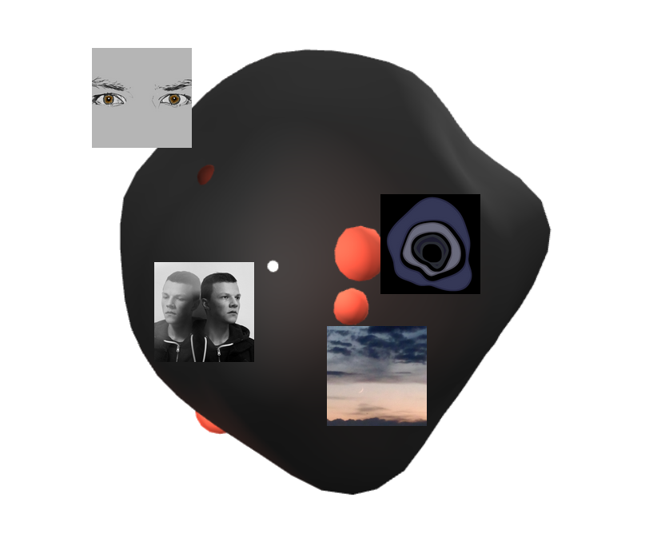
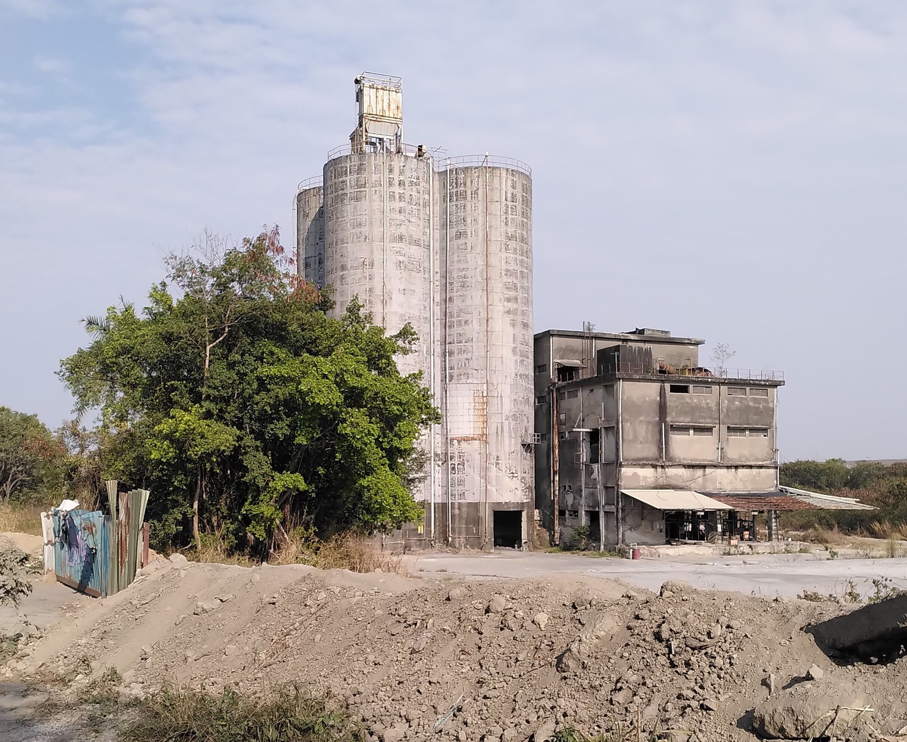

# Inbox

[TOC]

## 2024-05-15 08:28 Proto spirit stream ////

It aimed to be maximally accurate. I'm an opaque blob with some projects on the surface.
Who am I to categorize my project correctly? Instead, I dream of maps. They speak for themselves and display opportunity.
So projects are scattered over the surface, users were able to rotate the blob. The distance between them was determined by "connections" I set manually. Connected blobs attract each other and disconnected ones repell each other.
This was meant to lead to a visually quickly and intuitively understood blob distribution.

bigger spheres = more time spent on the project
brighter spheres = newer project
thumbnails of proximate spheres that act as buttons to the projects make them more distinct.


example for connections: Information about me (smol white dot) and the two rather personal works nearby seemed "connected" to me: they all give a more direct image of my mind.


In the summary at the beginning of each project page, connected notes (neighbors) were referenced explitly to lay out the structure and provide further reading.

- No search engine optimization - all content was generated dynamically and undiscovered by crawlers
- requires javascript
- inefficient to use, relies on curiosity of visitor, needs to turn the blob to discover everything
- information structure too weak to support large number of projects at various levels of resolution (density, thought hours) and versions
	- low benefit from connections at high cost of visual complexity. imagine dozens of project bubbles

[bitcoin whitepaper](https://bitcoin.org/bitcoin.pdf)
[ethereum whitepaper (original)](https://ethereum.org/content/whitepaper/whitepaper-pdf/Ethereum_Whitepaper_-_Buterin_2014.pdf)
[ethereum whitepaper (updated?)](https://ethereum.org/en/whitepaper/)
karpathy blockchain implementation

futarchy

### 2024-05-11 08:15 [Vitalik Buterin - Coordination, Good and bad](https://vitalik.eth.limo/general/2020/09/11/coordination.html)

>One important property of especially the milder cases of collusion is that one cannot determine whether or not an action is part of an undesired collusion just by looking at the action itself.

>[...]votes where vote selling is permitted quickly [collapse into plutocracy](https://vitalik.eth.limo/general/2019/04/03/collusion.html).

>[...] in [...] _cooperative game theory_, [we can prove that](https://en.wikipedia.org/wiki/Bondareva%E2%80%93Shapley_theorem) there are large classes of games that do not have any stable outcome (called a "[core](https://en.wikipedia.org/wiki/Core_(game_theory))"). In such games, whatever the current state of affairs is, there is always some coalition that can profitably deviate from it.
>One important part of that set of inherently unstable games is _majority games_. A majority game [is formally described](https://web.archive.org/web/20180329012328/https://www.math.mcgill.ca/vetta/CS764.dir/Core.pdf) as a game of agents where any subset of more than half of them can capture a fixed reward and split it among themselves


> In _[Liars and Outliers](https://books.google.com.sg/books/about/Liars_and_Outliers.html?id=lPsbhIUexo0C&redir_esc=y)_, Bruce Schneier reminds us that many "security systems" (locks on doors, warning signs reminding people of punishments...) also serve a moral function, reminding potential misbehavers that they are about to conduct a serious transgression and if they want to be a good person they should not do that.

(decentralization contains a warning that any attempt of centralization is unwelcome? However, consider the Ministry of Love)

>**Counter-coordination**. The fact that a system is decentralized makes it easy for participants not participating in the collusion to make a fork that strips out the colluding attackers and continue the system from there.

mechanisms against collusion:
- privacy protection
	- secret ballot
	- protection of whistleblowers
- reward to whistleblowers, encouraging defection in the collusion
- "Moral barriers" (?)
- Counter-coordination
- skin in the game for the colluders
- Decentralization in physical space
- Decentralization between role-based constituencies
- [Schelling points](https://en.wikipedia.org/wiki/Focal_point_(game_theory)), allowing large groups of people to quickly coordinate around a single path forward. Complex Schelling points could potentially even be implemented in code (eg. [recovery from 51% attacks](https://ethresear.ch/t/timeliness-detectors-and-51-attack-recovery-in-blockchains/6925) can benefit from this).
- Speaking a common language (or alternatively, splitting control between multiple constituencies who speak different languages)
- Using per-person voting instead of per-(coin/share) voting to greatly increase the number of people who would need to collude to affect a decision

>This all leads us to an interesting view of what it is that people building social systems _do_. One of the goals of building an effective social system is, in large part, determining _the structure of coordination_: which groups of people and in what configurations can come together to further their group goals, and which groups cannot?

(much of this thought seems unnecessary to me. The structure of reality will reveal itself when the tools allow it. If collusion is the optimal strategy, then so be it. but collusion should not succeed because an alternative was discouraged not technically possible. The job of a social system is to allow anything and everything, then have people build structure on top as they wish: filters, undoing privacy, subspaces. The best system is no system, the best part is no part. Reduce complexity and let people build. if the structure can contain reality it will, and then everyone gets what they deserve which effectively maximizes progress)
### 2024-05-10 12:47 [Vitalik Buterin - The end of my childhood](https://vitalik.eth.limo/general/2024/01/31/end.html)

[Zuzalu](https://www.palladiummag.com/2023/10/06/why-i-built-zuzalu/)

>[...], I realized that I do not even need to argue any of this. Regardless of whether our lives as a whole are finite or infinite, every single beautiful thing in our lives is finite.

(= more lifetime is almost only nice)

[the impossible provably optimal governance system](https://vitalik.eth.limo/general/2020/09/11/coordination.html)

>[...]the most important variables that make the difference between existing flawed systems succeeding or failing in practice (often, the degree of coordination between subgroups of participants, but also other things that we often black-box as ["culture"](https://www.writingruxandrabio.com/p/ideas-matter-how-i-stopped-being)

(success requires vision, which is embedded in culture)

>These two events, as different as they are in the type and the scale of their tragedy, both burned into my mind a similar lesson: that I actually have responsibilities in this world, and I need to be intentional about how I operate. Doing nothing, or living on autopilot and letting myself simply become part of the plans of others, is not an automatically safe, or even blameless, course of action.

(To me, maybe similar effect from playing Witcher 3, Cyberpunk 2077 or similar because they force decision making and show the results)
 
| Traditional stack                               | Decentralized stack                                                                                                                                                                                 |
| ----------------------------------------------- | --------------------------------------------------------------------------------------------------------------------------------------------------------------------------------------------------- |
| Banking system                                  | ETH, stablecoins, L2s for payments, DEXes (note: still need banks for loans)                                                                                                                        |
| Receipts                                        | Links to transactions on block explorers                                                                                                                                                            |
| Corporations                                    | DAOs                                                                                                                                                                                                |
| DNS (`.com`, `.io`, etc)                        | [ENS](https://ens.domains) (`.eth`)                                                                                                                                                                 |
| Regular email                                   | Encrypted email (eg. [Skiff](https://skiff.com/))                                                                                                                                                   |
| Regular messaging (eg. Telegram)                | Decentralized messaging (eg. [Status](https://status.app/))                                                                                                                                         |
| Sign in with Google, Twitter, Wechat            | [Sign in with Ethereum](https://login.xyz/), Zupass, Attestations via [EAS](https://attest.sh/), POAPs, Zu-Stamps... + [social recovery](https://vitalik.eth.limo/general/2021/01/11/recovery.html) |
| Publishing blogs on Medium, etc                 | Publishing self-hosted blogs on IPFS (eg. using [Fleek](https://app.fleek.co/))                                                                                                                     |
| Twitter, Facebook                               | [Lens](https://www.lens.xyz/), [Farcaster](https://www.farcaster.xyz/)...                                                                                                                           |
| Limit bad actors through all-seeing big brother | Constrain bad actors through zero knowledge proofs                                                                                                                                                  |

>[...]a major missing piece from this stack is democratic governance technology.

Carbonvote
Gitcoin


>Paul Graham has written about how every city [sends a message](https://paulgraham.com/cities.html): in New York, "you should make more money". In Boston, "You really should get around to reading all those books". In Silicon Valley, "you should be more powerful". When I visit Taipei, the message that comes to my mind is "you should rediscover your inner high school student".

[network states movement](https://vitalik.eth.limo/general/2022/07/13/networkstates.html)

### 2024-04-25 13:44
```
meta/adventure stack

family, friends
spirit stream stack
simple tools in challenging environment
```

```
Spirit stream stack

independent learning systems
BCIs
tiny corp accelerator
personal robot
	agriculture - true base of reality
spider hat
virtual clone
	generate useful personal text
	look for useful information
		compare word network
		convert text/images/video to latent space
writing systems as simple and versatile as paper
publishing framework (X, facebook,...)
site generator
news paper
```


2024-04-14 14:04
Videogames offer paths to the goal. Need money, friends, reputation, a house? Complete these steps: ...
They may not be easy, but the desired result can be *forced* by speedrunning them.
In reality the world is not responsive. Some theoretical offers are not truly available (homes, jobs, friends) without given reason. This allows believing the desired result is impossible. No clear ramp leads to it.
If the rules of the game were as obvious as "if I walk in this direction, I will eventually get to those distant mountains". Getting to the mountains is *forcible* at any time.
Getting a home is forcible through an axe and trees. Some groups don't permit such lowest grade, forced solutions. Imo, this is a mistake. Higher grade solutions should be available with similar simplicity.
"Steps" on the gradient between low and high grade solutions are often introduced by regulation. You make more than $x, you are in this different category and pay different taxes.
With some luck, the virtual clone ([Towards insanely great AI](Towards%20insanely%20great%20AI.md)) makes negotiation so cheap that many such rules can be thrown out.
The abandoned buildings connect to this too. They are a place of much evident progress without prohibitive rules.
High clarity tools, shining with future potential, encourage creation and exploration like nothing else I know. Erode unnecessary structure. Delete it, *force it*, and see what happens.


2024-04-03 19:11
A sad time, when the illusion of a serious world strikes. May chaos not come uninvited.<br>[https://www.youtube.com/watch?v=dy6neKO-8sk](https://www.youtube.com/watch?v=dy6neKO-8sk)


show don't tell, there is no replacement for showing because people lie, sometimes without knowing it, sometimes I lie to myself without knowing it.


1. I don't value fleeting things very much
2. what is not fleeting? functionality
3. I value tools and the adventure they make available


what isn't concise sucks, wastes my energy. Reducing complexity and word count are driving factors behind increasing resolution /clarity in my writing.




These abandoned buildings emitted an aura of great adventure. Ironically? Similar to buildings under construction, they are asking to be used, transformed, to become part of a new story. As they become "finished", this aura weakens, they become "boring". Their (unnecessary?) shiny finish discourages major modification, like drilling into or erecting new walls.

Think solar panels. theoretically, they just need sun, cables, a box that could stand anywhere. In the "finished" homes that I know, this is (unnecessarily?) more complicated. Is there access to the roof? Possible to mount it on the facade? get cables by the window inside? Need approval from all kinds of people? What of this makes practical sense? Is it mostly a social problem? Is it solved by having virtual clones that can negotiate for people more cheaply and quickly so people can live where their spirit aligns more with the opportunities of the enironment?

Buildings that are in poor condition can suggest decay and death from carelessness, visionlessness.

They can also suggest a strong focus on what is meaningful because ressources are scarce. Maybe short term thinking dominates and many opportunities for creative exploration are out of reach. However, as someone who appreciates efficiency, it seems that a larger precentage of things in that environment are beautiful to me, compared to "nice, calm, high living standard" environments. They become too "nice" and they disgust me, make me want to leave or destroy them. I wonder where this line of thought leads.


In difficult environments I dream of the future.
In easy environments I dream of destruction.