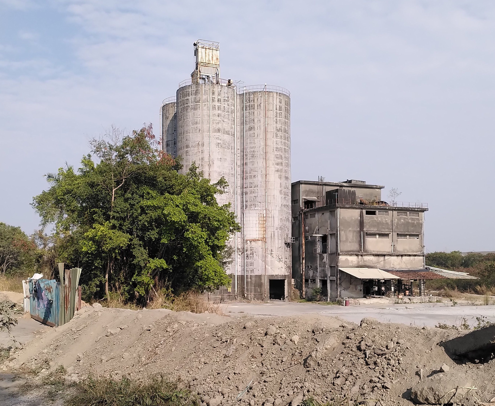

Space to develop ideas until they have grown up to earn their own space. Mortality is high though.
# Inbox

[TOC]

## 2024-09-11 08:51 Goal stack

0. Merge with other brains, explore the unknown, accelerate each other and build.

1. Independent learning systems will uncover new space in possibility, find human brains, interact, possibly exploit them for their needs. If the mind is truly open and on fast access and will not reject the intruder, but reveal its structure, the system may be curious. I have no intuition here.

2. BCIs will allow extension of the spirit into new forms, seamlessly extend thinking, solve learning and challenge the spirit like never before to direct its powers. They will allow the true transformation - altering minds is the last frontier. Capturing experience will go deeper than before. BCIs and independent learning systems combined are the Scariest, the most Curious, the hardest to implement. It will allow merging minds from anywhere given low enough latency. 
   I truly wonder what it would be like. Much of thought is like staring at a hole and iterating through paths to bridge it. Maybe there are many simultaneous holes and I am searching for an arrangement to shoot straight through them. It requires maintaining the context with all holes and working on multiple at the same time. Expanding the context of my mind might be extremely difficult. Instead, the context may contain items of increasingly broad scope, understood more deeply. Maybe contexts can be efficiently stored, restored.

3. Tiny corp accelerator distributes compute into more hands. Builds a bridge between ML framework and low level.
   Its approach is admirable. it reveals the nature and power of computation for everyone to see and use.
   It concerns itself with the technicalities for making increasingly fast, efficient and well-integrated processors. It includes some user experience in its API, the tiny box and internal representation.

4. Personal robots will manifest the growing intelligence, become a frontend. Building them concerns itself with materials, mechanics, packaging and machine-human interaction. They require strong interfaces to be cool. If it's "the robot and me" and not "me and an extra me-instance", it sucks. The personal robots will free individuals to be increasingly independent.

5. Spider hats (data collector my head, recording experience) will provide data for minds to merge and flood the internet with what would be garbage for most people and contexts.

6. virtual clones could make use of sparse or spider hat data to become an interface to the world, research, negotiate, use tools in my stead. Being built right now. They may make my software more userfriendly and trustworthy than it is today (become an OS that does not treat me like an idiot and teaches me how it works).

7. Simple, versatile communication media. Probably change nothing. They may accelerate the interface for noobs but pro tools for self expression and compressing ideas are the real deal. Not dumping it in a particularly optimized format. I don't even use many "pro tools" though.

8. Publishing frameworks for the individual could encourage higher quality idea space. Anything from markdown static site generator to generic website builder.
   Code as UI is nice. All is in one place, builds on text manipulation tools and no dumb menus.
   In the end it will be an AI I talk to and it generates or modifies nice code and the true tool beneath will be a fast, nice API for the AI to learn and use.
   The tool should be general enough to allow any website, on any host and have one-button publish.
   Extended by a "reader" API to scrape sites, assemble them into a UI. Another API for the pirvate virtual clone. Any APIs should be transparent, offer good logs to understand what is happening.

9. Publishing platform to replace hostile attention- and data-harvesters. This would be like fighting symptoms. Instead, it should be so easy for people to publish on their own that other platforms make no sense.

10. Functional and expressive clothing. Though it mostly modifies appearance. Rage quit from the pathetic SUV-style overlord brand identity bullshit that I find on the market.

These goals circle the realization of self and universe.

## 2024-07-14 20:23

there are bridges to be built. between the ideas, nature, work, the spirits. Curiosity leads to testing new ways to link them.
building a product means actualizing the spirits, making the product beautiful requires facing and approaching beauty myself. The nerd-unattractiveness comes from an incomplete person if at all, is not inherent in nerdbeing. requires negotiating between the spirits and curageously producing something complete. at least the most complete I can manage.
the product, say tinygrad, in greatness, is not a mere tool. it developed the elegance to reflect the truth in itself. to shine with the greens of growth, potential and mysteriousness, the mischivousness of a great troll, the danger and exhiliaration of its varied use, power and darkness. It reflects so stongly, it might just show the way. It should not miss but contain challenging sexiness, doors to transformation, destructive determination, exposition, spontaneousness.
The tool is dead if I talk to it and its reflection does not answer.
These properties do not lead to a singular product, they are the consequence of a refined product that reflects in truth, which can be the future of many products, though not all. The stupidity of some might be so near infinite, their abolishion might be the best thing to happen to them. Like projects clinging to past technology, unwilling to die gracefully.
The awfully draining, painful, torturous creation of something beautiful looks deep into the creator. Any of my tendencies to overplan, to clean obsessively, to autodestruct and turn evil in despair will become concentrated and obvious in the naked product, subject to the open world, inevitably failing due to its inadequacy and stupidity. I should not fear destruction, for I can try to fail gracefully.

The optimized organisms in nature reflect its truths. Nature does not leave alone, it knows me. The production of highly optimized, open systems that explore more of it, the continuation and expression of the spirits, is what they ask of me.

These are but empty words if they don't become actualized in a product.

There isn't anything but the present. The symbols of the past and future are superficial. it does not matter if I become terminally ill, am tortured, amount material wealth, receive social approval. there is only a naked person, the spirits and opportunity.

tinygrad should not be exclusively about implementing the latest techniques to become an acceptable deep learning framework.
Elegance through open selection, trial of characters through risk, competition. exploration of the depths through implementing increasingly complete capacity. If I am not scared of tinygrad, what is even the purpose of dealing with it?
Integration into silicon is the next frontier.
Uncover the poetry inherent in computing?

I don't know how to translate from these words to action, there are bridges to be built.

## cyberspace

Reaching cyberspace is an interface problem. If the computer would respond to my will more closely, my mind would enter it more completely. Sometimes I fear that it is mostly here already and it just turned out underwhelming.
Invention of telephones is followed by people who do nothing but phonecalls. Sucks. Tech can merge with nature if it allows to contain it: Make the telephone usable, automatable by anyone.

preliminary expression. I wonder if cyberspace exist, what it looks like.
It seems, any ideological battle, any spiritual one, would be fought in virtual spaces because they adapt faster, can be more expressive. How good are todays virtual spaces? what would the high quality ones look like?
Visiting the endless worlds. Building a bridge to reality is an impossible translation, the work to break myself at.

May the spirits remain informed by mortality and journey far.

## 2024-05-15 08:28 Proto spirit stream

It aimed to be maximally accurate. I'm an opaque blob with some projects on the surface.
Who am I to categorize my project correctly? Instead, I dream of maps. They speak for themselves and display opportunity.
So projects are scattered over the surface, users were able to rotate the blob. The distance between them was determined by "connections" I set manually. Connected blobs attract each other and disconnected ones repell each other.
This was meant to lead to a visually quickly and intuitively understood blob distribution.

bigger spheres = more time spent on the project
brighter spheres = newer project
thumbnails of proximate spheres that act as buttons to the projects and make them more recognizable.

In the summary at the beginning of each project page, connected notes (neighbors) were referenced explitly to lay out the structure and provide further reading.

The dynamically generated content was undiscovered by crawlers, required javascript and was inefficient to use and to add to.

## decentralization

[bitcoin whitepaper](https://bitcoin.org/bitcoin.pdf)
[ethereum whitepaper (original)](https://ethereum.org/content/whitepaper/whitepaper-pdf/Ethereum_Whitepaper_-_Buterin_2014.pdf)
[ethereum whitepaper (updated?)](https://ethereum.org/en/whitepaper/)
karpathy blockchain implementation

futarchy

### 2024-05-11 08:15 [Vitalik Buterin - Coordination, Good and bad](https://vitalik.eth.limo/general/2020/09/11/coordination.html)

>One important property of especially the milder cases of collusion is that one cannot determine whether or not an action is part of an undesired collusion just by looking at the action itself.

>[...]votes where vote selling is permitted quickly [collapse into plutocracy](https://vitalik.eth.limo/general/2019/04/03/collusion.html).

>[...] in [...] _cooperative game theory_, [we can prove that](https://en.wikipedia.org/wiki/Bondareva%E2%80%93Shapley_theorem) there are large classes of games that do not have any stable outcome (called a "[core](https://en.wikipedia.org/wiki/Core_(game_theory))"). In such games, whatever the current state of affairs is, there is always some coalition that can profitably deviate from it.
>One important part of that set of inherently unstable games is _majority games_. A majority game [is formally described](https://web.archive.org/web/20180329012328/https://www.math.mcgill.ca/vetta/CS764.dir/Core.pdf) as a game of agents where any subset of more than half of them can capture a fixed reward and split it among themselves

>**Counter-coordination**. The fact that a system is decentralized makes it easy for participants not participating in the collusion to make a fork that strips out the colluding attackers and continue the system from there.

mechanisms against collusion:
- privacy protection
	- secret ballot
	- protection of whistleblowers
- reward to whistleblowers
- Counter-coordination
- skin in the game for the colluders
- Decentralization in physical space
- Decentralization between role-based constituencies
- [Schelling points](https://en.wikipedia.org/wiki/Focal_point_(game_theory)), allowing large groups of people to quickly coordinate around a single path forward. Complex Schelling points could potentially even be implemented in code (eg. [recovery from 51% attacks](https://ethresear.ch/t/timeliness-detectors-and-51-attack-recovery-in-blockchains/6925) can benefit from this).
- Speaking a common language (or alternatively, splitting control between multiple constituencies who speak different languages)
- Using per-person voting instead of per-(coin/share) voting to greatly increase the number of people who would need to collude to affect a decision

>This all leads us to an interesting view of what it is that people building social systems _do_. One of the goals of building an effective social system is, in large part, determining _the structure of coordination_: which groups of people and in what configurations can come together to further their group goals, and which groups cannot?

(much of this thought seems unnecessary to me. The structure of reality will reveal itself when the tools allow it. If collusion is the optimal strategy, then so be it. Not sure what the purpose of a social system is. If anything were allowed and people build structure on it like filters, undoing privacy, subspaces, would it not be desirable? The best system is no system? If the structure can contain reality it will, and reality, as death, will be the appropriate judge?

### 2024-05-10 12:47 [Vitalik Buterin - The end of my childhood](https://vitalik.eth.limo/general/2024/01/31/end.html)

[Zuzalu](https://www.palladiummag.com/2023/10/06/why-i-built-zuzalu/)
[the impossible provably optimal governance system](https://vitalik.eth.limo/general/2020/09/11/coordination.html)

| Traditional stack                               | Decentralized stack                                                                                                                                                                                 |
| ----------------------------------------------- | --------------------------------------------------------------------------------------------------------------------------------------------------------------------------------------------------- |
| Banking system                                  | ETH, stablecoins, L2s for payments, DEXes (note: still need banks for loans)                                                                                                                        |
| Receipts                                        | Links to transactions on block explorers                                                                                                                                                            |
| Corporations                                    | DAOs                                                                                                                                                                                                |
| DNS (`.com`, `.io`, etc)                        | [ENS](https://ens.domains) (`.eth`)                                                                                                                                                                 |
| Regular email                                   | Encrypted email (eg. [Skiff](https://skiff.com/))                                                                                                                                                   |
| Regular messaging (eg. Telegram)                | Decentralized messaging (eg. [Status](https://status.app/))                                                                                                                                         |
| Sign in with Google, Twitter, Wechat            | [Sign in with Ethereum](https://login.xyz/), Zupass, Attestations via [EAS](https://attest.sh/), POAPs, Zu-Stamps... + [social recovery](https://vitalik.eth.limo/general/2021/01/11/recovery.html) |
| Publishing blogs on Medium, etc                 | Publishing self-hosted blogs on IPFS (eg. using [Fleek](https://app.fleek.co/))                                                                                                                     |
| Twitter, Facebook                               | [Lens](https://www.lens.xyz/), [Farcaster](https://www.farcaster.xyz/)...                                                                                                                           |
| Limit bad actors through all-seeing big brother | Constrain bad actors through zero knowledge proofs                                                                                                                                                  |

>[...]a major missing piece from this stack is democratic governance technology.

???

Carbonvote
Gitcoin

[network states movement](https://vitalik.eth.limo/general/2022/07/13/networkstates.html)

## 2024-04-14 14:04
Videogames offer paths to the goal. Need money, friends, reputation, a house? Complete these steps: ...
They may not be easy, but the desired result can be *forced* by speedrunning them.
In reality the world is not responsive. Some theoretical offers are not truly available (homes, jobs, friends) without given reason. This allows believing the desired result is impossible. No clear ramp leads to it.
If the rules of the game were as obvious as "if I walk in this direction, I will eventually get to those distant mountains". Getting to the mountains is *forcible* at any time.
Getting a home is forcible through an axe and trees. Some groups don't permit such lowest grade, forced solutions. Imo, this is a mistake. Higher grade solutions should be available with similar simplicity.
"Steps" on the gradient between low and high grade solutions are often introduced by regulation. You make more than $x, you are in this different category and pay different taxes.
With some luck, the virtual clone ([Towards insanely great AI](Towards%20insanely%20great%20AI.md)) makes negotiation so cheap that many such rules can be thrown out.
The abandoned buildings connect to this too. They are a place of much evident progress without prohibitive rules.
High clarity tools, shining with future potential, encourage creation and exploration like nothing else I know. Erode unnecessary structure. Delete it, *force it*, and see what happens.

## 2024-04-03 19:11
A sad time, when the illusion of a serious world strikes. May chaos not come uninvited. [https://www.youtube.com/watch?v=dy6neKO-8sk](https://www.youtube.com/watch?v=dy6neKO-8sk)

show don't tell, there is no replacement for showing because people lie, sometimes without knowing it, sometimes I lie to myself without knowing it.

1. I don't value fleeting things very much
2. what is not fleeting? functionality
3. I value tools and the adventure they make available

what isn't concise sucks, wastes my energy. Reducing complexity and word count are driving factors behind increasing resolution /clarity in my writing.

These abandoned buildings emitted an aura of great adventure. Ironically? Similar to buildings under construction, they are asking to be used, transformed, to become part of a new story. As they become "finished", this aura weakens, they become "boring". Their (unnecessary?) shiny finish discourages major modification, like drilling into or erecting new walls.

Think solar panels. theoretically, they just need sun, cables, a box that could stand anywhere. In the "finished" homes that I know, this is (unnecessarily?) more complicated. Is there access to the roof? Possible to mount it on the facade? get cables by the window inside? Need approval from all kinds of people? What of this makes practical sense? Is it mostly a social problem? Is it solved by having virtual clones that can negotiate for people more cheaply and quickly so people can live where their spirit aligns more with the opportunities of the enironment?

Buildings that are in poor condition can suggest decay and death from carelessness, visionlessness.

They can also suggest a strong focus on what is meaningful because ressources are scarce. Maybe short term thinking dominates and many opportunities for creative exploration are out of reach. However, as someone who appreciates efficiency, it seems that a larger precentage of things in that environment are beautiful to me, compared to "nice, calm, high living standard" environments. They become too "nice" and they disgust me, make me want to leave or destroy them. I wonder where this line of thought leads.

In difficult environments I dream of the future.
In easy environments I dream of destruction.