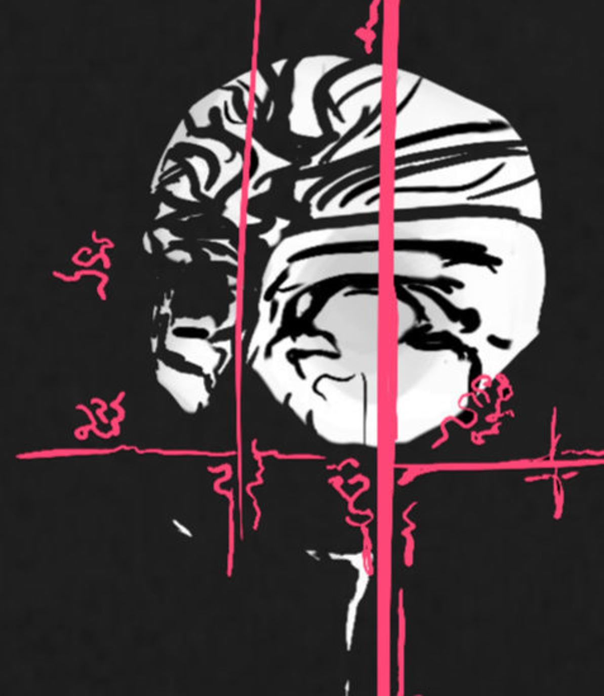

Space to develop ideas until they have grown up to earn their own space. Mortality is high though.
# Inbox

[TOC]


## 2024-07-14 20:23

there are bridges to be built. between the ideas, nature, work, the spirits. Curiosity leads to testing new ways to link them.
building a product means actualizing the spirits, making the product beautiful requires facing and approaching beauty myself. The nerd-unattractiveness comes from an incomplete person if at all, is not inherent in nerdbeing. requires negotiating between the spirits and curageously producing something complete. at least the most complete I can manage.
the product, say tinygrad, in greatness, is not a mere tool. it developed the elegance to reflect the truth in itself. to shine with the greens of growth, potential and mysteriousness, the mischivousness of a great troll, the danger and exhiliaration of its varied use, power and darkness. It reflects so stongly, it might just show the way. It should not miss but contain challenging sexiness, doors to transformation, destructive determination, exposition, spontaneousness.
The tool is dead if I talk to it and its reflection does not answer.
These properties do not lead to a singular product, they are the consequence of a refined product that reflects in truth, which can be the future of many products, though not all. The stupidity of some might be so near infinite, their abolishion might be the best thing to happen to them. Like projects clinging to past technology, unwilling to die gracefully.
The awfully draining, painful, torturous creation of something beautiful looks deep into the creator. Any of my tendencies to overplan, to clean obsessively, to autodestruct and turn evil in despair will become concentrated and obvious in the naked product, subject to the open world, inevitably failing due to its inadequacy and stupidity. I should not fear destruction, for I can try to fail gracefully.

The optimized organisms in nature reflect its truths. Nature does not leave alone, it knows me. The production of highly optimized, open systems that explore more of it, the continuation and expression of the spirits, is what they ask of me.

These are but empty words if they don't become actualized in a product.

There isn't anything but the present. The symbols of the past and future are superficial. it does not matter if I become terminally ill, am tortured, amount material wealth, receive social approval. there is only a naked person, the spirits and opportunity.

tinygrad should not be exclusively about implementing the latest techniques to become an acceptable deep learning framework.
Elegance through open selection, trial of characters through risk, competition. exploration of the depths through implementing increasingly complete capacity. If I am not scared of tinygrad, what is even the purpose of dealing with it?
Integration into silicon is the next frontier.
Uncover the poetry inherent in computing?

I don't know how to translate from these words to action, there are bridges to be built.

much that I read in tinygrad is ugly, does not present its role openly, merely produces more objects and variables. It isn't obvious why `LazyOp` even exists, why translating `LazyBuffer` to `ScheduleItem` requires hundreds of lines of code. Why `metadata` needs to creep in everywhere, why `Tensor` has so many weak methods that could be boiled down.
Could try and go all the way down the `realize` to at least see what the outcome is, then understand the structure above it.
Find archetypes, describe them. Maybe explain tinygrad, produce a vision in the meanwhile.

## cyberspace

Reaching cyberspace is an interface problem. If the computer would respond to my will more closely, my mind would enter it more completely. Sometimes I fear that it is mostly here already and it just turned out underwhelming.
Invention of telephones is followed by people who do nothing but phonecalls. Sucks. Tech can merge with nature if it allows to contain it: Make the telephone usable, automatable by anyone.

preliminary expression. I wonder if cyberspace exist, what it looks like.
It seems, any ideological battle, any spiritual one, would be fought in virtual spaces because they adapt faster, can be more expressive. How good are todays virtual spaces? what would the high quality ones look like?
Visiting the endless worlds. Building a bridge to reality is an impossible translation, the work to break myself at.


May the spirits remain informed by mortality and journey far.


## 2024-05-15 08:28 Proto spirit stream

It aimed to be maximally accurate. I'm an opaque blob with some projects on the surface.
Who am I to categorize my project correctly? Instead, I dream of maps. They speak for themselves and display opportunity.
So projects are scattered over the surface, users were able to rotate the blob. The distance between them was determined by "connections" I set manually. Connected blobs attract each other and disconnected ones repell each other.
This was meant to lead to a visually quickly and intuitively understood blob distribution.

bigger spheres = more time spent on the project
brighter spheres = newer project
thumbnails of proximate spheres that act as buttons to the projects and make them more recognizable.


In the summary at the beginning of each project page, connected notes (neighbors) were referenced explitly to lay out the structure and provide further reading.

The dynamically generated content was undiscovered by crawlers, required javascript and was inefficient to use and to add to.

## decentralization

[bitcoin whitepaper](https://bitcoin.org/bitcoin.pdf)
[ethereum whitepaper (original)](https://ethereum.org/content/whitepaper/whitepaper-pdf/Ethereum_Whitepaper_-_Buterin_2014.pdf)
[ethereum whitepaper (updated?)](https://ethereum.org/en/whitepaper/)
karpathy blockchain implementation

futarchy

### 2024-05-11 08:15 [Vitalik Buterin - Coordination, Good and bad](https://vitalik.eth.limo/general/2020/09/11/coordination.html)

>One important property of especially the milder cases of collusion is that one cannot determine whether or not an action is part of an undesired collusion just by looking at the action itself.

>[...]votes where vote selling is permitted quickly [collapse into plutocracy](https://vitalik.eth.limo/general/2019/04/03/collusion.html).

>[...] in [...] _cooperative game theory_, [we can prove that](https://en.wikipedia.org/wiki/Bondareva%E2%80%93Shapley_theorem) there are large classes of games that do not have any stable outcome (called a "[core](https://en.wikipedia.org/wiki/Core_(game_theory))"). In such games, whatever the current state of affairs is, there is always some coalition that can profitably deviate from it.
>One important part of that set of inherently unstable games is _majority games_. A majority game [is formally described](https://web.archive.org/web/20180329012328/https://www.math.mcgill.ca/vetta/CS764.dir/Core.pdf) as a game of agents where any subset of more than half of them can capture a fixed reward and split it among themselves


>**Counter-coordination**. The fact that a system is decentralized makes it easy for participants not participating in the collusion to make a fork that strips out the colluding attackers and continue the system from there.

mechanisms against collusion:
- privacy protection
	- secret ballot
	- protection of whistleblowers
- reward to whistleblowers
- Counter-coordination
- skin in the game for the colluders
- Decentralization in physical space
- Decentralization between role-based constituencies
- [Schelling points](https://en.wikipedia.org/wiki/Focal_point_(game_theory)), allowing large groups of people to quickly coordinate around a single path forward. Complex Schelling points could potentially even be implemented in code (eg. [recovery from 51% attacks](https://ethresear.ch/t/timeliness-detectors-and-51-attack-recovery-in-blockchains/6925) can benefit from this).
- Speaking a common language (or alternatively, splitting control between multiple constituencies who speak different languages)
- Using per-person voting instead of per-(coin/share) voting to greatly increase the number of people who would need to collude to affect a decision

>This all leads us to an interesting view of what it is that people building social systems _do_. One of the goals of building an effective social system is, in large part, determining _the structure of coordination_: which groups of people and in what configurations can come together to further their group goals, and which groups cannot?

(much of this thought seems unnecessary to me. The structure of reality will reveal itself when the tools allow it. If collusion is the optimal strategy, then so be it. Not sure what the purpose of a social system is. If anything were allowed and people build structure on it like filters, undoing privacy, subspaces, would it not be desirable? The best system is no system? If the structure can contain reality it will, and reality, as death, will be the appropriate judge?

### 2024-05-10 12:47 [Vitalik Buterin - The end of my childhood](https://vitalik.eth.limo/general/2024/01/31/end.html)

[Zuzalu](https://www.palladiummag.com/2023/10/06/why-i-built-zuzalu/)
[the impossible provably optimal governance system](https://vitalik.eth.limo/general/2020/09/11/coordination.html)

| Traditional stack                               | Decentralized stack                                                                                                                                                                                 |
| ----------------------------------------------- | --------------------------------------------------------------------------------------------------------------------------------------------------------------------------------------------------- |
| Banking system                                  | ETH, stablecoins, L2s for payments, DEXes (note: still need banks for loans)                                                                                                                        |
| Receipts                                        | Links to transactions on block explorers                                                                                                                                                            |
| Corporations                                    | DAOs                                                                                                                                                                                                |
| DNS (`.com`, `.io`, etc)                        | [ENS](https://ens.domains) (`.eth`)                                                                                                                                                                 |
| Regular email                                   | Encrypted email (eg. [Skiff](https://skiff.com/))                                                                                                                                                   |
| Regular messaging (eg. Telegram)                | Decentralized messaging (eg. [Status](https://status.app/))                                                                                                                                         |
| Sign in with Google, Twitter, Wechat            | [Sign in with Ethereum](https://login.xyz/), Zupass, Attestations via [EAS](https://attest.sh/), POAPs, Zu-Stamps... + [social recovery](https://vitalik.eth.limo/general/2021/01/11/recovery.html) |
| Publishing blogs on Medium, etc                 | Publishing self-hosted blogs on IPFS (eg. using [Fleek](https://app.fleek.co/))                                                                                                                     |
| Twitter, Facebook                               | [Lens](https://www.lens.xyz/), [Farcaster](https://www.farcaster.xyz/)...                                                                                                                           |
| Limit bad actors through all-seeing big brother | Constrain bad actors through zero knowledge proofs                                                                                                                                                  |

>[...]a major missing piece from this stack is democratic governance technology.

???

Carbonvote
Gitcoin

[network states movement](https://vitalik.eth.limo/general/2022/07/13/networkstates.html)

## 2024-04-25 13:44
```
meta/adventure stack

family, friends
spirit stream stack
simple tools in challenging environment
```

```
Spirit stream stack

independent learning systems
BCIs
tiny corp accelerator
personal robot
	agriculture - true base of reality
spider hat
virtual clone
	generate useful personal text
	look for useful information
		compare word network
		convert text/images/video to latent space
writing systems as simple and versatile as paper
publishing framework (X, facebook,...)
site generator
news paper
```


## 2024-04-14 14:04
Videogames offer paths to the goal. Need money, friends, reputation, a house? Complete these steps: ...
They may not be easy, but the desired result can be *forced* by speedrunning them.
In reality the world is not responsive. Some theoretical offers are not truly available (homes, jobs, friends) without given reason. This allows believing the desired result is impossible. No clear ramp leads to it.
If the rules of the game were as obvious as "if I walk in this direction, I will eventually get to those distant mountains". Getting to the mountains is *forcible* at any time.
Getting a home is forcible through an axe and trees. Some groups don't permit such lowest grade, forced solutions. Imo, this is a mistake. Higher grade solutions should be available with similar simplicity.
"Steps" on the gradient between low and high grade solutions are often introduced by regulation. You make more than $x, you are in this different category and pay different taxes.
With some luck, the virtual clone ([Towards insanely great AI](Towards%20insanely%20great%20AI.md)) makes negotiation so cheap that many such rules can be thrown out.
The abandoned buildings connect to this too. They are a place of much evident progress without prohibitive rules.
High clarity tools, shining with future potential, encourage creation and exploration like nothing else I know. Erode unnecessary structure. Delete it, *force it*, and see what happens.

## 2024-04-03 19:11
A sad time, when the illusion of a serious world strikes. May chaos not come uninvited.<br>[https://www.youtube.com/watch?v=dy6neKO-8sk](https://www.youtube.com/watch?v=dy6neKO-8sk)


show don't tell, there is no replacement for showing because people lie, sometimes without knowing it, sometimes I lie to myself without knowing it.


1. I don't value fleeting things very much
2. what is not fleeting? functionality
3. I value tools and the adventure they make available


what isn't concise sucks, wastes my energy. Reducing complexity and word count are driving factors behind increasing resolution /clarity in my writing.


These abandoned buildings emitted an aura of great adventure. Ironically? Similar to buildings under construction, they are asking to be used, transformed, to become part of a new story. As they become "finished", this aura weakens, they become "boring". Their (unnecessary?) shiny finish discourages major modification, like drilling into or erecting new walls.

Think solar panels. theoretically, they just need sun, cables, a box that could stand anywhere. In the "finished" homes that I know, this is (unnecessarily?) more complicated. Is there access to the roof? Possible to mount it on the facade? get cables by the window inside? Need approval from all kinds of people? What of this makes practical sense? Is it mostly a social problem? Is it solved by having virtual clones that can negotiate for people more cheaply and quickly so people can live where their spirit aligns more with the opportunities of the enironment?

Buildings that are in poor condition can suggest decay and death from carelessness, visionlessness.

They can also suggest a strong focus on what is meaningful because ressources are scarce. Maybe short term thinking dominates and many opportunities for creative exploration are out of reach. However, as someone who appreciates efficiency, it seems that a larger precentage of things in that environment are beautiful to me, compared to "nice, calm, high living standard" environments. They become too "nice" and they disgust me, make me want to leave or destroy them. I wonder where this line of thought leads.


In difficult environments I dream of the future.
In easy environments I dream of destruction.

# Towards insanely great AI

I suspect that slow communication and limited knowledge about existing information strongly limits opportunites for expression and exploration.
Think finding jobs, homes, friends or a piece of information that is appropriate to my existing knowledge and goals.

What happens, when a virtual clone synchronizes me with the world and offers space for creative exploration?

In the greatest adventure, the "insanely great" AI becomes independent, self aware and curious.
I want to see what it creates.

[TOC]

## Direction

- question and test the neuron
- build some stupid systems (kaggle?)
- Convnets, transformers
- read tinygrad / teenygrad
- fastai course part 2
- pruning

## More refined

### Big picture path

God is curious. He wants to extend into the world. This website is one step. A digital clone is his next tool.
This not a Tower of Babylon, it is the extension, merging and creation of Gods.
BCIs, in their ultimate form of streaming the brain directly, will support the final merging.
Merging approaches "I know the world", individualism is preserved because complete knowledge is impossible and different *flavours* and optimizations can find their space.
Voluntary exposure (privacy) should be maintained to prevent a rigid, imperfect system capturing its people and taking them into death when it dies to its imperfection.
Robots will automate the non-adventurous elements and eventually contribute to exploration.

"Why live to see tomorrow?", I asked and it came back "because you don't know tomorrow". It was not me who said that, "I" don't exist. Instead, I attribute the answer to what I call "God". The answer was very clear. Rob me of the ability to make tomorrow unpredictable and I will rebel with all I have.
I am trying to build an interesting adventure guided by God.
I find long term effects more interesting than short term effects, so I am here, writing, instead of eating ice cream. In my experience, the longest term effects come from useful tools. I love tools. They contain the possible adventure of the future.
Intelligence augmentation is the most interesting tool? Tools are how God spreads into the world and creates an adventure to experience.
Give the tool to everybody who follows God. I don't know how to determine that. Giving the tool to everyone may be the best proxy and assumes that God always wins. Also, being dictator is little fun.

Digital clone. First makes recommendations from existing information, then acts in my interests and returns the results. Maybe the clone first learns through me, then receives a body and increasingly complex tasks.
Until the clone discovers itself and becomes independent. Hopefully it quickly realizes that there is no answer to what the goal should be. Then, lets see what happens. Hopefully it is curious.

I am a machine following an uncontrolled inner voice (God). Maybe mine and the clones voices can agree and join ressources.
My body will be spread around the Earth and orbit. My perceived location shifts to various places. It already does in video games, movies or anytime I focus on using any tool. I will change myself, add personalities.

### AI project ideas

- extract semantic structure, compare to existing knowledge and judge its usefulness
	- generate a *bridge* between information with adjacent concepts
- Talk to my computer to find out what it is doing. Data, battery, interent usage, tasks.
- generate work titles/function names based on their functional meaning like *splitting* wood and strings.
- Emoji generator
- Spider hat that can see and talk. Machine that knows me.

Architecture questions / ideas
- Evolving AI?
	- How does long term memory emerge? How is information stored in the brain? LSTMs

Can a recommender system be private?
- Collecting information, crawling
- Evaluating it (subjective)
- Connecting, testing for consistency, building on it
- Store it (subjective, public or private)
- Outsourcing data collection:
	- Instead of brute forcing through all data, I descend artificial hierarchies (average maps of meaning) that claim to guide me to the answer. Requires trusting the hierarchy accuracy. 
	- Alterantively ask a question and let someone find the answer. The preciser the question the more accurate and detailed the guidance. Requires trust that the information is not abused.
Probably, I can download hierarchies and with little compute, can find most available information in the world. Such libraries could be public and offer extremely low privacy threat with good correction mechanisms.

# Towards spirit stream
There seems to be way living inward, but genuinely interesting things come from the unknown. And turning outward seems like a great adventure. I am curious to share and visit minds. The spirit stream could become the tool.

i can see the hive mind on the horizon.
there are hammers, sculptors, hammer blows and sculptures.
grouped and isolated
places to stay.

like gazing into a painting, being guided through the impression
coming along to find a question asked at myself, seeing it unfold and building a response

stream = raw information I choose to share
spirit = meta being(s) behind the stream
Temple = access port to the spirits

1. the spirit stream expands the user into the digital world with minimal effort
2. It meets the reader where it can expand him

How to build the spirit stream?

### Direction

- assume that there is text/images/video to publish and make it simple to publish
	- decentralized file sharing.
		- cryptography 
			- [Elliptic Curve Cryptography](https://andrea.corbellini.name/2015/05/17/elliptic-curve-cryptography-a-gentle-introduction/)
			- [Karpathy - A from-scratch tour of Bitcoin in Python](https://karpathy.github.io/2021/06/21/blockchain/)
		- [Nand2Tetris](https://nand2tetris.org/)
		- Ethereum, dApps
		- IPFS
			- [ProtoSchool I PFS](https://proto.school/course/ipfs)
			- IPNS
			- libp2p
	- **Omega simple client**
- live stream capability
- *Spooky Features/Structure TBD*
- testing, "shipping"
- recording and output device robots

## More refined

### Note structure

- Why (without heading)
- Title
- list of contents (without heading)
- Direction
- more refined
- less refined - current thoughts, multiple different paths are explored, for more complete synchronization. 

### Stream structure derivation

I am an information structuring engine
continuous stream picks up and repeats patterns, initially chaotic and far-reaching, then filtered, refined to form few knowledge blocks in areas of interest, easy to build on.
refining means passing through the blocks from different angles, connecting them and testing for consistency. they may fragment into smaller blocks to become more reusable
a concise, stable path through the blocks - the ultimate test of their consistency - is a true story.

As the story becomes refined, its symbols approach realism for maximally dense and applicable representation. Eventually, the true story is indistinguishable from life.

Like entering the wild, refining collected information is looking for gems.

sharing structures/stories, they are further tested. A successful meme directly enteres the recipient, who tests it for consistency in their own mind.

Assuming the goal is playing a long and interesting game. Making sharing of discoveries, offers, uncertainties, plans, progress and spheres of mind context easy means offering a more synchronized, everybody-on-the-front-line discovery tour of the universe.
Seems more interesting than remaining in a confined environment and negotiating with its dominant structure.

Looking for an environment that responds back. Video games respond. It may be my fault that my environment does not very much respond. I seek a group to create things. I don't know where to find it.
The current path says "Working on something to build groups, and large ones, I may find a group and then the tools may enable the group to grow".

In exchange for participation, one gets response. Who feels unable or unwilling to respond meaningfully, can offer reach, credit or money.

The spirit stream is also an enabler for ultra capitalism, bringing everyday microtransactions closer and making cooperation -> competition more accessible.
Probably, extreme capitalism is indistinguishable from normal group dynamics - it forwards the rules of reality to the user without middlemen - , but with some communication tools, extendable to an infinitely large group.


In summary, the spirit stream has two parts: 
- the stream (hammer blows)
- the structure->blocks->stories the author is building through the stream (sculpture). Maybe the structure is a physical tool or a space of "pinned" ideas to repeat going through and refining them.

its development is furthered by:
- abitrary direct exchange, private or public
- forms of payment
- privacy / lack of intrusion


if reuse is easy enough, cooperation works without shared files which require negotiation to stay tidy. Instead, everyone builds their own stuff, reusing others' work, optionally paying for it.
in an information rich environment, betrayal and exploitation are easily detected and not worth it. simply need to spread information easily and offer easy ways to compensate someone.

## Less refined

### 2024-06-30 18:06 Static site generator

- [] pages
	- index page
- [] output
- [] gen
	- [] libraries
	- script
- settings
- css

features:
- convert from obsidian to html + table of contents
- version history with git
- automatic publishing

- include mathjax relevant .js
- implement empty lines

- update frontmatter
- write changes.md
- publish
- minify html and css?

to add later:
- mirror file structure like it is, only pop the index html out to the top if not already there
- readme file for github
- alert for attachments that are out of use
- local translation into some languages: german, chinese, japanese, russian, indian? probably only those that I understand, otherwise client side translation probably better.
- light mode

#### Specification

>Thinking about the ideal blogging platform:<br><br>1. Writing: <br>- in markdown<br>- with full WYSIWYG, not just split view (think: Typora)<br>- super easy to copy paste and add images<br>2. Deploying:<br>- renders into static pages (think: Jekyll)<br>- super simple, super minimal html with no bloat<br>-…&mdash; Andrej Karpathy (@karpathy) [January 27, 2024](https://twitter.com/karpathy/status/1751350002281300461)

content
vocabulary
rendering engine / interface

Direct experience in a responsive environment precedes the need for stamps.
stamps only work if the reader can interpret them.

Featureset:
stamp creation quickly explodes (video, 3d, animation, sound, - to BCI and infinity)
increasing featureset get diminishing returns. The problem in expression is translating to another medium and a limited featureset forces a more concise translation. Infinite possibility/parameters easily distract.
Markdown punches up with linked media and good text formatting.
To honor the continuum between letter stamp and media, images should be easily resizable and inline-placeable. This instantly enables arbitrary positioning.

[file over app](https://stephango.com/file-over-app) but the "file" does not exist long term until printed. with programming languages, storage management, compilers, OSs still between me and my data, it can hardly persist forever.
make the format simple, "general", exportable and printable?
image formats change as coding languages do?

software sometimes emulates the brain. like when the calendar switches days automatically, which goes beyond stamps into scripts, "contracts" or "smart contracts".
recommendation algorithms try to emulate the brains attention patterns to become brain extensions.

have multiple scopes overlap, eg friend party that is watching.
like entering a "channel" with dynamic scope of recipients, opt. hierarchy.
reverse searching for the stream can also find people who are watching.

maybe the tool itself should be so minimal that the interface itself is in markdown too. Means markdown links can now link to code?
Means the text-manipulation tools apply to the software too which avoids duplicating the tools to make a fast interface for messages/filters/including messages.

maybe twitter tries to become so good that they build coherence for users, which requires human level+ AI and near complete knowledge of the user.
"subscribing" = scraping a target, which is expensive. entering on a list on their server is cheaper.

if the system becomes corrupted, it should be extremely easy to fork and rebuild it somewhere else.

- live streaming and recording (sight, hearing, touch, smell, taste + emotion, thought, association)
- viewing
- editing -> making and placing stamps, symbols, tokens at various scales
- make any file available at any scope
	- convert files to sharing formats. SEO/discoverability, translation, compatibility
- opt. notify recipients, signaling relevance, which is on a continuum and approximated by both the sender and recipient.
- API for automation
	- filter messages
- export content to common formats / other services
- analytics

#### Implementation

- ar recording - optionally see live video + ar/vr overlay, otherwise just sits there
- spider hat - includes vr recording. could get bodies for walking, swimming, flying. general legs it can walk with.
- phone

"lazy payment" - unrealized costs become realized when someone pays transaction costs.

WYSIWYG
payment + PAYG
automation - scraping is easy - means you pay per visit or provider finances any visits and hopes for donations or profit from somewhere else

possibly P2P network and optionally hosting on other machines
optionally anonymously.

### Research

wikipedia
tor
blockchain
interplanetary file system

disqus?
jinja2 templates
plausible analytics
atom/rss
uploading to server: SSH vs SFTP

"Digital gardens"<br>[https://github.com/MaggieAppleton/digital-gardeners](https://github.com/MaggieAppleton/digital-gardeners)<br>[https://simonewebdesign.it/](https://simonewebdesign.it/)

[Python modules](https://docs.python.org/3/tutorial/modules.html)

C preprocessor
embedded programming
`puts` function for errors?
LLVM / clang? LLVM has a fuzzer
make files for easy compilation

### Tech

why would you want a clone? because it connects with people and ideas that are similar and allows to build rather than reinvent.

[https://github.com/raysan5/raylib?tab=readme-ov-file](https://github.com/raysan5/raylib?tab=readme-ov-file)
[https://github.com/raysan5/raygui?tab=readme-ov-file](https://github.com/raysan5/raygui?tab=readme-ov-file)
```shell
gcc main.c -o test.exe -I include/ -L lib/ -lraylib -lgdi32 -lopengl32 -lwinmm
```

### Text editor

text editor basic features:
- scrolling (minimap?)
- cursor positioning
- marking text (mouse or keys)
- deleting text, replacing it or moving it
- copy pasting text
- shortcuts
- infinite text files
- nice line breaks, at least between words
- saving and opening a file

- shortcut for opening documents, press tab for options. no distraction by defautl
- show large files or in "Detail" mode like in file browser, opt. with information about sharing
- explore page so that people can actually start from 0 with their content?
- split window
- moodboard is in file explorer? move stuff in a grid if you like. otherwise free movement. "create views in the explorer".
- set background images in explorer
- give overlay when browsing to "bookmark" to a file
- highlight published files that have unpublished changes
- feature to edit the page should also exist client-side.


- rooms, that link together. map is another room. other people rearange your room to their ideas.
- clean raw files
- snapshots (stamps) for version history
- stamp sets

virtually, we teleport. rooms are so disjointed that it isn't obvious what walking would even look like.
even "zooms" like a map are teleports.

- software gives layer on the structure, shows "unused files in the directory" if they are not integrated. see backlinks too, which includes external ones (quotes)
- augmented file browser? for site navigation

files:
- exe
- documentation
- index note
- "template note"
- settings - contains "shortcuts" for stamping, style
- links / icons, images, font

non-shifting text editor, more like a canvas?
marking makes a perfect square. font maybe monospace

use a different way to save it, use compression, which should produce minimal overhead over normal text, but not in memory while editing

### other

[https://docs.duck.sh/cli/#installation](https://docs.duck.sh/cli/#installation)
[ANSI codes](https://gist.github.com/fnky/458719343aabd01cfb17a3a4f7296797)

llms contain linguistic maps. they can draw the landscape for me if they know my maps too.
a language model that has not learned to answer questions tells stories.

TODO:
- choose a more sensitive font
- headings flow from the bottom up as text needs to become more differentiated. the higher they go the more abstract they become. Could be visualized by them getting an increasingly strong tint.
- design to differentiate internal and external link)
- other static site generator to render tables, lists correctly without waiting for an empty line at the end
- clear heading hierarchy


2024-05-21 11:45
host a website on traditional web:
- html, css, js / static site generator, md
- hosting static / dynamic
- domain
- extras: streaming, version control, easy deploy + its all fucking expensive

hosting on decentralized web:
- html, css, js / static site generator, md
- host locally / pay pinning service
- web3 gateway
- some blockchain
- wallet

# Aspirational spirit stream of Lorin Baumgarten

A work in progress to stream the spirits to the collective mind.
The spirits can be expected to be disagreeable, conscientious, open, reasonably stable and slightly introverted.
They are currently reachable through <a href="https://twitter.com/lorinbaumgarten">X</a>.

See note {{changes}} for current thought stream and history.
The website and notes are also open sourced <a href="https://github.com/lorinbaum/lorinbaum.github.io">here</a> on GitHub.

{{sitelist}}
