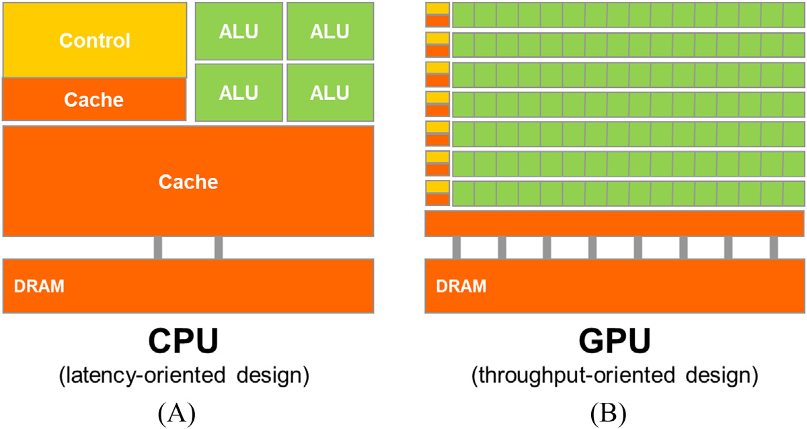
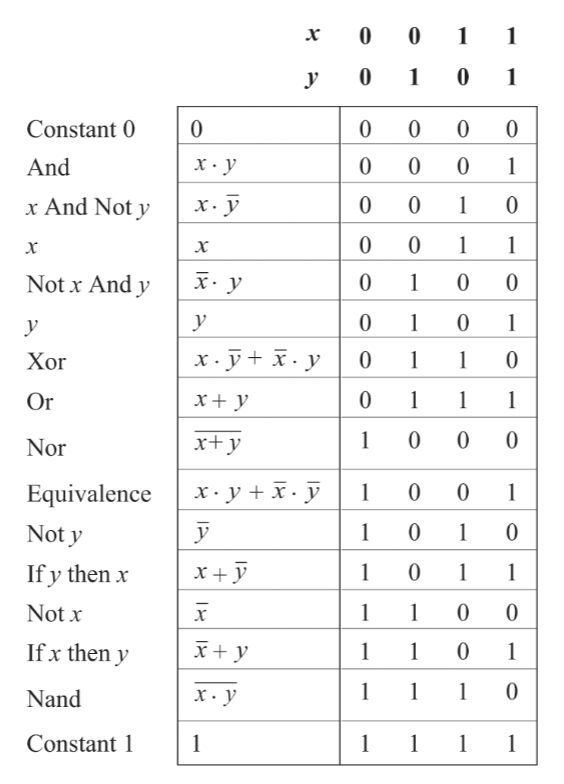

Following my working definition of beauty (truthful, open reflection of underlying character / properties / identity), I like computers as a potential beauty-machine. Build a beautiful beauty machine. Then, see it wander off into the New and Unpredicted. Fuck comfort. I am already dead when I recognize that the elusive self is the destination.
Build the beautiful machine, extend into it, let it extend into me.
There is a tech stack to map and integrate such that the result can be reflective of the universe.
I hate technicalities and nomenclature. Ugliness. The aim is to extract the principles, the self in the universe and the universe in the self.
To the unknown.

# Microprocessors

[TOC]

## Direction
## More refined

### Programming Massively Parallel Processors
(4th edition, Wen-mei W. Hwu, David B. Kirk, Izzat El Hajj)

#### 1. Introduction

##### Why massively parallel processors?

Because depending on the program
- massively parallel, throughput-orientied processors, commonly referred to as Graphics Processing Units (GPUs, graphics was their first leading application),
- latency-oriented, less parallel, general-purpose processors, traditionally referred to as Central Processing Units (CPUs, every computer has one),
- or a combination of both
could be fastest or most efficient.


*Cache = fast on-chip memory
DRAM = "slow" off-chip Dynamic Random Access Memory
Many CPUs also have a GPU on the same chip, which is less powerful than contemporanous, discrete ones.*

These approaches are distinct, because optimizing for low latency means
- sacrificing expensive chip area for
	- large caches for faster data access
	- control units for better utilization
	with diminishing returns
- increasing clock rate -> higher voltage -> exponentially higher power consumption

Throughput-oriented processors use the chip area for more processing units at lower clockrates and implement parallel memory access. This leads to much higher throughput for similar cost and power consumption.

Low latency is best for sequential programs, were each step depends on the previous one.
Many tasks in simulation, graphics processing and machine learning inherently offer potential for parallelization and so, can benefit from throughput-oriented processors.

Graphics processing because each pixel can often be treated independently.
machine learning because it involves many matrix multiplications that can be done in parallel.
simulation because many particles have to account for the same forces and so, the same calculation

##### How will reading this help?

It's a guide on using GPUs effectively, which requires careful, application specific management of their many processing units and small caches and cooperation with the CPU.
Various, reportedly similar, programming models exist to accomplish this and here, Nvidias Compute Unified Device Architecture (CUDA) will be used. It works on Nvidia GPUs only, is the best performing and most widely used.

## Less refined

GPUs bottom up
I know why they are built.
actually I don't because I don't know how CPUs use their Caches and Control Units and higher clock rates to improve performance.
leaving aside exact implementation, how are GPUs organized so I can benefit from them optimally?
how precisely do I program them?

organized around streaming multiprocessors and memory hierarchy
so they can cooperate: share memory for speed and synchronize (for?)

- grid -> (blockCluster ->) block -> thread.
- warps are more hardware related and translate threads to the cores?

### 2. Heterogenous data parallel computing

2.1 Data parallelism
- data parellelism where I can treat individual data points independetly to a varying degree. example: converting image to grayscale. data parellelism is main source of parallelism because the intereting applications use large amounts of data (simulation, image recognition (? matrix multiplication))
- task parallelism (to be explained more later) means splitting up a task into multiple independent ones. data parallelism is a simpler special case of task parallelism
- code is being reorganized to be executed around the new data structure

2.2 CUDA C program structure
- framework vs programming model
	- framwork provides specific functino, programming model more like a way to think about program and data structure (warps, block, threads)
- kernel (seed) vs function. its a function that is "launched" onto the GPU and executed for each thread
- cuda c extends normal c (standard / ANSI C) with keywords, some new syntax and functions to run stuff on the GPU. all normal c code runs on CPU
- host and device code somehow cooperate. the host launches (kernel) a grid of threads
- cuda threads are sequential programs with a program counter and its variables. (each thread runs the same program but effectively has an id as defined by predefined variables that differ for each thread)
- Generating and scheduling threads on GPU is very fast. Not on CPU. kernels tend to be simple and can just be copied into the threads. context switching is also extremely fast on GPU for latency hiding.
- On CPU what if I open more threads than are available on the CPU? they are switched into the physical threads

2.3 vector addition kernel CPU
- conventional c host code
- declaring pointers is with `float *P;`, accessing address of a variable with `int *addr = &V` and getting the item at the pointer with `float V = *P`
- subsequent statements in the main function can use the output `C`
- getting ~20 MFLOPS on CPU
- the following code for on-device computation will practically outsource this part, but its inefficient because it will be moving a lot of dta around which is slow.
- it will allocate memory on device and move the arrays there, then run the kernel, then free device vectors

```c
#include <stdio.h>
#include <time.h>

void vecAdd(float* A, float* B, float* C, int n) {
    for (int i = 0; i < n; i++) C[i] = A[i] + B[i];
}

int main() {
    // initialize vectors
    int n = 5;
    float A[n] = {1.2, 3.1, 0.7, 1.6, 2.5};
    float B[n] = {3.0, 2.7, 0.3, 1.3, 2.2};
    float C[n];
    
    // kernel
    struct timespec start, end;
    clock_gettime(CLOCK_MONOTONIC_RAW, &start);
    vecAdd(A, B, C, n);
    clock_gettime(CLOCK_MONOTONIC_RAW, &end);

    // results
    for (int i = 0; i < n; i++) printf("%.2f + %.2f = %.2f\n", A[i], B[i], C[i]);
    printf("Wall clock time: %.9fs\n", ((end.tv_sec - start.tv_sec) + (end.tv_nsec - start.tv_nsec) / 1000000000.0));

    return 0;
}
```

the code will compiled into binary so the cpu can execute it

2.4 Device global memory and data transfer
- cudaMalloc and cudaFree
- cudaMalloc assigns to the argument pointer (`void **`) and returns possible errors. so there is need for the cudaCheck function.
- A_h and A_d for host and device
- the vecAdd function that allocates, copies and copies back and frees is called *stub* for calling a kernel.
- error checking macro

2.5 Kernel functions and threading
- the kernel functions will be written in SPMD style (single program multiple data).
- grid -> block -> thread
- 1 block = 1024 threads max
- threadIdx and blockidx for thread id
- what is ANSI C? CUDA C is an extension of ANSI C
- globa, host and device keywords for kernel functions.
- global kernel function = new grid. 
- grid of threads = loop (loop parallelism)
- boundary checking

2.6 Calling kernel functions
- execution configuration parameters
- cannot make assumptions about execution order
- some gpus will work through it in smaller pieces than others
- language needs a compiler. NVCC produces host code (gcc?) and device code (PTX -> binary)
- what is the purpose of just in time compilation?

2.7 Compilation
- needs a different compiler
- to virtual binary files (PTX)
- runtime component of nvcc translates to "real object files" to be executed on GPU. but in the illustration its called "device just-in-time compiler"

### The Elements of Computing Systems: Building a Modern Computer from First Principles
(second edition - Noam Nisan, Shimon Schocken)

>What I hear, I forget; What I see, I remember; What I do, I understand.
—Confucius (551–479 B.C.)

#### Hardware

- Church-Turing conjecture that all computers are essentially the same. It does not matter which computer is implemented here.
- good modular design -> module are truly independent and can be treated as black boxes by users.
- NAND Gates can implement any computer
- general road is bottom up but each chapter is top down, goal -> implementation

#### 1. Boolean Logic

A truth table shows all possible input combinations and their desired output.
Any truth table can be implemented. Using a subset of simple logic gates. One is {And, Or, Not}, but Nand or Nor can do it too.

various functions (defined in truth tables or other forms) exist. Possible boolean functions for n binary inputs is ${2}^{2^{n}}$. and some have names, like here with two inputs:



Testing complex chip implementation completely is infeasible, so they test on a subset.

### The Art of Electronics
(Paul Horowitz, Winfield Hill, 2015)

(there are many ways to implement logic gates but electronics seems to be the dominant one, so on to electronics!)

In some substrates, there are electrons loosely bound to their atom cores. They are presumably far away from it.
If there is an electron surplus on one side and an electron deficit on the other, they will leave their atom and flow in the direction of the deficit. Electrons are said to be negatively charged. They repell each other (away from the surplus) and are attracted to positive charge (towards the deficit, where positively charged protons outweigh the electrons).
An imbalance in electrons can be generated in various ways. One is rubbing certain materials and for some reason the heat will cause some electrons from one material to jump to the other.
The actual electron flow is slow, but the "wave" (electromagnetic wave) travels at 50-99% light speed.
More loose electrons = better conductor.
Resistors, sometimes made from both conductors and insulators impede flow by forcing barriers into the path. Here, energy is lost and heat emitted.

Rate of flow $I$ = current \[charge/second or "amps A"] ("I" from "intensity" which is only confusing. Also charge is measured in coulombs, which is equivalent to a bunch of electrons)
"pressure" $V$ = voltage \[energy/charge or "volts V"]. Always applies between two points. There is no such thing as absolute voltage. There is an amount of energy per electron, called electronvolt. Moving electrons around requires non-linear energy. so energy/charge increases as the delta energy increases.
There any connection to batteries charging slowly?
resistance indicating how much the material impedes flow $R$ \[ohms $\Omega$ or Joule-seconds/charge² which is not intuitive at all!]
also conductance \[Siemens $S$] which is just inverse of resistance.
Power $P$ neatly fit into place with $V*I$ being giving energy / second or Watts $W$.

Then kirchhoffs laws
and ohms law
(observations)
which together explain parallel and series circuits' behaviour

? maxwells equations -> eletromagnetism
? coulombs law for forces between charged stuff


### Research

GPU PCBs are huge but mostly data storage and delivery, power transformation and delivery and other I/O in support of the core. The Voltage Regulator Modules (VRMs) emit notable heat.
Non Founders Edition cards offer more powerful cooling and sometimes electrical robustness and smallness.

Trying to verify ALU percentage on chip area, but ALUs are too small to differentiate easily?
[Intel Raptor Lake microarchitecture](https://en.wikichip.org/wiki/intel/microarchitectures/raptor_lake)
[Intel Alder lake-S good annotation](https://hothardware.com/news/intel-raptor-lake-huge-cache-upgrade-for-gaming)

*H100 die. "squares" are streaming multiprocessors (144). Darker areas between are mostly L3 Cache.*
[H100 Tensor Core GPU Architecture](https://resources.nvidia.com/en-us-tensor-core)

[Understanding the anatomy of GPUs using Pokémon](https://blog.ovhcloud.com/understanding-the-anatomy-of-gpus-using-pokemon/)
[Reddit Books for GPU arch](https://www.reddit.com/r/GraphicsProgramming/comments/1871frx/books_for_gpu_arch/)

Learning the Art of Electronics
The Art of Electronics
https://www.tinkercad.com/circuits

Different implementations. See how (if) they differ fundamentally (all switch based implementations seem similar)

