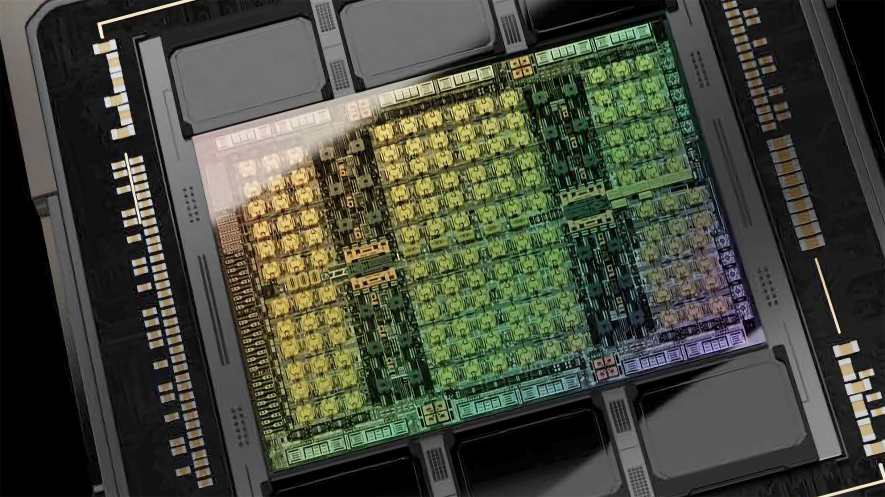

# Programming massively parallel processors (summary and comments)

[TOC]

## Direction
## More refined

### 1. Introduction

#### Why massively parallel processors?

Because depending on the program
- massively parallel, throughput-orientied processors, commonly referred to as Graphics Processing Units (GPUs, graphics was their first leading application),
- latency-oriented, less parallel, general-purpose processors, traditionally referred to as Central Processing Units (CPUs, every computer has one),
- or a combination of both
could be fastest or most efficient.

*ALU = Arithemtic Logic Unit, where the actual computation happens
DRAM = Dynamic Random Access Memory (off-chip)
Many CPUs also have a GPU on the same chip, which is less powerful than contemporanous, discete ones.*

These approaches are distinct, because optimizing for low latency means
- sacrificing expensive chip area for
	- large caches for faster data access
	- control units for better utilization
	with diminishing returns
- increasing clock rate -> higher voltage -> exponentially higher power consumption

Throughput-oriented processors use the chip area for more processing units at lower clockrates and implement parallel memory access. This leads to much higher throughput for similar cost and power consumption.

Low latency is best for sequential programs, were each step depends on the previous one.
Many tasks in simulation, graphics processing and machine learning inherently offer potential for parallelization and so, can benefit from throughput-oriented processors.

#### How will reading this help?

It's a guide on using GPUs effectively, which requires careful, application specific management of their many processing units and small caches and cooperation with the CPU.
Various, reportedly similar, programming models exist to accomplish this and here, Nvidias Compute Unified Device Architecture (CUDA) will be used. It works on Nvidia GPUs only, is the best performing and most widely used.

## Less refined

### 2. Heterogenous data parallel computing
### Research

#### Architecture

[Intel Raptor Lake microarchitecture](https://en.wikichip.org/wiki/intel/microarchitectures/raptor_lake)
[Intel Alder lake-S good annotation](https://hothardware.com/news/intel-raptor-lake-huge-cache-upgrade-for-gaming)

[H100 Tensor Core GPU Architecture](https://resources.nvidia.com/en-us-tensor-core)
[Understanding the anatomy of GPUs using Pokémon](https://blog.ovhcloud.com/understanding-the-anatomy-of-gpus-using-pokemon/)
[Reddit Books for GPU arch](https://www.reddit.com/r/GraphicsProgramming/comments/1871frx/books_for_gpu_arch/)
