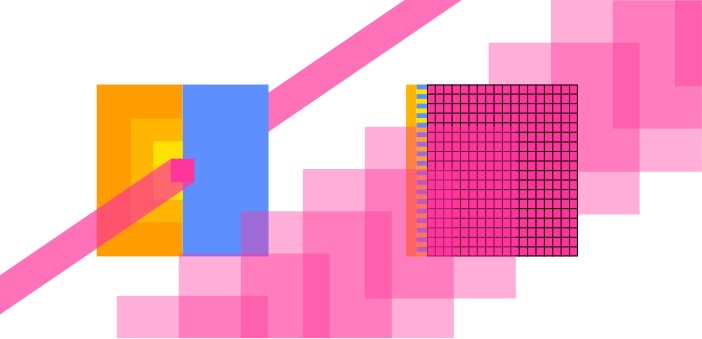

Colonize computing substrates.

Map, integrate and rebuild the tech stack to be reflective of the universe.
Extract principles, the self in the universe and the universe in the self.

# Towards Computation

[TOC]

## Direction

From top down:

- How does AI work? [Andrej Karpathy](https://karpathy.ai/zero-to-hero.html)
- [tinygrad](https://tinygrad.org/) seems to build a beautiful, integrated tool to build AI. To help build it, deep knowledge of computers seems helpful (Optimizing abstration layers and performance)
- How do computers work on a high level? [Nand to Tetris](https://www.nand2tetris.org/)
- How would I use CPUs and GPUs for AI without tinygrad? Programming massviely parallel computers (4th edition, Wen-mei W. Hwu, David B. Kirk, Izzat El Hajj)
- How do electronics work? [The Art of Electronics](https://artofelectronics.net/) and [Learning the Art of Electronics](https://learningtheartofelectronics.com/)
- How are electronics built?
- How is silicon refined, crystallized, doped and etched?
- How does this compare to other computing substrates? Brain, optical and quantum computing?

Rebuild from bottom up!

## More refined

## Less refined

Mechanisms that can control propagation of a signal depending on their state and that can change their state depending on another signal can be used for computers. = they can form systems that convert any input signals into any output signals.
Arrange the mechanism such that it is the most useful and dense (fast, efficient), translator.
Spirits resemble such mechanisms. Bacteria, plants, brains, humans, computers, companies, countries, ecosystems.
They can choose to merge/become coherent. Software enables extreme plasticity.

Different computing substrates are unified under hardware description languages, which define connections between given logical units to form desirable larger logic behavior.
Implementation is expensive, so most hardware is designed to be general: provides basic functions that follow a series of stored instructions (software). Various languages exist to help humans state their wishes in terms of those instructions.

---

Hardware description language
Depending on the implementation, various basic building blocks may be available. Mechanical adders or square root calculators, transistors, or gates like NAND, OR, AND, NOT.
HDL expresses connections between these. No speak of electrons, but bits, gates, clocks and busses.
Bits is information spread into multiple signals like (1101 = 13), instead of single 13 signal. For flexibility?
Gates are commonly used arrangements. Truth table of all possible gates with two binary inputs:

| x:<br>y:    | 0<br>0 | 0<br>1 | 1<br>0 | 1<br>1 |
| ----------- | ------ | ------ | ------ | ------ |
| constant 0  | 0      | 0      | 0      | 0      |
| And         | 0      | 0      | 0      | 1      |
| x And Not y | 0      | 0      | 1      | 0      |
| x           | 0      | 0      | 1      | 1      |
| Not x And y | 0      | 1      | 0      | 0      |
| y           | 0      | 1      | 0      | 1      |
| Xor         | 0      | 1      | 1      | 0      |
| Or          | 0      | 1      | 1      | 1      |
| Nor         | 1      | 0      | 0      | 0      |
| Equivalence | 1      | 0      | 0      | 1      |
| Not y       | 1      | 0      | 1      | 0      |
| If y then x | 1      | 0      | 1      | 1      |
| Not x       | 1      | 1      | 0      | 0      |
| If x then y | 1      | 1      | 0      | 1      |
| Nand        | 1      | 1      | 1      | 0      |
| Constant 1  | 1      | 1      | 1      | 1      |

Signal propgation takes some time until the output stabilizies (adding 15 and 17 might initally output 22 before carrying over 1 and stabilizing at 32). Clocks exist to fetch the data only when it is expected to have stabilized. They periodically change their output between 0 and 1. Storage will only accept input if the clock is on a 1 cycle. The clock is timed such that any calculation can stabilize during the 0 cycle. They also help synchronized processes. Desktop consumer processors today reach 5 GHz clockrates.




Latency-oriented vs throughput-orientied processors.
Latency is reduced through:
- large on-chip caches (L1, L2, L3 = yellow) for faster data access
- large control units (blue) for better utilization
- higher clockrates
each with diminishing returns.

Throughput-oriented processors use the chip area for more processing cores (magenta) at lower clockrates, saving power. The cores require fast, parallel memory access to stay fed.


Hardware implementation
Signal propagation speeds: Flowing water ~ tens of m/s. Soundwaves in solids ~ thousands of m/s. Electromagnetic signals approach the speed of light ~300,000,000 m/s. Quantum entanglement allows instant transmission of information?

Electronics
They went outside and found that some stuff repels or attracts other stuff: Two groups of stuff attract each other but repel members of the same group and still nobody knows why. + and - charges.
If I wiggle a charge, it takes some time for charges nearby to react. As if a signal travelling at 300,000,000 m/s lets them know.
How to derive that they flow?
How to make them flow?
How to build transistors?
How are these ideas embedded today?

In some substrates, there are electrons loosely bound to their atom cores. They are not part of a bond and are presumably far away from the core.
If there is an electron surplus on one side and an electron deficit on the other, they will leave their atom and flow in the direction of the deficit.
More loose electrons = better conductor.
Resistors, sometimes made from both conductors and insulators impede flow by forcing barriers into the path. Energy is converted to heat.

In a silicon crystal, there are no free electrons.
It is possible to replace some silicon atoms with others that will either have free floating electrons or too few electrons to connect in the grid and will thus produce an electron hole. Both materials thus become conductors. They remain electrically neutral.
If placed next to each other, some free electrons flow to over to fill the electron holes. But now there is an electron imbalance that wants them to flow back. This prevents all free electrons filling the holes in the other material.
If more electrons are added to the side of free floating electrons and a deficit connected to the other side. The side which lack electrons will lack even more and the side that has them will have even more and quickly the pressure is large enough for electrons to jump float through the non-conductive gap.
In the other direction, electrons will first fill the electron holes and on the other side they will be sucked out, effectively eliminating charge carries and widening the non-conductive gap (depletion zone). Only if a large voltage is applied, do electrons flow again.
(Diode)
Transistors can be built from an n-p-n arrangement (or p-n-p) where each n-p or p-n interface has a depletion zone and so, is a diode. No electrions flow unless a large voltage is applied. (source, drain).
Between source and drain is a capacitor (gate), that if activated sucks electrons in (or out) of the depletion zone and that creates a small channel where charge can flow freely.

### The Elements of Computing Systems: Building a Modern Computer from First Principles
(second edition - Noam Nisan, Shimon Schocken)

>What I hear, I forget; What I see, I remember; What I do, I understand.
—Confucius (551–479 B.C.)

#### Hardware

- Church-Turing conjecture that all computers are essentially the same. It does not matter which computer is implemented here.
- good modular design -> module are truly independent and can be treated as black boxes by users.
- NAND or NOR Gates can implement any computer
- general road is bottom up but each chapter is top down, goal -> implementation

#### 1. Boolean Logic

Possible boolean functions for n binary inputs is ${2}^{2^{n}}$. and some have names, like here with two inputs:

Testing complex chip implementation completely is infeasible, so they test on a subset.

### 2. Heterogenous data parallel computing

2.1 Data parallelism
- data parellelism where I can treat individual data points independetly to a varying degree. example: converting image to grayscale. data parellelism is main source of parallelism because the intereting applications use large amounts of data (simulation, image recognition (? matrix multiplication))
- task parallelism (to be explained more later) means splitting up a task into multiple independent ones. data parallelism is a simpler special case of task parallelism
- code is being reorganized to be executed around the new data structure

2.2 CUDA C program structure
- framework vs programming model
	- framwork provides specific functino, programming model more like a way to think about program and data structure (warps, block, threads)
- kernel (seed) vs function. its a function that is "launched" onto the GPU and executed for each thread
- cuda c extends normal c (standard / ANSI C) with keywords, some new syntax and functions to run stuff on the GPU. all normal c code runs on CPU
- host and device code somehow cooperate. the host launches (kernel) a grid of threads
- cuda threads are sequential programs with a program counter and its variables. (each thread runs the same program but effectively has an id as defined by predefined variables that differ for each thread)
- Generating and scheduling threads on GPU is very fast. Not on CPU. kernels tend to be simple and can just be copied into the threads. context switching is also extremely fast on GPU for latency hiding.
- On CPU what if I open more threads than are available on the CPU? they are switched into the physical threads

2.3 vector addition kernel CPU
- conventional c host code
- declaring pointers is with `float *P;`, accessing address of a variable with `int *addr = &V` and getting the item at the pointer with `float V = *P`
- subsequent statements in the main function can use the output `C`
- getting ~20 MFLOPS on CPU
- the following code for on-device computation will practically outsource this part, but its inefficient because it will be moving a lot of dta around which is slow.
- it will allocate memory on device and move the arrays there, then run the kernel, then free device vectors

```c
#include <stdio.h>
#include <time.h>

void vecAdd(float* A, float* B, float* C, int n) {
    for (int i = 0; i < n; i++) C[i] = A[i] + B[i];
}

int main() {
    // initialize vectors
    int n = 5;
    float A[n] = {1.2, 3.1, 0.7, 1.6, 2.5};
    float B[n] = {3.0, 2.7, 0.3, 1.3, 2.2};
    float C[n];
    
    // kernel
    struct timespec start, end;
    clock_gettime(CLOCK_MONOTONIC_RAW, &start);
    vecAdd(A, B, C, n);
    clock_gettime(CLOCK_MONOTONIC_RAW, &end);

    // results
    for (int i = 0; i < n; i++) printf("%.2f + %.2f = %.2f\n", A[i], B[i], C[i]);
    printf("Wall clock time: %.9fs\n", ((end.tv_sec - start.tv_sec) + (end.tv_nsec - start.tv_nsec) / 1000000000.0));

    return 0;
}
```

the code will compiled into binary so the cpu can execute it

2.4 Device global memory and data transfer
- cudaMalloc and cudaFree
- cudaMalloc assigns to the argument pointer (`void **`) and returns possible errors. so there is need for the cudaCheck function.
- A_h and A_d for host and device
- the vecAdd function that allocates, copies and copies back and frees is called *stub* for calling a kernel.
- error checking macro

2.5 Kernel functions and threading
- the kernel functions will be written in SPMD style (single program multiple data).
- grid -> block -> thread
- 1 block = 1024 threads max
- threadIdx and blockidx for thread id
- what is ANSI C? CUDA C is an extension of ANSI C
- globa, host and device keywords for kernel functions.
- global kernel function = new grid. 
- grid of threads = loop (loop parallelism)
- boundary checking

2.6 Calling kernel functions
- execution configuration parameters
- cannot make assumptions about execution order
- some gpus will work through it in smaller pieces than others
- language needs a compiler. NVCC produces host code (gcc?) and device code (PTX -> binary)
- what is the purpose of just in time compilation?

2.7 Compilation
- needs a different compiler
- to virtual binary files (PTX)
- runtime component of nvcc translates to "real object files" to be executed on GPU. but in the illustration its called "device just-in-time compiler"

### fastai diffusion

[PART 2: deep learning foundations to stable diffusion 2022](https://www.youtube.com/playlist?list=PLfYUBJiXbdtRUvTUYpLdfHHp9a58nWVXP)

1. have a classification that says how much something corresponds to the target
	- add noise to targets and train a neural net to predict what noise was added
2. get gradient for every pixel of the input
3. update pixel

*Unet*: input: some noisy image. output: the noise

Use an *autoencoder* to reduce image size before training the unet. unet now predicts the noise in the *latents* (encoded images). use autoencoder's decoder to get high res image again.
[AE vs VAE](https://towardsdatascience.com/difference-between-autoencoder-ae-and-variational-autoencoder-vae-ed7be1c038f2)

LABELS

add image label to the input for unet training. Makes it easier for unet to predict noise. Now, I can input label + noise and it starts to find noise that leaves an image equal to my label.

label needs encoding to be non-specific. "beautiful swan", "nice swan", "graceful swan" should return similar images. Training the network on every wording leads to combinatorial explosion.

Instead: train a network to encode images and their labels with a similar vector. Then, since, slight differences in wordings lead to the similar images, the network understands their similarity and can interpolate usefully.

the image vector and its label's vector should be similar. Their vector should be dissimilar to other image or text embedding vectors.
Calculate similarity of two vectors: dot product (= higher if more similar)

loss function (in this case higher = better) = dot product of matching image+label - dot product of non-matching image+label
(= *contrastive loss*)
models used in this case for image and text encoding : CLIP (contrastive loss IP(?))

network being *multimodal*: similar embeddings in different modes

model does not know how to improve on a finished image if it turned out wrong. needs to add noise, then redo.

### Research

#### Electronics

Learning the Art of Electronics
The Art of Electronics
https://www.tinkercad.com/circuits

Paul Drude model of electricty pretends that electrons are discrete mechanical objects. This works, but really they are quantum particles.


#### Chips

GPU PCBs are huge but mostly data storage and delivery, power transformation and delivery and other I/O in support of the core. The Voltage Regulator Modules (VRMs) emit notable heat.
Non Founders Edition cards offer more powerful cooling and sometimes electrical robustness and smallness.

Trying to verify ALU percentage on chip area, but ALUs are too small to differentiate easily?
[Intel Raptor Lake microarchitecture](https://en.wikichip.org/wiki/intel/microarchitectures/raptor_lake)
[Intel Alder lake-S good annotation](https://hothardware.com/news/intel-raptor-lake-huge-cache-upgrade-for-gaming)

*H100 die. "squares" are streaming multiprocessors (144). Darker areas between are mostly L3 Cache.*
[H100 Tensor Core GPU Architecture](https://resources.nvidia.com/en-us-tensor-core)

[Understanding the anatomy of GPUs using Pokémon](https://blog.ovhcloud.com/understanding-the-anatomy-of-gpus-using-pokemon/)
[Reddit Books for GPU arch](https://www.reddit.com/r/GraphicsProgramming/comments/1871frx/books_for_gpu_arch/)

#### AI

Backpropagation described here:
[Andrej Karpathy: Neural networks: Zero to Hero](https://www.youtube.com/playlist?list=PLAqhIrjkxbuWI23v9cThsA9GvCAUhRvKZ)
[Wolfram Alpha to look up functions for derivatives](https://www.wolframalpha.com/).
[Linear layers, convolutional neural networks and optimizers](https://ml4a.github.io/ml4a/)

-  [https://course.fast.ai/](https://course.fast.ai/)
	- The book: [https://github.com/fastai/fastbook/blob/master/01_intro.ipynb](https://github.com/fastai/fastbook/blob/master/01_intro.ipynb)
	- [course](https://course.fast.ai)
	- [forums](https://forums.fast.ai)
	- [youtube part 1](https://www.youtube.com/playlist?list=PLfYUBJiXbdtSvpQjSnJJ_PmDQB_VyT5iU)
	- [youtube part 2](https://www.youtube.com/playlist?list=PLfYUBJiXbdtRUvTUYpLdfHHp9a58nWVXP)
- [essential libraries: numpy, matplotlib, pandas, pytorch](https://wesmckinney.com/book)
- [https://huggingface.co/learn/nlp-course/chapter1/1](https://huggingface.co/learn/nlp-course/chapter1/1)
- sympy: symbolic processing?
- wolfram alpha
- higher level papers by Joscha Bach
- [Transformers](https://www.youtube.com/watch?v=wjZofJX0v4M&vl=en)
- [Assembly](https://www.nayuki.io/page/a-fundamental-introduction-to-x86-assembly-programming)
- How does long term memory emerge? How is information stored in the brain? LSTMs

A Path Towards Autonomous Machine Intelligence (Yann Lecun)
Model Predictive Control MPC
hierarchical planning - no AI system does this so far except implementing by hand
generative adversarial network  GAN

LLM Security threats Promt insertion, jailbreak, data poisoning

Robot:
step motor, brushless motor -> more complicated control (servos?), brushed motor
harmonic reducers, planetary gearboxes
[building a robot arm](https://www.youtube.com/watch?v=F29vrvUwqS4)
I should be able to fist bump the robot hard, so it flies back but catches itself.

perceptual loss?