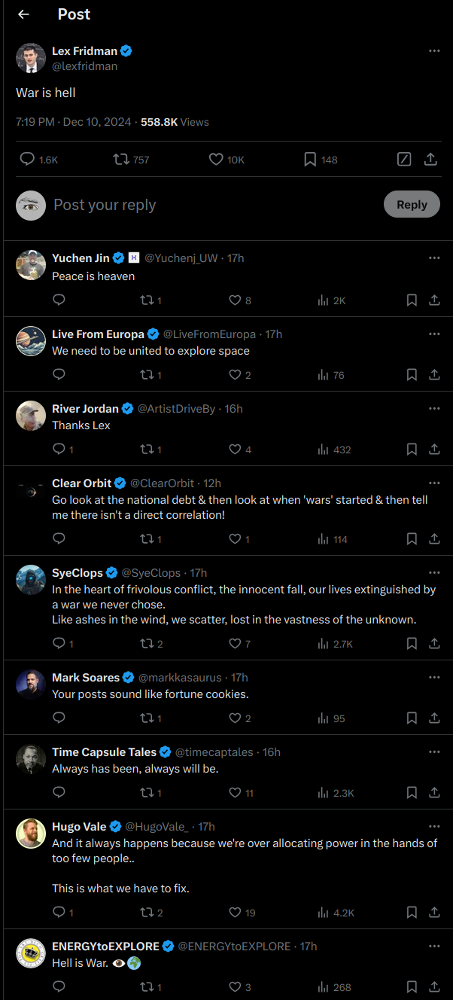
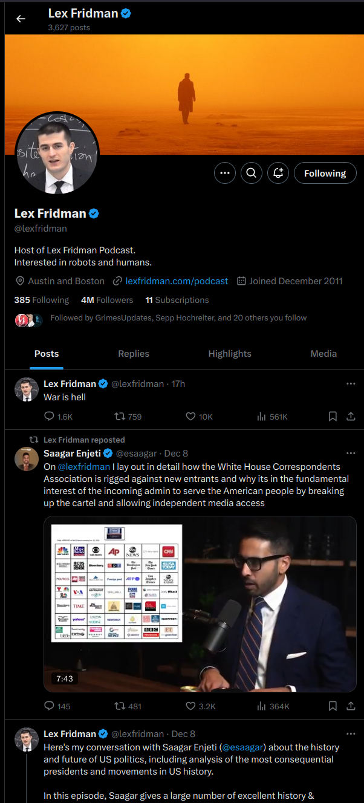
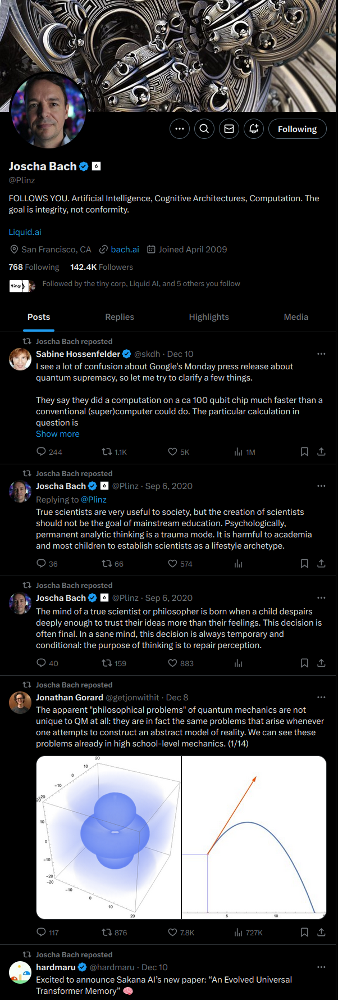
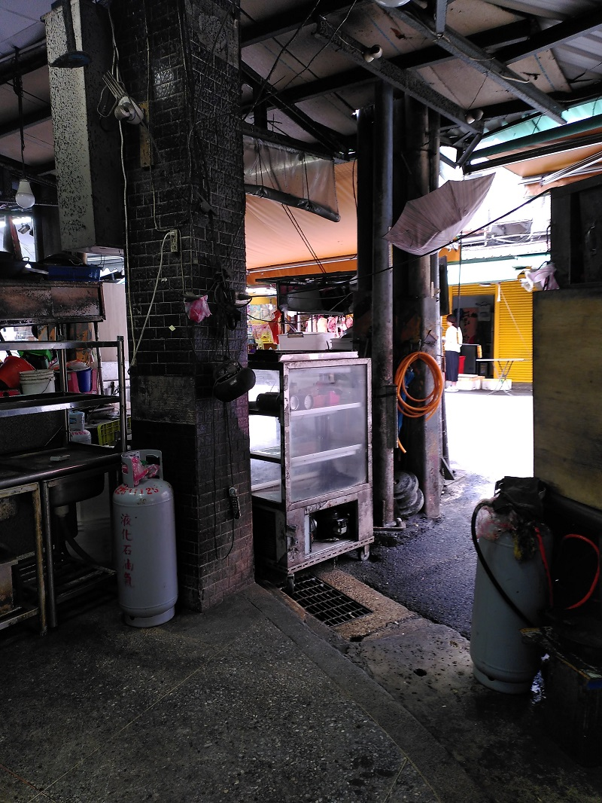

i can see the hive mind on the horizon.
there are hammers, sculptors, hammer blows and sculptures.
grouped and isolated
places to stay.

like gazing into a painting, being guided through the impression
coming along to find a question asked at myself, seeing it unfold and building a response

# Towards spirit stream

[TOC]

### Direction

## More refined

### Site structure

- H1 Aspirational spirit stream of Lorin Baumgarten
- Introduction
- Quick Guide
- List of notes sorted by "most recently modified"
	- note structure:
		- Text describing why the note exists
		- H1 Title
		- list of contents
		- H2 Direction
		- H2 more refined
		- H2 less refined - current thoughts, multiple different paths being explored, for more complete synchronization. 
- guiding philosophy

### Stream components derivation

Senses explore, parse, filter
Stream of consciousness repeats patterns from
chaotic and far-reaching
to filtered and coherent knowledge
to actionable, linearized and accessible stories

In writing, graphs, images, products
and the tools to build them
in progress
from memory

Share the process in truth to
test, be surprised, dance, reproduce, join the cutting edge, offer, cohere, support, punish
into common languages per context
into any scopes
with any conditions

Where I am,
When I am.

## Less refined

### Components

- Scrape, filter
- Writing and viewing bits that are grouped into "files" (patterns) along (at least) 3 axes: resolution, completion, age. These dimensions may use a:
- General framework for organization: files, tags, paths lead to the overlap between files, folders/links (graph file sytem. tags that have tags,... that have links to files). Becomes circular through backlinks and possible references from inside the file. Allow linking anything. Images, text, make super easy.
- Simple export into self contained copies
- (opt.) version control: extend, branch, merge and view changes. Version history is a graph of graphs

- compile into optimized formats (HTML)
- File encryption
- Analytics + docs = Interface to the machine
- Compatibility with most hardware to get closer to the user for convenience. (phone, emebedded devices)

- share on static server: SSH, HTTPS, IPFS(?), streaming (SRT?), API
- Dynamic server: authenticate into permission groups + opt. meet conditions (paywall, forms, etc.) to view some content. APi should allow for relaying: Watching a stream from my site but my server is too slow to serve it? Relay to other people -> take load of my server -> get better connection yourself!

### Next version

- link based filesystem
  files are folders linking to more files. have backlinks too. files are tags to the linked files. search through files shared by the target (links, or backlinks). give api to get size of files in a particular selection
- history can only exist per file and is an interface on top of the filesystem. links in files link to the latest version without specifying the version. if automatically generated / updated links change, note this in the commit api and optionally add those files to history.
- Interface: programmatically produce list of backlinks! and forward links by search. some code generates one-time, as a shortcut. some generates every time the file is displayed. like link lists. create a code cell like in jupyter notebook. some display the code too.
- text interface like cli: search bar, commands, answer questions
- database stores links for faster access
- .md -> HTML
	- inputs: path, (permission group)
	- settings: css, frame
	- (filter links to files outside permission (note this in cache))
	- convert md, put into frame
	- add css
	- output: html
- Dynamic HTTP server
- Authentication
- API to get raw files / folder structure

1. flatten website / vault
2. remove "smartness"
3. link database, link based filesystem api
4. history api

### Dumping on X

The social media I know are mostly incoherent
They bet on an algorithm to *always* feed me *engaging* scraps from someone.
Some scraps are large, long form podcasts.
Each account is a scrap factory.
Consider this post from the highly respectable Lex Fridman and the responses:

Utter crap and I am sad to have spent time reading this.
Without context, such (all visible) statements appear arbitrary and are virtually worthless.
Assuming I disagree with any of the visible statements, where would I find an explanation? A sincere mind exploring its meaning? On his profile?

If I wanted to listen to his podcasts, youtube offers a significantly superior interface - many small tiles, one per podcast.
The best use of this platform I have found is as a torrent of near-random ideas, a glimpse into what bothers humans on their toilet breaks.
Even the most enjoyable profile I know is a stream of scraps, each pointing in different directions:

Presumably, in X's endgame, the incoherence problem is solved by an allmighty algorithm that collects and connects, maybe translates information from everywhere into the most valuable personalized package and delivers it directly into my perception. Similarly, it would collect information from me into its X-the-everything-app-database.
X owns the algorithm and the data.
I am unaware of sites that function fundamentally differently. Even reddit or discord.

In this spirit I am invited to produce scraps. I happen to have no desire to produce scraps. I perceive it as wasteful to produce new scraps every time my opinion or work evolves and instead would like to keep building towards something increasingly coherent.

Regarding this image, I previously noted:

>These abandoned buildings emitted an aura of great adventure. Ironically? Similar to buildings under construction, they are asking to be used, transformed, to become part of a new story. As they become "finished", this aura weakens, they become "boring". Their (unnecessary?) shiny finish discourages major modification, like drilling into or erecting new walls.
>
>Think solar panels. theoretically, they need sun+cables+box that could stand anywhere. In the "finished" homes that I know, this is (unnecessarily?) more complicated. Access to the roof? Facade mounting possible? Get cables by the window inside? Need approval from all other residents?
>What of this makes practical sense? Is it mostly a social problem? Is it solved by having virtual clones that can negotiate for people cheaper and quicker so people can live where their spirit aligns more with the opportunities of the environment?
>
>It seems that a larger precentage of things in that ("abandoned") environment are beautiful to me, compared to "nice, calm, high living standard" environments. They become too "nice" and they disgust me, make me want to leave or destroy them.

Also applies to different places like these:

I see their potential for transformation and their openness to colonization by my spirits.
Humans are part of the environment that I want to extend into. To cohere and build with.
Part of this is a stream of new and foreign ideas, but most of it is building:

> i can see the hive mind on the horizon.
> there are hammers, sculptors, hammer blows and sculptures.
> grouped and isolated
> places to stay.
> 
> like gazing into a painting, being guided through the impression
> coming along to find a question asked at myself, seeing it unfold and building a response

The allmighty X algorithm may eventually facilitate this. But it will have to construct and maintain coherent "rooms" from scraps. Seems inefficient.

Instead make it easy to build rooms to reflect myself and make them easy to interconnect so they can take on virtually arbitrary size. Coherence from bottom up?

### other

markdown
- links to files with `![]` and just paste their contents like with images, depending on file type

- dyanmic rendering + cache

database
- tags
	- permission groups
	- encrypted (raw=renders decrypted file site on client)
- users
	- permission groups
	- passwords
- shared links, their scope and expiration
- logs

UI
file browser:
- download (raw) folder / selection
- selection, file name, created, modified, tags, raw
- generate share link
home
- only place to open file browser, which is a full screen site that expands to the right and down
- contact
- payment
- links to top level folders
- most recently changed files and what changed
- login
top row in file
- go to top button, where the index is too, so can reference another heading easily.
- Entrance
- previous and next if usable
- path to file
- download file
- view raw

[ANSI codes](https://gist.github.com/fnky/458719343aabd01cfb17a3a4f7296797)

llms contain linguistic maps. they can draw the landscape for me if they know my maps too.
a language model that has not learned to answer questions tells stories.

TODO:
- choose a more sensitive font
- design to differentiate internal and external link
- clearer heading differentiation
- cli note for attachments that are out of use

| centralized                              | decentralized                                                         |
| ---------------------------------------- | --------------------------------------------------------------------- |
| mostly HTTPS, SSL certificate            | custom protocol, slow                                                 |
| no static address or hard to get -> DDNS | content addressing                                                    |
| domain                                   | web3 gateway or its undiscoverable = domain, DDNS                  |
|                                          | easily connectable to wallets                                         |
| everyone knows who I am                  | can be anonymous                                                      |
|                                          | servicing capability automatically expands if people host my stuff |
Ridiculous. Rarely useful, it seems. If the internet sucks, those responsible must be confronted directly, not joined by an inefficient alternative.

[git flavored markdown](https://docs.gitlab.com/ee/user/markdown.html)

[Karpathys ideal blogging platform](https://twitter.com/karpathy/status/1751350002281300461)
[file over app](https://stephango.com/file-over-app)

"lazy payment" - unrealized costs become realized when someone pays transaction costs.
optionally anonymously.

WYSIWYG
payment + PAYG

wikipedia
tor
interplanetary file system

disqus
plausible analytics
atom/rss

"Digital gardens"
[https://github.com/MaggieAppleton/digital-gardeners](https://github.com/MaggieAppleton/digital-gardeners)
[https://simonewebdesign.it/](https://simonewebdesign.it/)

[Python modules](https://docs.python.org/3/tutorial/modules.html)

C preprocessor
embedded programming
`puts` function for errors?
LLVM / CLANG
`make` files for easy compilation

non-hierarchical file system.
bytes, pointers -> pointers are bytes too and can store tags for their bytes.
files, tags. Tags are files too. So, structure defined by links.
How to navigate it?
design an entry point, link files like obsidian already supports it. Wikipedia.
Graph view is useless.
search files by how they are connected.
tags are unnecessary, they are literally a weak link
navigate through forward and backward links.
optionally select an overlap of multiple links. like ctrl-click to add to the group which must overlap.
the backlink that I come from should be highlighted
Information, however, becomes hierarchically organized as it matures. No problem. Hierachy is a subset of this system.
converting from hierarchy is easy. converting to hierarchy requires disambiguation: which link(s) should become the files folder(s)? Mutltiple folders means the file is copied.
drives are tags.
branches are tags.
snapshots from previous commits belong to the commit tag
omg
easy
git gives UI for merging files and tags, like from pull requests or other branches.
how to limit number of forward links while maintaining their precision? display them as searchable list. searchable also for overlap.

content addressing solves the streaming relay problem? Choose to relay and others automatically connect based on their connection cost.
optionally pay for relay
= IPFS, (filecoin(?))

messages are files automatically received and that I actively send out.
can be (are) grouped under tags depending on sender.

| Taken hierarchy path | forward links, some external |
| -------------------- | ---------------------------- |
| backlinks            | broken links                 |

- render images into ones that can load progressively
- if opening encrypted files, use client side javascript to ask for a key to decrypt them.

- generate links for sharing files and resolve them in requests
- block users that request too much or try passwords

sciter for html, css, js engine for UI

Talking about something is rather boring. The necessities of everyday life.
Talking with someone intensely feels like consciously using the interface to explore the landscape of the other persons mind. Much like testing an input output function for its shape. There is something behind the words, the face, the body. This is an offer to merge into coherence.
If there was a faster interface, its highest value would not be space for more stories to tell but space to negotiate and reach coherence. = Makes it easier to *understand* someone and reach mutually beneficial agreement.