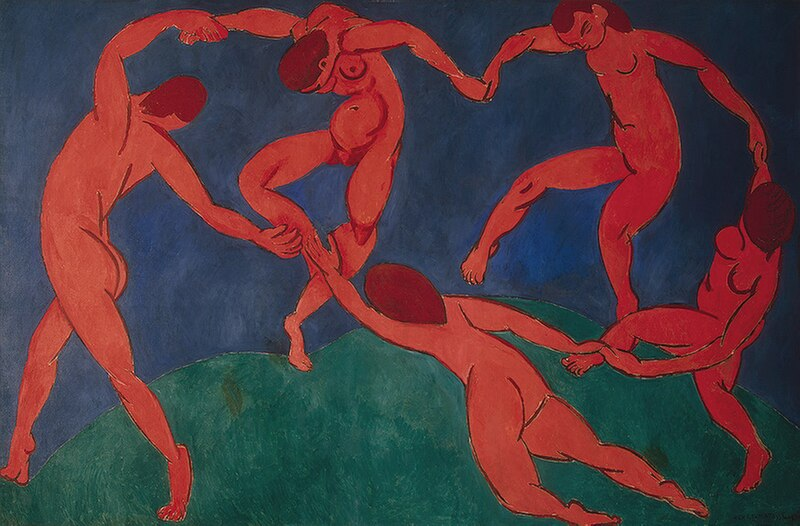

# Aspirational spirit stream of Lorin Baumgarten

Occasional stream of the spirits to the collective mind.
The spirits can be expected to be disagreeable, conscientious, open, reasonably stable and slightly introverted.
They are currently reachable through <a href="https://twitter.com/lorinbaumgarten">X</a> and  `me [at] lorinbaumgarten [dot] com`.

See note {{changes}} for current thought stream and history.
Source is also available on <a href="https://github.com/lorinbaum/lorinbaum.github.io">GitHub</a>.

{{sitelist}}

## Trying to do what I want and build tools that help
2024-11-08 08:53

*La Danse (Henri Matisse, 1910, State Hermitage Museum, Saint Petersburg, Russia)*

Paying open, precise attention to experience, I gain distance and loose track of the self, which is more of a reference point than a discrete perception. So *I* die and the world as sensed and my motivations - spirits - and my feelings and thoughts trying to make sense become less disitinguishable. Experience flows through me, perceptions lead to actions all by themselves. The moment - all that exists - is enough, no matter the pain, joy, fear or hope.
From this place, I bring back deep appreciation for experience and the uncontrolled flow of self into the world. It's that against destruction and apathy.

Negotiating between my spirits to form an approximately coherent dance is a great source of meaning and adventure.
All spirits are heard and integrated. There is no evil spirit to shut out, but there can be excess.
Integrity is happiest, strongest, most durable and adventurous. Its outcome is truly unknown, scary, exciting, much more interesting than lying propaganda to maintain arbitrary ideology.

On this open-outcome journey I value other spirits and tools that are true to their nature and who I can merge with, even temporarily.

Mine and all other spirits (humans, animals, plants, memes, programs) compete for existence. Long term, free market always wins because it has the most accurate and flexible connection to reality.
The spirits and the market benefit from coherence - in world model and through cooperation.

My spirits deeply want to increase coherence, shape and force the environment to reflect themselves. An environment that adapts to them and responds with its own integrated spirit. If the link becomes strong enough, the environment is colonized and enters the perceived self seamlessly.
This is how they colonized the body. They want to colonize the universe.

*2024 07 07 a spirit inviting adventure*

Become more coherent internally, let spirits live!
Build an environment that supports and encourages it!
Create open, accessible, honest tools that create and extend spirits and link them with high resolution, high speed interfaces!
Avoid lock-ins, thresholds, ideology, disintegration, dishonesty!

- Software (spirits) -> Interface spirit stream
	- Outgoing (express memes)
		- (personal) language
		- structuring into linearized stories
		- compiler into sharing friendly format
		- runtime (server software)
	- Incoming (scrape, decompile, filter, structure and translate for individual minds)
-  Hardware (body) -> Electronics (computation)
	- Chips, brains
	- Brain-computer-interfaces, server hardware, satellites, fibre cables, antennas
	- Actuators, Sensors