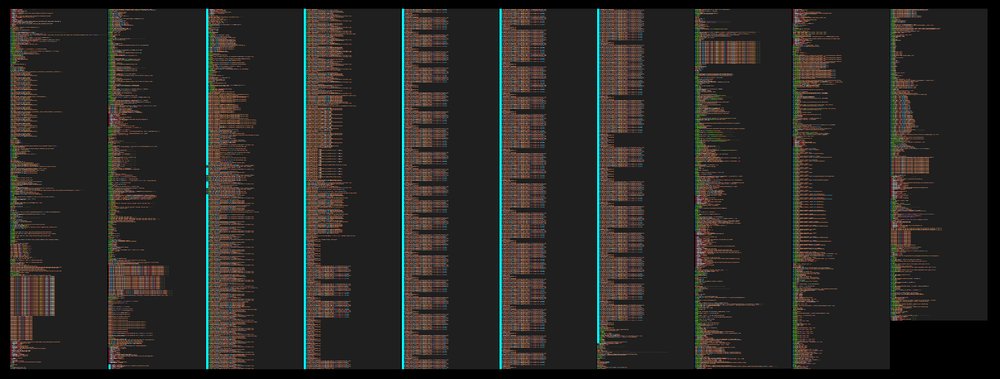
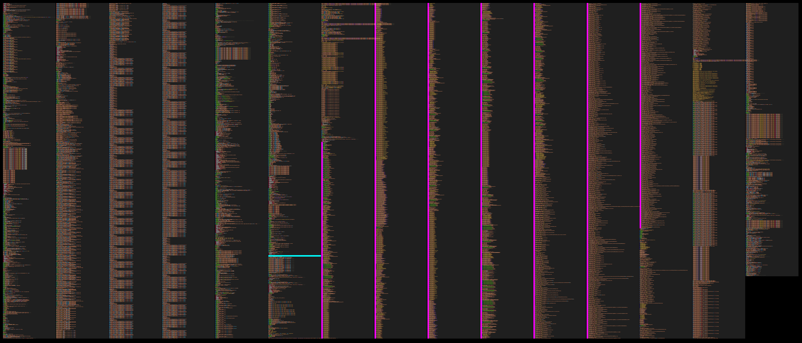

tinygrad tries to be simple. I like deleting things. See if I can't help delete in tinygrad. Seems to be a new and adventurous world on the other side.

# tinygrad dev exploration

[TOC]
## Direction


trace execution of a tinygrad script
- steps:
	- `from tinygrad.tensor import Tensor`
	- `Tensor([1,2,3])`
	- `Tensor([1,2,3]) + 2`
	- `(Tensor([1,2,3]) + 2).tolist()
read tensor.py
explore anything unfamiliar
condense any writing
create more abstract layers, current writing is one layer above code. should eventually connect all the way to the mission.

python inliner for tinygrad?

## More refined

## Less refined

### tinygrad inliner

from reading its not obvious what happens
could miss parts
can't keep track of values
reading too much that is irrelevant

inlined code would be a practical story through a structure of relationships
tinygrad code lays out the structure directly

- write an executable python file that fulfills the same function as the traced script without calling functions
- classes are maintained (Tensor, LazyBuffer(?))
- function variables are renamed to be unique
- function calls = indented comment = function name, source file, line number
- return = indented comment
- for loops and comprehensions are only shown once

### tinycorp mission

accelerate, commoditize the petaflop
improve soft-hardware interface for tensor compute first
funded by love and tinyboxes

factory -> soft (tinygrad), hard (tinybox, tinychip?)
product -> compiled models?

*tinygrad model --> friendly C --> standalone would be (is?) nice*

### encountered python

`__slots__` lists the expected class attributes for fast access and memory savings [more](https://stackoverflow.com/questions/472000/usage-of-slots)
`all()` and `any()` for evaluating multiple bools.
`WeakValueDictionary` for accessing values that can be garbage collected like the reference isn't there
if there is an argument in a function definition like `*atuple`,  it becomes optional and returns an empty tuple (or list?) if not given
`deque` from `collections` = data structure for efficient insertion and deletion from two ends of a list.
`dict.get(self, key, default=None, /)` Return the value for key if key is in the dictionary, else default.
format specifiers. `int:8` means the int takes up 8 spaces when printing. same as `int:8d` d for digit. can do alignment with `int:>8d` for right alignment.
### Importing Tensor

```python
from tinygrad.tensor import Tensor
```

sets the stage with 3749 lines of tinygrad code as determined through `sys.settrace` (2024-07-08 17:27)

Mostly [imports](https://docs.python.org/3/reference/import.html) and the construction of the `PatternMatcher` in `tinygrad/codegen/uops.py` (marked with cyan left border)
13: `helpery.py` 
- makes `U` and `T` `TypeVar`s
- determines if the computer runs OSX to set the location of tinygrads cache
- sets and caches environment variables as `ContextVar` objects.
	- DEBUG, IMAGE, BEAM, NOOPT, JIT
	- WINO, THREEFRY, CAPTURING
	- GRAPH, GRAPHPATH, SAVE_SCHEDULE, RING
	- MULTIOUTPUT, PROFILE
	- this does not cover all environment variables relevant to tinygrad, not even those mentioned in the docs as [global variables](https://docs.tinygrad.org/env_vars/#global-variables)
- Global Counters: `global_ops`, `global_mem`, `time_sum_s`, `kernel_count`, `mem_used`
- ProfileLogger (?)
- sets up cache db path, cachelevel and version (?)
206: `dtype.py`
- `ConstType = Union[float, int, bool]`
- declares dtypes as DType Objects and some aliases:
	- bool, int8, uint8, int16, uint16, int32, uint32, int64, uint64, float16, bfloat16, float32, float64
	- half = float16; float = float32; double = float64 
	- uchar = uint8; ushort = uint16; uint = uint32; ulong = uint64 
	- char = int8; short = int16; int = int32; long = int64
- sets default float by environment variable else `float32` and default int `int32`
- `promo_lattice` that defines how different dtypes get promoted, presumably when different dtypes meet in an operation.
- `DTYPES_DICT` and `INVERSE_DTYPES_DICT` to translate between tinygrad dtypes and their names like "bool": dtypes.bool
367: `shape/symbolic.py`
- `sint = Union[int, Variable, MulNode, SumNode]`
- `render_python: Dict[Type, Callable[..., str]]`  where the callables return a string representing the Object in `Type`.
581: `ops.py`
- tinygrads ops are defined:
	- `UnaryOps(Enum)`: `EXP2`, `LOG2`, `CAST`, `BITCAST`, `SIN`, `SQRT`, `NEG`, `RECIP`
	- `BinaryOps(Enum)`: `ADD`, `MUL`, `IDIV`, `MAX`, `MOD`, `CMPLT`, `CMPNE`, `XOR`, `SHL`, `SHR`, `OR`, `AND`
	- `TernaryOps(Enum)`: `WHERE`, `MULACC`
	- `ReduceOps(Enum)`: `SUM`, `MAX`
	- `BufferOps(Enum)`: `LOAD`, `CONST`, `STORE`
	- `LoadOps(Enum)`: `EMPTY`, `CONST`, `COPY`, `CONTIGUOUS`, `CUSTOM`, `ASSIGN`, `VIEW`
- `Op = Union[UnaryOps, BinaryOps, ReduceOps, LoadOps, TernaryOps, BufferOps]`
- `UNSAFE_PAD_OPS = {UnaryOps.RECIP, UnaryOps.LOG2, UnaryOps.EXP2, BinaryOps.IDIV}`
- `InterpretedFlopCounter: Dict[Op, Callable]` which generates `FlopCounter` objects with shape, flops and memory for various lazyops except `LoadOps`, `TernaryOps.MULACC`
- `python_alu` implements lazyops using python and its math module. covers `UnaryOps` except `CAST` and `BITCAST`, `BinaryOps` and `TernaryOps.WHERE`.
- `truncate: Dict[DType, Callable]` providing functions to truncate any number to the desired dtype.
754: `codegen/uops.py` (Note: quick reserach says UOps are really $\mu$ (micro) operations, UPat presumably is $\mu$ pattern)
- The `UOps(Enum)` class variables:
	- `SINK`,`VAR`,`DEFINE_GLOBAL`,`DEFINE_VAR`,`DEFINE_LOCAL`,`DEFINE_ACC`,`CONST`,`SPECIAL`,`NOOP`,`UNMUL`,`GEP`
	- `CAST`,`BITCAST`,`VECTORIZE`,`ALU`,`WMMA`
	- `LOAD`,`STORE`,`PHI`
	- `BARRIER`,`IF`,`RANGE`
	- `ENDRANGE`,`ENDIF`
- `TypeVar` `T`
- `constant_folder` which constructs a `PatternMatcher` singleton with a `patterns:List[Tuple[Union[UPat, UOp], Callable]]` (~500 lines)
- `PatternMatcher`'s initialization takes ~1300 more lines as it constructs `UPat` objects and runs their `compile` function.
2694: `device.py`
- `Device = _Device()` singleton, which populates `Device._devices` with strings of devices for which there is a `runtime/uops_{device}.py` file
- sets defaults in `BufferOptions` class: `image = None`,`uncached`,`cpu_access`,`host`,`nolru` are all `False`
- `MallocAllocator = _MallocAllocator()` singleton (no `__init__`)
2816: `lazy.py`
- `lazycache: WeakValueDictionary[Any, LazyBuffer] = WeakValueDictionary()`
- `view_supported_devices = {"LLVM", "CLANG", "CUDA", "NV", "AMD", "METAL", "DISK"}`
2920: `codegen/kernel.py`
- `OptOps(Enum)`: `TC`,`UPCAST`,`UPCASTMID`,`UNROLL`,`LOCAL`,`GROUP`,`GROUPTOP`,`NOLOCALS`,`PADTO`
- `LocalBuffer` dataclass with `name`,`size`,`dtype=dtypes.float32`,`realized=None`
3007: `codegen/linearizer.py`
- `render_ops: Dict[Type, Callable[..., UOp]]`
	- for `NumNode`,`Variable`,`MulNode`,`DivNode`,`ModNode`,`LtNode`,`SumNode`,`AndNode
~3100: `engine/schedule.py`
- `SCHEDULES: List = []`
3299: `tensor.py`
- `Tensor` class with:
	- `__slots__ = "lazydata", "requires_grad", "grad", "_ctx"`
	- `__deletable__ = ('_ctx',)`
	- `training`, `no_grad` are `False`
	- `_seed = int(time.time())`
	- `_rng_counter = None`
- produces methods on `Tensor`class for each device in `Device._devices` like `Tensor.cuda()` as aliases for `Tensor.to("cuda")`
- if `IMAGE` from environment variables `>0`, creates more aliases for `Tensor.image_conv2d` and `Tensor.image_dot` by introducing `Tensor.conv2d` and `Tensor.dot` respectively.
3646: `nn/state.py`
- `safe_dtypes`and `inverse_safe_dtype` dictionaries for translating between some naming (?) to tinygrad dtypes and back (inverse)
3728: `engine/jit.py`
- `ReturnType = TypeVar("ReturnType")`

### Creating a Tensor

```python
Tensor(
    data: Union[
        None,
        ConstType,
        List,
        Tuple,
        LazyBuffer,
        ndarray,
        bytes,
        MultiLazyBuffer,
        Variable,
    ],
    device: Optional[Union[str, tuple, list]] = None,
    dtype: Optional[DType] = None,
    requires_grad: Optional[bool] = None,
)
```

```python
from tinygrad.tensor import Tensor
Tensor([1,2,3])
```


9656 lines (the linearizer-lowerer commit ([#4957](https://github.com/tinygrad/tinygrad/commit/6972a2569f5a848b101f4c9310d5de373328dbfb)) changed this, documentation is paused as this might be cleaned up), the cyan line marks the border between previous import code and new tensor construction code. most new code comes from `runtime/autogen/cuda.py`(magenta left border) because in this case, cuda is the device it finds for the Tensor.

determine device for the Tensor using `Device.canonicalize()`, which merely formats `device` if it's not `None`, but since it is, responsibility is handed to `Device.DEFAULT` to find one.
- it looks for `{DEVICE}=1` in environment variables
- `Device[{device}]` is tried for `METAL`,`AMD`,`CUDA`, `GPU`, `CLANG`, `LLVM`, -> `Device.__get_canonicalized_item` -> eventually tries `{device}Device.__init__({device})` (like `CUDADevice`) in their respective `runtime/ops_{device}.py` until it finds one that returns no errors.
	- `METAL` fails within 3 lines when it tries to import the `Metal` library.
	- `AMD` imports the `AMDRenderer` from `renderer/cstyle.py` (runs ~300 lines of importing and classvariable definitions), then imports from `runtime/driver/hip_comgr.py` which tries `runtime/autogen/comgr.py` and fails within 15 lines.
	- `CUDA` should fail within ~30 lines when it tries to get `libcuda.so` but in this case cuda is installed, so it imports from `runtime/ops_cuda.py`, `runtime/autogen/cuda.py` (4000+ lines of mysterious code) and `runtime/autogen/nvrtc.py`
		- `from tinygrad.renderer.cstyle import CUDARenderer` which is already available from the AMD attempt earlier.
		- `from tinygrad.renderer.assembly import PTXRenderer`
		- `PTXRenderer` has lots of class variables:
			- `device="CUDA"`, `suffix="PTX"`
			- `global_max = (2147483647, 65535, 65535)`, `local_max = (1024, 1024, 64)`, `shared_max = 49152`
			- `tensor_cores: List[TensorCore]`
			- `kernel_prefix`, `barrier`, `gid`, `gdim`, `lid`
			- `asm_for_op:Dict[Op, Callable]` by all appearances functions for op->assembly translation
			- `supports_half: List[Op]` with a small selection of ops
			- `types: Dict[DType, str]` and `men_types: Dict[DType, str]` (almost identical, except for 3 types(?)) to translate between tinygrad dtypes and apparently some other convention
			- `const_requires_mov: List[DType] = [dtypes.half, dtypes.bool]`
		- `ptx_matcher` is another `PatternMatcher`
		- `PTX = getenv("PTX")`, 0 if not given.
`CUDADevice.__init__` gets itself `device_id`, `cu_device`, `context`, `arch`, `pending_copyin`, checking that the interactions with cuda (`libcuda.so`) return no errors on multiple occasions.
`CUDADevice.devices.append(self)`
9406: `from tinygrad.runtime.graph.cuda import CUDAGraph`
calls
```python
Compiled.__init__(
	CUDAAllocator,
	PTXRenderer(self.arch) if PTX else CUDARenderer(self.arch)`, # PTX=0 (default)
	PTXCompiler(self.arch) if PTX else CUDACompiler(self.arch),
	functools.partial(CUDAProgram, self),
	graph=CUDAGraph
)
```
which is the superclass of `CUDADevice`, where `dname`(device name), `allocator`, `renderer`, `compiler`, `runtime`, `graph`  come together and are stored in `self` (ultimately in `CUDADevice` as it inherits these instance variables from its parent classes.
- `CUDAAllocator` inherits from `LRUAllocator`, calls `super().__init__()` which only runs `self.cache: Dict[Tuple[int, Optional[BufferOptions]], Any] = defaultdict(list)`(sidenote: `LRUAllocator` itself also inherits from `Allocator`).
- `CUDARenderer` initialization in this case stores `[]` in `self.tensor_cores`
- `CUDACompiler` (child of `Compiler`) gets itself `self.arch`, `self.compile_options` and `super().__init__(f"compile_cuda_{self.arch}")` which sets `self.cachekey` unless explicitly preventes through env variable `DISABLE_COMPILER_CACHE`
- `CUDAGraph`, notably is not initialized, the imported class is just passed on.

in `Compiler.__init__()` if `compiler` was `None` it would be replaced by the generic `Compiler()` and `renderer` by `Renderer()`.

`CudaDevice` returned to `Device.__get_canonicalized_item` and cached (`@functools.lru_cache(maxsize=None)` decorator):
```python
CUDADevice {
	'cu_device': c_int(0),
	'context': <tinygrad.runtime.autogen.cuda.LP_struct_CUctx_st at 0x7f7a12c49a40>,
	'arch': 'sm_61',
	'pending_copyin': [],
	'dname': 'CUDA',
	'allocator': <tinygrad.runtime.ops_cuda.CUDAAllocator at 0x7f7a12dad9f0>,
	'compiler': <tinygrad.runtime.ops_cuda.CUDACompiler at 0x7f7a12cd7b20>,
	'runtime': functools.partial(<class 'tinygrad.runtime.ops_cuda.CUDAProgram'>, <tinygrad.runtime.ops_cuda.CUDADevice object at 0x7f7a12daeb60>),
	'graph': tinygrad.runtime.graph.cuda.CUDAGraph,
	'renderer': <tinygrad.renderer.cstyle.CUDARenderer at 0x7f7a12c244f0>
}
```
also this `CUDADevice` is stored in classvariable `CUDADevice.devices:List[CUDADevice]`
if `DEBUG>=1`, a message will inform that the device was opened.

for now, the returned `CUDADevice` only demonstrates that `CUDA` can be used as a device for the new Tensor. environmentvariable `CUDA` is set to `1` to save this work in the future.

In Tensor construction, depending on type of data input, `_loadop()`, `_fromnp` or `_frompy` create the tensors `LazyBuffer`.
The example Tensor construction determines dtype (`dtypes.default_int`), then
`data = _fromnp(np.array(data).astype(_to_np_dtype(dtype)))`
(numpy as a dependency is phased out, so this probably changes soon)
`_from_np_dtype` uses a dictionary from `dtype.py` to translate the numpy dtype to a tinygrad `DType`
-> `LazyBuffer.loadop(LoadOps.EMPTY, x.shape, _from_np_dtype(x.dtype), "NPY")`

```python
@staticmethod
  def loadop(op, shape:Tuple[sint,...], dtype:DType, device:str, arg=None, src:Tuple[LazyBuffer, ...]=(), enable_cache=False) -> LazyBuffer:
    assert isinstance(src, tuple)
    return create_lazybuffer(device, ShapeTracker.from_shape(shape), dtype, op, arg, src, enable_cache=enable_cache)
```
`op` was given as `LoadOps.EMPTY`
```python
ShapeTracker.from_shape(shape:Tuple[sint, ...]): return ShapeTracker((View.create(shape),))
```

`ShapeTracker((View.create(shape),))` to give the ShapeTracker a View. Since no stride is defined, it will be created using `strides_for_shape(shape)`, then canonicalized. Then `View(shape, stride, offset=0, mask=None, contiguous=True)` with these default arguments.

```python
@dataclass(frozen=True)
class View:
	shape: Tuple[sint, ...]
	strides: Tuple[sint, ...]
	offset: sint
	mask: Optional[Tuple[Tuple[sint, sint], ...]]
	contiguous: bool
```

```python
@dataclass(frozen=True)
class ShapeTracker:
	views: Tuple[View, ...]
```

```python
create_lazybuffer(
	device: str,
	st: ShapeTracker,
	dtype: DType,
	op: Optional[Op] = None,
	arg:Any = None,
	srcs: Tuple[LazyBuffer, ...] = (),
    base: Optional[LazyBuffer] = None,
    enable_cache = bool(getenv("LAZYCACHE", 1))
)
```

in `create_lazybuffer` the `lazycache` is interacted with, which stores lazybuffers. a `cache_key` is generated from the lazybuffers parameters. If the key yields an existing `LazyBuffer` from `lazycache`, that one will return, otherwise a new one is created with this constructor, where it will pass `metadata=_METADATA.get()` as `metadata` ([#5271](https://github.com/tinygrad/tinygrad/commit/9150a6be7a30bbd17f0b84f3352fac7af0c68b73)):

```python
LazyBuffer(
    device: str,
    st: ShapeTracker,
    dtype: DType,
    op: Optional[Op] = None,
    arg: Any = None,
    srcs: Tuple[LazyBuffer, ...] = (),
    base: Optional[LazyBuffer] = None,
    metadata:Optional[Metadata]=None
)
```

`st` is the `ShapeTracker` just created

In the lazybuffer's initialization, it finds that `base` is `None` and decides that an assignment to `self.buffer` is in order.
Given the op `LoadOps.EMPTY`, it makes a `Buffer` (a class imported from `tinygrad.device`) through `Buffer(device, self.size, dtype)`. But creating it like that in this case does nothing except store the instance.
the buffer's `_lb_refcount` property is incremented by 1
the `contiguous_child` property (didn't exist before) is set to `None`
and `forced_realize` to `False`
the meaning of all 3 escapes me right now.

The `LazyBuffer` is done and returning to `_fromnp()` into the variable `ret` where:
`ret.buffer.allocate(x)` (x is a numpy array) causes the buffer to find itself an `Allocator`:
`self.allocator = Device[self.device].allocator`. Indexing into `Device` returns a `NpyDevice` (same as earlier when it was about finding an available device, but this time with `NPY`. This device is very minimal, has the default `Compiler` and `Renderer` and a mostly empty `NpyAllocator`)

on `buffer.allocate(x)` where `x` is the `np.ndarray`, `x` is just assigned to `buffer._buf`, without calling `Buffer.alloc` which is not implemented for this device.
completing what is commented "fake realize" in `_fromnpy`, `del ret.srcs` (which was `()`) makes sure that `LazyBuffer.realized` will return `True`.
Also adds the buffer's size to `GlobalCounters.mem_used`

In the final step of `Tensor` initialization, the mismatching devices, one being the discovered one (`CUDA` in this case) and one being `NPY` are detected and `self.lazydata = data.copy_to_device(device)` takes care of it, `data` being the created `LazyBuffer` and `device` being the discovered device from the start.
`LazyBuffer.copy_to_device(device)` in this case leads to `self.base._copy(device)._view(self.st)`

```python
# LazyBuffer._copy:
return create_lazybuffer(device, ShapeTracker.from_shape(self.shape), self.dtype, LoadOps.COPY, self.buffer.nbytes, (self,), enable_cache=False)
```

assign a  `Buffer` to the `LazyBuffer`, because `base` is `None` again (the npy lazybuffer is stored in `srcs`).

the `._view(self.st)` that follows `._copy(device)`, does nothing here, because the new shapetracker has the same shape and is contiguous.

The final object looks like this:
```python
Tensor {
	'_ctx': None,
	'requires_grad': None,
	'grad': None,
	'lazydata': {
		'device': 'CUDA',
		'st': ShapeTracker(views=(View(
			'shape': (3,),
			'strides': (1,), 
			'offset': 0,
			'mask': None,
			'contiguous': True
			)
		,)),
		'dtype': dtypes.int,
		'shape': (3,),
		'size': 3,
		'metadata': None,
		'_base': None,
		'op': <LoadOps.COPY: 3>,
		'arg': 12,
		'srcs': LazyBuffer {
			'device': 'NPY',
			'st': ShapeTracker(views=(View(
				'shape': (3,),
				'strides': (1,),
				'offset': 0,
				'mask': None,
				'contiguous': True
				)
			,)),
			'dtype': dtypes.int,
			'shape': (3,),
			'size': 3,
			'metadata': None,
			'_base': None,
			'op': <LoadOps.EMPTY: 1>,
			'arg': None,
			'buffer': <buf real:True device:NPY size:3 dtype:dtypes.int offset:0>,
			'contiguous_child': None,
			'forced_realize': False
		},		
		'buffer': <buf real:False device:CUDA size:3 dtype:dtypes.int offset:0>,
		'contiguous_child': None,
		'forced_realize': False
	}
}
```
`Tensor` also has some classvariables, ignored here, can be seen in [Importing Tensor](#Importing%20Tensor) at `tensor.py`.
### Adding to a Tensor

```python
t = Tensor([1,2,3]) + 2
```

goes to `Tensor.add(self, x, reverse=False)`
-> `return F.Add.apply(*self._broadcasted(x, reverse))`

`self._broadcasted` determines dtype then creates Tensor from `y` (2) using:
`Tensor(dtypes.as_const(y, y_dtype), x.device, y_dtype, requires_grad=False)`
where `dtypes.as_const()` casts the input using one of pythons `int`, `float`, `bool` functions. Reason still escapes me.

bypassing the whole numpy story because data is integer and not array this time, so lazybuffer comes more directly from `_loadop(LoadOps.CONST, tuple(), dtype, device, data)` where `data` eventually ends up as the lazybuffers `arg` property.

The `ShapeTracker` will be empty, because the provided shape is `tuple()`. (its a 0D Tensor)

Because `op` is `LoadOps.CONST` and dtype is `int` the data once again runs through `dtypes.as_const()` and `enable_cache` (-> `lazycache`)  is enabled.

the returned `Tensor.lazydata`:
```python
Tensor.lazydata {
	'device': 'CUDA',
	'st': ShapeTracker(views=(View(shape=(), strides=(), offset=0, mask=None, contiguous=True),)),
	'dtype': dtypes.int,
	'shape': (),
	'size': 1,
	'metadata': None,
	'_base': None,
	'op': <LoadOps.CONST: 2>,
	'arg': 2,
	'srcs': (),
	'buffer': <buf real:False device:CUDA size:1 dtype:dtypes.int offset:0>,
	'contiguous_child': None,
	'forced_realize': False
}
```

back in `_broadcasted`, dtypes of x and y are matched
`_broadcast_shape(x.shape, y.shape)` determines a target shape
and broadcast `x` and `y` to that shape (x is already that shape so nothing happens)

`padded = _pad_left(y.shape, shape)` where `shape` is the target shape transforms `()` to `(1,)`, ready to be expanded through `F.Expand.apply(self.reshape(padded), shape=shape)`

`Tensor.reshape` calls `F.Reshape.apply(self, new_shape)` from `function.py`, which inherits from `class Function` in `tensor.py`.
all `Function` "children", in their `apply`function, return a new Tensor and populate it with new `lazydata`, `requires_grad`, `grad=None` and `_ctx` if  applicable. `_ctx` contains the function that was called, which also contains the parent Tensors.
`Function.apply()` calls the functions `forward` method on the `Tensor.lazydata`

`lazydata.reshape` turns into `self._view(st.reshape(newShape))` in `lazy.py`.
In `st.reshape(newShape)` (`shapetracker.py`), by default, the new returned `ShapeTracker` will have its most recent view in `views` replaced by a new one, through `View.reshape(newShape)`.
Environment variable `MERGE_VIEWS=0` changes this behaviour to including all previous views with the new one appended in the new shapetracker.

`View.reshape(newShape)` in this case simply returns a new View from `View.create(newShape)`
strides for the new shape  are determined (`strides_for_shape(shape)` -> `(1,)`) and canonicalized -> `(0,)`.
finally:
```python
contiguous = offset == 0 and mask is None and strides == strides_for_shape(shape)
return View(shape, strides, offset, mask, contiguous)
```

back at `_view(newShapetracker)` in `lazy.py` a new lazybuffer comes from `create_lazybuffer(self.device, new_st, self.dtype, base=self.base)`.
notably, `self.base` is just `self` because `self._base` is `None`
```python
@property
  def base(self) -> LazyBuffer: return self._base if self._base is not None else self
```

next from `F.Expand.apply(self.reshape(padded), shape=(3,))`, where `self.reshape(padded)` has now returned the new Tensor. Expand similarly returns a new Tensor with a new LazyBuffer from  `LazyBuffer.expand` -> `ShapeTracker.expand` -> `View.expand` -> `View.create(new_shape, self.strides, self.offset, mask)` -> `View` -> `ShapeTracker` -> `LazyBuffer._view` -> `createLazyBuffer` -> `LazyBuffer`

notably, `View.create` does not change strides and since no mask was given it also remains `None`. These lines:
```python
contiguous = offset == 0 and mask is None and strides == strides_for_shape(shape)
return View(shape, strides, offset, mask, contiguous)
```
cause `contiguous` to be `False` because the unchaged stride is `(0,)`, but the appropriate stride for the new shape would be `(1,)`
Notably, `create_lazybuffer(self.device, new_st, self.dtype, base=self.base)` takes the base of the "reshape lazybuffer" which is the LoadOps.CONST lazybuffer. So in the final Tensor, there remains no reference to the reshape lazybuffer:

```python
Tensor:
	'_ctx': None
	'requires_grad' : None
	'grad': None
	'lazydata':
		'device': "CUDA"
		'st' : ShapeTracker(views=(View(
			'shape':(3,),
			'strides':(0,),
			'offset':0,
			'mask':None,
			'contiguous':False
		),))
		'dtype': dtypes.int
		'shape': (3,)
		'size': 3
		'_base': LazyBuffer:
			'device': "CUDA"
			'st': ShapeTracker(views=(View(
				'shape':(),
				'strides':(),
				'offset':0,
				'mask':None,
				'contiguous'=True
			),))
			'dtype': dtypes.int
			'shape': ()
			'size': 1
			'_base': None
			'op': <LoadOps.CONST: 2>
			'arg': 2
			'srcs': ()
			'buffer': <buf real:False device:CUDA size:1 dtype:dtypes.int offset:0>
			'contiguous_child': None
			'forced_realize': False
```

Finally, `F.Add.apply` is called on the input tensor and the created Tensor.
new tensor lazydata = `return x.e(BinaryOps.ADD, y)` where `BinaryOps.ADD`, like `LoadOps.CONST` is an entry in `class BinaryOps(Enum)`

```python
def e(
	self, 
	op:Union[LoadOps, UnaryOps, BinaryOps, TernaryOps],
	*in_srcs:LazyBuffer,
	arg:Optional[Any] = None
	) -> LazyBuffer
```
gets `out_dtype` from input
tries shortcuts if one of the operants is effectively 0
```python
create_lazybuffer(self.device, ShapeTracker.from_shape(self.shape), out_dtype, op, arg, tuple(srcs))
```

```python
Tensor:
	_ctx = None
	requires_grad = None
	grad = None
	lazydata:
		device = "CUDA"
		st = ShapeTracker(views=(View(
			shape=(3,)
			strides = (1,)
			offset = 0
			mask = None
			contiguous = True
		),))
		dtype = dtypes.int
		shape = (3,)
		_base = None
		op = <BinaryOps.ADD: 1>
		arg = None
		srcs = (
			<LB CUDA (3,) int (<LoadOps.COPY: 3>, None)>, # previously created lazybuffer [1,2,3] copied from NPY 
			<LB CUDA (3,) int ShapeTracker(views=(View(shape=(3,), strides=(0,), offset=0, mask=None, contiguous=False),))> # new lazybuffer from 2
		)
		buffer = <buf real:False device:CUDA size:3 dtype:dtypes.int offset:0>
		contiguous_child = None
		forced_realize = False
```

It seems, tinygrads laziness means that operations are initially stored in lazybuffers that reference other lazybuffers through `srcs` (in ADD in this case) or `_base` (in shape changes) and so form a graph.
```bash
DEBUG=4 CUDA=1 python -c "from tinygrad.tensor import Tensor; (Tensor([1,2,3]) + 2).tolist()"
```
displays a graph that seem to echo this, though shape changes are apparently left out
```
  0 ━┳ BufferOps.STORE MemBuffer(idx=0, dtype=dtypes.int, st=ShapeTracker(views=(View(shape=(3,), strides=(1,), offset=0, mask=None, contiguous=True),)))
  1  ┗━┳ BinaryOps.ADD None
  2    ┣━━ BufferOps.LOAD MemBuffer(idx=1, dtype=dtypes.int, st=ShapeTracker(views=(View(shape=(3,), strides=(1,), offset=0, mask=None, contiguous=True),)))
  3    ┗━━ BufferOps.CONST ConstBuffer(val=2, dtype=dtypes.int, st=ShapeTracker(views=(View(shape=(3,), strides=(0,), offset=0, mask=None, contiguous=False),)))
```

### Realizing a Tensor

```python
(Tensor([1,2,3]) + 2).tolist()
```

`Tensor.tolist()` = `Tensor.data().tolist()` = `Tensor._data().cast(self.dtype.fmt, self.shape).tolist()`

```python
def _data(self) -> memoryview:
    if 0 in self.shape: return memoryview(bytearray(0))
    # NOTE: this realizes on the object from as_buffer being a Python object
    cpu = self.cast(self.dtype.scalar()).contiguous().to("CLANG").realize()
    buf = cast(Buffer, cast(LazyBuffer, cpu.lazydata).base.realized)
    if self.device != "CLANG": buf.options = BufferOptions(nolru=True)
    return buf.as_buffer(allow_zero_copy=True if self.device != "CLANG" else False)
```

`Tensor.cast(self.dtype.scalar())` does nothing because `self.dtype == self.dtype.scalar()` in this case.
`Tensor.contiguous()` -> `lazydata.base.forced_realize = True`, otherwise nothing in this case, because not needed.
`Tensor.to("CLANG")`. if it is not already on CLANG, it makes a new Tensor with the same lazydata, but `device="CLANG"`, so it add a `LoadOps.COPY` Lazybuffer to the graph.

```python
def realize(self, *lst:Tensor, do_update_stats=True) -> Tensor:
    run_schedule(*self.schedule_with_vars(*lst), do_update_stats=do_update_stats)
    return self
```

#### Schedule

```python 
def schedule_with_vars(
	self,
	*lst:Tensor,
	seen:Optional[Set[LazyBuffer]]=None
) -> Tuple[List[ScheduleItem], Dict[Variable, int]]:
	# left out some lines that aren't executed
	schedule, var_vals = create_schedule_with_vars(flatten([x.lazydata.lbs for x in (self,)+lst]), seen)
    return memory_planner(schedule), var_vals
```
where `flatten` in this case returns a list with one entry: the "BinaryOps.ADD-lazybuffer" 

from `engine/schedule.py`
```python
SCHEDULES: List = []
def create_schedule_with_vars(
	outs:List[LazyBuffer],
	seen:Optional[Set[LazyBuffer]]=None
) -> Tuple[List[ScheduleItem], Dict[Variable, int]]:

  if seen is None: seen = set()
  graph, in_degree, prescheduled = _graph_schedule(outs, seen)

```

from `engine/schedule.py`
```python
def _graph_schedule(
	outs:List[LazyBuffer],
	seen:Set[LazyBuffer]
) -> Tuple[
	DefaultDict[LazyBuffer, List[LazyBuffer]], DefaultDict[LazyBuffer, int],
	Dict[LazyBuffer, _LBScheduleItem]
]:

  """create a graph for realizing the outputs"""
  # start by just realizing the buffers passed in
  realizes: Dict[LazyBuffer, None] = {x.base:None for x in outs if x.base.realized is None}
  allbufs: Dict[LazyBuffer, None] = {}
  simple_pads: Set[LazyBuffer] = set()
  children: DefaultDict[LazyBuffer, Dict[LazyBuffer, None]] = defaultdict(dict)
  
  for out in outs: _recurse_lb(out.base, realizes, allbufs, simple_pads, children, scheduled=True)
  ```
strange that it uses `out.base` it means if the latest lazybuffer was already on clang and a reshape, it would be ignored for now.

from `engine/schedule.py`
```python
def _recurse_lb(
	buf:LazyBuffer,
	realizes:Dict[LazyBuffer, None],
	allbufs:Dict[LazyBuffer, None],
    simple_pads:Set[LazyBuffer],
    children:DefaultDict[LazyBuffer, Dict[LazyBuffer, None]],
    scheduled=False
):

  """recursively search the entire graph for all LazyBuffers, insert realizes after expands"""
  if buf in allbufs or buf.base.realized is not None: return
  if GRAPH: log_lazybuffer(buf, scheduled)
  # view
  if buf.base != buf:
    # fuse some pads
    if len(buf.st.views) == 1 and buf.st.views[-1].mask is not None and all_int(buf.base.st.shape) and \
        prod(buf.base.st.shape) >= prod([y-x for x,y in buf.st.views[-1].mask]):
      simple_pads.add(buf.base)
    # realize all expands
    elif prod(buf.base.st.shape) < prod(buf.st.shape):
      if buf.base.op in ReduceOps and buf.base.srcs[0].base.op is LoadOps.CONST:
        pass # don't realize reduceops on const (unless base is forced_realize)
      if buf.base.op is UnaryOps.CAST and isinstance(buf.base.srcs[0].dtype, ImageDType) and isinstance(buf.base.arg, ImageDType):
        pass # don't realize image to image casts. this is part of a larger problem
      else:
        realizes[buf.base] = None
    # check all other pads for safe fusion
    elif any(v.mask is not None for v in buf.st.views): simple_pads.add(buf.base)
    return _recurse_lb(buf.base, realizes, allbufs, simple_pads, children)
  # base
  allbufs[buf] = None
  if buf.forced_realize: realizes[buf] = None
  if buf.op in LoadOps: realizes[buf.base] = None
  if buf.op is LoadOps.COPY:
    assert buf.srcs[0].st.contiguous and buf.srcs[0].size == buf.srcs[0].base.size, "can only copy contig"
    realizes[buf.srcs[0].base] = None
  if buf.op is LoadOps.VIEW: realizes[buf.srcs[0].base] = None
  for x in buf.srcs:
    if x.base.realized is None: children[x.base][buf] = None
    _recurse_lb(x, realizes, allbufs, simple_pads, children)

def _is_padding_okay(buf:LazyBuffer, realizes:Dict[LazyBuffer, None]) -> bool:
  if buf in realizes or buf.realized is not None: return True
  # NOTE: this broke to_image_idx and coder with JIT
  if buf.op in UNSAFE_PAD_OPS: return False
  return all(_is_padding_okay(x.base, realizes) for x in buf.srcs)
```

`realizes` = lbs with `self.forced_realize` or that are `LoadOps` or source of `LoadOps.COPY` and base of view lbs if the lb was expanded compared to its base, unless exceptions.
```python
realizes = {
  <LB CLANG (3,) int (<LoadOps.COPY: 3>, None)> = None # copy
  <LB CUDA (3,) int (<BinaryOps.ADD: 1>, None)> = None # source of copy
  <LB CUDA (3,) int (<LoadOps.COPY: 3>, None)> = None # copy
  <LB NPY (3,) int (<LoadOps.EMPTY: 1>, <buf real:True device:NPY size:3 dtype:dtypes.int offset:0>)> = None # src of copy
  <LB CUDA () int (<LoadOps.CONST: 2>, None)> = None # base of view lb
}
```

`allbufs` = base lbs (no view lazybuffers).
the NPY LoadOps.EMPTY lazybuffer isn't included because for it `self.realized` returns true which returns from `_recurse_lb` before it could be added to `allbufs`.
```python
allbufs = {
  <LB CLANG (3,) int (<LoadOps.COPY: 3>, None)> = None
  <LB CUDA (3,) int (<BinaryOps.ADD: 1>, None)> = None
  <LB CUDA (3,) int (<LoadOps.COPY: 3>, None)> = None
  <LB CUDA () int (<LoadOps.CONST: 2>, None)> = None
}
```

`simple_pads` = lb base if there is a mask  = `{}`

`children` = unrealized lbs in `srcs`.
```python
children = {
  <LB CUDA (3,) int (<BinaryOps.ADD: 1>, None)> = None
  <LB CUDA (3,) int (<LoadOps.COPY: 3>, None)> = None
  <LB CUDA () int (<LoadOps.CONST: 2>, None)> = None
}
```

back in `_graph_schedule`:
```python
  assign_targets = {x.srcs[1]:x for x in realizes if x.op is LoadOps.ASSIGN and x not in seen and x.realized is None}

  # check if we have to realize pads
  for p in simple_pads:
    if not _is_padding_okay(p, realizes):
      realizes[p] = None

  # find all reduces, and pair them to a elementwise op. if they can't be cleanly paired, force realize the reduce (or a contig child)
  reduce_for_op: Dict[LazyBuffer, LazyBuffer] = {}
  for r in allbufs:
    if r.op not in ReduceOps or r in realizes: continue

    group: Set[LazyBuffer] = set()
    _recursive_group(r, r.st, r, children, realizes, reduce_for_op, group)
    # max one reduceop per kernel
    can_chase = all(tr not in reduce_for_op for tr in group)
    # TODO: forced_realize exists because the scheduler is incapable of checking for self-contained DAGs
    forced_realize = r in group
    if not forced_realize and len(group) > 1:
      # create a multi output kernel if the LazyBufferss can cleanly group
      rc_parents, rc_children = deque(group), deque(group)
      while rc_parents and not forced_realize:
        # max one reduceop per kernel
        if (p:=rc_parents.pop()).op in ReduceOps: forced_realize = True
        else: rc_parents.extend(x.base for x in p.srcs if x.base.realized is None and x.base is not r)
      # search descendants of the reduceop that can cleanly group
      realized_descendants: Set[LazyBuffer] = set()
      while rc_children and not forced_realize:
        if (c:=rc_children.pop()).op in ReduceOps or not c.st.contiguous or c.st.size != r.st.size or c in reduce_for_op:
          realized_descendants.clear()
          break
        if c in realizes and c not in group: realized_descendants.add(c)
        rc_children.extend(x for x in children[c] if x.realized is None and x.device == r.device)
      group.update(realized_descendants)
    # can only fuse assign if no other assign_target is used in the kernel
    if not forced_realize and any(x.op is LoadOps.ASSIGN for x in group):
      parents = deque((r, *group))
      while parents and not forced_realize:
        if (p:=parents.pop().base).realized or p in realizes:
          if p in assign_targets and assign_targets[p] not in group: forced_realize, can_chase = True, False
          continue
        parents.extend(p.srcs)
    if forced_realize:
      tr = r
      if can_chase:
        # can chase this down to contiguous children
        st = tr.st
        while len(children[tr]) == 1:
          tr_next = next(iter(children[tr]))
          st_childs = dedup(s for s in tr_next.srcs if s.base is tr)
          if len(st_childs) > 1: break
          if st.size != st_childs[0].st.size: break
          st = st + st_childs[0].st
          if not st.contiguous or tr_next.op in ReduceOps: break
          tr = tr_next
        # don't cast to higher size before store (tr cannot be realized if forced_realize)
        if tr.op is UnaryOps.CAST and tr.arg.itemsize > tr.srcs[0].dtype.itemsize:
          tr = tr.srcs[0].base
        reduce_for_op[tr] = r
      realizes[tr] = None
    else: reduce_for_op.update((tr, r) for tr in group)

  output_groups: DefaultDict[LazyBuffer, List[LazyBuffer]] = defaultdict(list)
  for buf in realizes:
    if buf.realized is not None or buf.op is LoadOps.CONST or buf in seen: continue
    output_groups[reduce_for_op[buf] if buf in reduce_for_op and MULTIOUTPUT else buf].append(buf)

    # make things that can't be images not images
    if isinstance(buf.dtype, ImageDType) and (prod(buf.shape) != prod(buf.dtype.shape) or
                                              not any(buf.shape[x]%4 == 0 for x in buf.st.unit_stride_axes())):
      if DEBUG >= 2: print(f"forcing image {buf.dtype} with shape {buf.shape} to float32")
      buf.dtype = dtypes.float32
      # hack the underlying buffer too
      if buf.base is buf:
        assert not hasattr(buf.buffer, '_buf'), "can't fixup allocated buffer"
        buf.buffer.dtype = dtypes.float32
        buf.buffer.options = None
 # preschedule all buffers in realizes
  prescheduled = {group[0]:(group, *_lower_lazybuffer(group, realizes, reduce_for_op)) for group in output_groups.values()}
```

(current value): 
```python
output_groups = {
  <LB CLANG (3,) int (<LoadOps.COPY: 3>, None)>: [same buffer]
  <LB CUDA (3,) int (<BinaryOps.ADD: 1>, None)>: [same buffer]
  <LB CUDA (3,) int (<LoadOps.COPY: 3>, None)>: [same buffer]
}
```

```python
def _lower_lazybuffer(outs:List[LazyBuffer], realizes:Dict[LazyBuffer, None], reduce_for_op:Dict[LazyBuffer, LazyBuffer]):
  """describe the computation for a LazyBuffer with LazyOp + inputs + var_vals"""
  if (out:=outs[0]).op is LoadOps.COPY and getenv("USE_COPY_KERNEL") and out.device.split(":")[0] == out.srcs[0].device.split(":")[0]:
    rd = LazyOp(BufferOps.LOAD, (), MemBuffer(1, dtypes.uint8, st:=ShapeTracker.from_shape((out.arg,))))
    return (LazyOp(BufferOps.STORE, (rd,), MemBuffer(0, dtypes.uint8, st)), ), [x.base for x in out.srcs], {}, []
  if out.op in {LoadOps.CUSTOM, LoadOps.COPY, LoadOps.EMPTY, LoadOps.VIEW}: return (LazyOp(out.op, (), out.arg), ), [x.base for x in out.srcs], {}, []
  var_vals: Dict[Variable, int] = merge_dicts([out.st.var_vals.copy() for out in outs])
  assign_targets = {x.srcs[1]:x for x in outs if x.op is LoadOps.ASSIGN}
  cache: Dict[Tuple[LazyBuffer, ShapeTracker], LazyOp] = {}
  ast: List[LazyOp] = []
  inputs: List[LazyBuffer] = []
  for i, out in enumerate(outs):
    output_st = ShapeTracker.from_shape(reduce_for_op[out].shape if out in reduce_for_op else out.shape)
    output_view = out.arg[0] if out.op is LoadOps.ASSIGN and out.arg else output_st
    lop = _recursive_lazyop(out, inputs, tuple(outs), var_vals, output_st, realizes, assign_targets, cache=cache)
    output_view, vv = output_view.simplify().unbind()
    if vv: var_vals.update(vv)
    ast.append(LazyOp(BufferOps.STORE, (lop, ), MemBuffer(i, out.dtype, output_view)))
  return tuple(ast), inputs, var_vals, dedup([x[0].metadata for x in cache if x[0].metadata and x[0] not in inputs])
```

```python
@dataclass(frozen=True, eq=False)
class LazyOp:
  op: Op
  src: Tuple[LazyOp, ...] = ()
  arg: Any = None

@dataclass(frozen=True)
class MemBuffer:
  idx: int
  dtype: DType
  st: ShapeTracker

@dataclass(frozen=True)
class ConstBuffer:
  val: ConstType | Variable
  dtype: DType
  st: ShapeTracker
```

`_lower_lazybuffer` returns:
- `(LazyOp(LoadOps.COPY, (), 12),), [LB CUDA BinaryOps.ADD], {}, []` for `CLANG` copy 
- enters `_recursive_lazyop` when processing `output_groups[1]`
- `(LazyOp(LoadOps.COPY, (), 12),), [LB CUDA BinaryOps.ADD], {}, []` again for the `CUDA` copy 

`_recursive_lazyop` returns `LazyOp` for the two copy lbs and the add lb in `output_groups`.
in the add lb it recurses trough its sources:
- `<LB CUDA (3,) int (<LoadOps.COPY: 3>, None)>`
	- simplify and unbind shapetracker (simplify does nothing here because the shapetracker has only one view. Unbind seems to act on variables, of which there aren't any here).
	- append the lb to `inputs`
	- return `LazyOp(BufferOps.LOAD, (), MemBuffer(len(outputs)+inputs.index(buf), buf.dtype, unbound_st)))
- `<LB CUDA (3,) int ShapeTracker(views=(View(shape=(3,), strides=(0,), offset=0, mask=None, contiguous=False),))>)`
	- switch to its base `<LB CUDA () int (<LoadOps.CONST: 2>, None)>
	- return `LazyOp(BufferOps.CONST, (), ConstBuffer(val, buf.dtype, unbound_st))` where `val` is `arg`, which is 2.
`ast.append(LazyOp(BufferOps.STORE, (lop, ), MemBuffer(i, out.dtype, output_view)))'
`return tuple(ast), inputs, var_vals,` + metadata stuff, ignored for now. `var_vals` is `{}` because nothing symbolic in this case.

```python
"""
prescheduled:List[Tuple[]] {
	group[0]:LazyBuffer (
		group: List[LazyBuffer],
		abstract syntax tree (ast): Tuple[LazyOp],
		inputs: List[LazyBuffer]
		variable values: Dict[Variable, int],
		metadata: List[?]
	)
}
"""
prescheduled = {
	<LB CLANG (3,) int (<LoadOps.COPY: 3>, None)>: (
		[<LB CLANG (3,) int (<LoadOps.COPY: 3>, None)>],
		(LazyOp(op=LoadOps.COPY, src=(), arg=12),),
		[<LB CUDA (3,) int (<BinaryOps.ADD: 1>, None)>],
		{},
		[]
	),
	<LB CUDA (3,) int (<BinaryOps.ADD: 1>, None)>: (
		[<LB CUDA (3,) int (<BinaryOps.ADD: 1>, None)>],
		(LazyOp(
			op=BufferOps.STORE
			src=(LazyOp(
				op=BinaryOps.ADD,
				src=(
					LazyOp(
						op=BufferOps.LOAD,
						src=(),
						arg=MemBuffer(
							idx=1,
							dtype=dtypes.int,
							st=ShapeTracker(views=(
								View(
									shape=(3,),
									strides=(1,),
									offset=0,
									mask=None,
									contiguous=True
								),
							))
						)
					),
					LazyOp(
						op=BufferOps.CONST
						src=()
						arg=ConstBuffer(
							val=2,
							dtype=dtypes.int,
							st=ShapeTracker(views=(
								View(
									shape=(3,),
									strides=(0,),
									offset=0,
									mask=None,
									contiguous=False
								),
							))
						)
					)
				),
				arg=None
			),),
			arg=MemBuffer(
				idx=0,
				dtype=dtypes.int,
				st=ShapeTracker(views=(
					View(
						shape=(3,),
						strides=(1,),
						offset=0,
						mask=None,
						contiguous=True
					),
				))
			)
		),)
		[<LB CUDA (3,) int (<LoadOps.COPY: 3>, None)>],
		{},
		[__add__ - __main__:3::<module>]
	),
	<LB CUDA (3,) int (<LoadOps.COPY: 3>, None)>: (
		[<LB CUDA (3,) int (<LoadOps.COPY: 3>, None)>],
		(LazyOp(op=LoadOps.COPY, src=(), arg=12),),
		[<LB NPY (3,) int (<LoadOps.EMPTY: 1>, <buf real:True device:NPY size:3 dtype:dtypes.int offset:0>)>],
		{},
		[]
	)
}
```

back in `_graph_schedule`
```python
  schedule_targets = {out:ps for ps in prescheduled.values() for out in ps.outputs}

  graph: DefaultDict[LazyBuffer, List[LazyBuffer]] = defaultdict(list)
  in_degree: DefaultDict[LazyBuffer, int] = defaultdict(int)
  for key, lsi in prescheduled.items():
    if key not in in_degree: in_degree[key] = 0
    # realize outputs after all parents are realized
    scheduled_parents = set(schedule_targets[x].outputs[0] for x in lsi.inputs if x in schedule_targets)
    for x in scheduled_parents:
      graph[x].append(key)
      in_degree[key] += 1
    # realize outputs before a parent is assigned to
    parents_assigns = set(schedule_targets[assign_targets[x]].outputs[0] for x in lsi.inputs if x in assign_targets)
    for assign in parents_assigns:
      graph[key].append(assign)
      in_degree[assign] += 1

  return graph, in_degree, prescheduled
```

`lsi` = LazyScheduleItem?
`schedule_targets` makes an entry for every item in every group and assigns it the tuple in `prescheduled` that it is part of.

`scheduled_parents = set(schedule_targets[x][0][0] for x in lsi[2] if x in schedule_targets)`
`lsi[2]` is inputs, so if an input is one of the entries in a lazybuffer group, add the tuple with its info.
this returns an empty set for the third group, because its input (the `NPY` lazybuffer) is not in any group (= not in `output_groups` because it is already realized)

the input group's `group[0]` as a key in `graph` and append the current prescheduled `key`
some detailed explanation: The `ADD` lb is the first key in `graph` because it is the input of the first group (where the key is the `COPY` lb) in `prescheduled` that is also part of group itself. The value it gets assigned is the first item in the group that it was an input of, so, the `COPY` lb.
this way, graph "points" from the inputs to the groups that depend on them.
every time an input of a group is added to graph this way, the groups key in the `in_degree` dictionary increases by 1.

```python
graph = {
	<LB CUDA (3,) int (<BinaryOps.ADD: 1>, None)>: [<LB CLANG (3,) int (<LoadOps.COPY: 3>, None)>],
	<LB CUDA (3,) int (<LoadOps.COPY: 3>, None)>: [<LB CUDA (3,) int (<BinaryOps.ADD: 1>, None)>]
}

in_degree = {
	<LB CLANG (3,) int (<LoadOps.COPY: 3>, None)>: 1,
	<LB CUDA (3,) int (<BinaryOps.ADD: 1>, None)>: 1,
	<LB CUDA (3,) int (<LoadOps.COPY: 3>, None)>: 0
}
```

back in `create_schedule_with_vars`
```python
  queue = deque(si for key, si in prescheduled.items() if in_degree[key] == 0)
  schedule: List[ScheduleItem] = []
  var_vals: Dict[Variable, int] = {}
  kernel_number = GlobalCounters.kernel_count
  while queue:
	ps = queue.popleft()
	for buf in ps.outputs: seen.add(buf)
	if GRAPH:
	  kernel_number += 1
	  for out in ps.outputs: realized_lazybuffer(out, kernel_number)
	var_vals = merge_dicts([var_vals, ps.var_vals])
	for out in ps.outputs: del out.srcs  # can only schedule once
	schedule.append(si:=ScheduleItem(ps.ast, tuple(x.buffer for x in (ps.outputs+ps.inputs) if x.size != 0)))
	if logops and si.ast[0].op not in LoadOps and not any(i.device.startswith("DISK:") for i in si.inputs): logops.write(str(si.ast)+"\n")
	for x in graph[ps.outputs[0]]:
	  in_degree[x] -= 1
	  if in_degree[x] == 0: queue.append(prescheduled[x])

  if SAVE_SCHEDULE:
	def _save():
	  print(f"saving {len(SCHEDULES)} schedule graphs to", fp:=getenv("SAVE_SCHEDULE_PATH", "schedule.pkl"))
	  with open(fp, "wb") as f: pickle.dump(SCHEDULES, f)
	if len(SCHEDULES) == 0: atexit.register(_save)
	SCHEDULES.extend((ps.ast for ps in prescheduled.values()) if getenv("CAPTURE_AST") else [(graph, prescheduled)])
  # confirm everything was scheduled correctly
  if not all(degree == 0 for degree in in_degree.values()) or len(prescheduled) != len(schedule):
	raise RuntimeError(f"cycle detected in graph, prescheduled {len(prescheduled)} but only scheduled {len(schedule)}")
  if DEBUG >= 1 and len(schedule) >= 10: print(f"scheduled {len(schedule)} kernels")
  return schedule, var_vals
```

```python
queue = deque([
   (
		[<LB CUDA (3,) int (<LoadOps.COPY: 3>, None)>],
		(LazyOp(op=LoadOps.COPY, src=(), arg=12),),
		[<LB NPY (3,) int (<LoadOps.EMPTY: 1>, <buf real:True device:NPY size:3 dtype:dtypes.int offset:0>)>],
		{},
		[]
	)
])
```

adds any buffers of the group to `seen`.
deletes `srcs` of lazybuffers in the group

```python
@dataclass(frozen=True)
class ScheduleItem:
  ast: Tuple[LazyOp, ...]
  bufs: Tuple[Buffer, ...]
  metadata: Optional[List[Metadata]] = None
```

```python
schedule.append(si:=ScheduleItem(
	ps[1],
	tuple(x.buffer for x in ps[0]+ps[2] if x.size != 0),
	ps[4]
))
```

then finds the lb it just made a `ScheduleItem` from in `graph`, which returns the `group[0]` item of the groups that depend on the just processed one.
Add the group tuple from `prescheduled` to `queue`.

```python
schedule = [
	ScheduleItem(
		ast=(
			LazyOp(
				op=LoadOps.COPY,
				src=(),
				arg=12
			),
		),
		bufs=(
			<buf real:False device:CUDA size:3 dtype:dtypes.int offset:0>,
			<buf real:True device:NPY size:3 dtype:dtypes.int offset:0>
		),
		metadata=[]
	),
	ScheduleItem(
		ast=(
			LazyOp(
				op=BufferOps.STORE,
				src=(
					LazyOp(
						op=BinaryOps.ADD,
						src=(
							LazyOp(
								op=BufferOps.LOAD,
								src=(),
								arg=MemBuffer(
									idx=1,
									dtype=dtypes.int,
									st=ShapeTracker(views=(
										View(
											shape=(3,),
											strides=(1,),
											offset=0,
											mask=None,
											contiguous=True
										),
									))
								)
							),
							LazyOp(
								op=BufferOps.CONST,
								src=(),
								arg=ConstBuffer(
									val=2,
									dtype=dtypes.int,
									st=ShapeTracker(views=(
										View(
											shape=(3,),
											strides=(0,),
											offset=0,
											mask=None,
											contiguous=False
										),
									))
								)
							)
						),
						arg=None
					),
				),
				arg=MemBuffer(
					idx=0, 
					dtype=dtypes.int,
					st=ShapeTracker(views=(
						View(
							shape=(3,),
							strides=(1,),
							offset=0,
							mask=None,
							contiguous=True
						),
					))
				)
			),
		),
		bufs=(
			<buf real:False device:CUDA size:3 dtype:dtypes.int offset:0>,
			<buf real:False device:CUDA size:3 dtype:dtypes.int offset:0>
		),
		metadata=[__add__ - __main__:3::<module>]
	),
	ScheduleItem(
		ast=(
			LazyOp(
				op=LoadOps.COPY,
				src=(),
				arg=12
			),
		),
		bufs=(
			<buf real:False device:CLANG size:3 dtype:dtypes.int offset:0>,
			<buf real:False device:CUDA size:3 dtype:dtypes.int offset:0>
		),
		metadata=[]
	)
]
```

with `GRAPH=1`, tinygrad produces output that reflects this schedule:


back in `tensor.py` -> `schedule_with_vars`
```python
return memory_planner(schedule), var_vals
```

-> `schedule.py`
```python
def memory_planner(schedule:List[ScheduleItem]) -> List[ScheduleItem]:
  # Exclude buffers involved in load ops (e.g transfers) to preserve parallelism in graphs.
  assigned = _internal_memory_planner(
    [si.bufs for si in schedule],
    noopt_buffers={b for si in schedule if si.ast.op is not MetaOps.SINK for b in si.bufs}
    )
  return [ScheduleItem(si.ast, tuple(assigned.get(x, x) for x in si.bufs), si.metadata) for si in schedule]
```

`_internal_memory_planner` is optional (`NO_MEMORY_PLANNER=1` skips it and it still works).
actually, it skips all buffers where `buf.lb_refcount > 0` anyway , which applies to all of the current buffers since they all come from the `LazyBuffer` constructor, where they automatically get a reference. `assigned` will be `{}`.

`memory_planner` returns the `schedule` exactly as it was.

then back in `Tensor.realize`
```python
def realize(self, *lst:Tensor, do_update_stats=True) -> Tensor:
	run_schedule(*self.schedule_with_vars(*lst), do_update_stats=do_update_stats)
```

#### Run

```python
def run_schedule(schedule:List[ScheduleItem], var_vals:Optional[Dict[Variable, int]]=None, do_update_stats=True):
  for ei in lower_schedule(schedule):
    if len(capturing) and CAPTURING: capturing[0].add(ei)
    ei.run(var_vals, do_update_stats=do_update_stats)
```

```python
def lower_schedule(schedule:List[ScheduleItem]) -> Generator[ExecItem, None, None]:
  while len(schedule):
    si = schedule.pop(0)
    try: yield lower_schedule_item(si)
    except Exception as e:
      if DEBUG >= 2:
        print(f"error lowering {si.ast.op}")
        print("tensor operations:")
        pprint.pprint(si.metadata, indent=2)
      raise e
```

```python
def lower_schedule_item(si:ScheduleItem) -> ExecItem:
  assert len(set(x.device for x in si.bufs)) == 1 or si.ast.op is MetaOps.COPY or getenv("USE_COPY_KERNEL")
  if si.ast.op is MetaOps.SINK:
    runner = get_runner(si.outputs[0].device, si.ast)
    return ExecItem(runner, [si.bufs[x[0]] for x in runner.p.globals], si.metadata)
  out = si.outputs[0]
  if si.ast.op is MetaOps.COPY:
    kernel_type = BufferCopy
    if hasattr(Device[out.device].allocator, 'transfer') and out.device.split(":")[0] == si.inputs[0].device.split(":")[0]:
      kernel_type = BufferXfer
    return ExecItem(kernel_type(si.ast.arg, out.device, si.inputs[0].device), list(si.bufs))
  if si.ast.op is MetaOps.CUSTOM: return ExecItem(CustomOp(si.ast.arg), list(si.bufs))
  if si.ast.op is MetaOps.EMPTY: return ExecItem(EmptyOp(out), list(si.bufs))
  if si.ast.op is MetaOps.VIEW: return ExecItem(ViewOp(out), list(si.bufs))
  raise RuntimeError(f"don't know how to lower {si.ast}")
```

TODO: `LoadOps` was recently renamed to `MetaOps` and `MetaOps.SINK` was added.
on the first `ScheduleItem` which copies from `NPY` to `CUDA`
determines `kernel_type=BufferCopy` which is a class.
`return ExecItem(kernel_type(si.ast.arg, out.device, si.inputs[0].device), list(si.bufs))` initiates `BufferCopy`

```python
class BufferCopy(Runner):
  def __init__(self, total_sz, dest_device, src_device):
    if total_sz >= 1e6: name = f"{type(self).__name__[6:].lower()} {total_sz/1e6:7.2f}M, {dest_device[:7]:>7s} <- {src_device[:7]:7s}"
    else: name = f"{type(self).__name__[6:].lower()} {total_sz:8d}, {dest_device[:7]:>7s} <- {src_device[:7]:7s}"
    super().__init__(colored(name, "yellow"), dest_device, 0, total_sz)
  def copy(self, dest, src):
    disk_supports_fast_copyout = src.device.startswith("DISK") and hasattr(src.allocator.device, 'io_uring') and hasattr(src.allocator.device, 'fd')
    if src.device.startswith("DISK") and hasattr(dest.allocator, 'copy_from_disk') and disk_supports_fast_copyout and src.nbytes >= 4096:
      dest.allocator.copy_from_disk(dest._buf, src._buf, src.nbytes)
    elif src.device.startswith("DISK") and hasattr(dest.allocator, 'as_buffer'):
      # fast(ish) path, uses readinto in diskbuffers
      src.allocator.copyout(dest.allocator.as_buffer(dest._buf), src._buf)
    else:
      dest.copyin(src.as_buffer(allow_zero_copy=True))  # may allocate a CPU buffer depending on allow_zero_copy
  def __call__(self, rawbufs:List[Buffer], var_vals:Dict[Variable, int], wait=False):
    dest, src = rawbufs[0:2]
    assert dest.size == src.size and dest.dtype == src.dtype, f"buffer copy mismatch, {dest.size} != {src.size}, {dest.dtype} != {src.dtype}"
    st = time.perf_counter()
    self.copy(dest, src)
    if wait:
      Device[dest.device].synchronize()
      return time.perf_counter() - st

class Runner:
  def __init__(self, display_name:str, dname:str, op_estimate:sint=0, mem_estimate:sint=0):
    self.first_run, self.display_name, self.dname, self.op_estimate, self.mem_estimate = True, display_name, dname, op_estimate, mem_estimate
  @property
  def device(self): return Device[self.dname]
  def exec(self, rawbufs:List[Buffer], var_vals:Optional[Dict[Variable, int]]=None) -> Optional[float]:
    return self(rawbufs, {} if var_vals is None else var_vals)
  def __call__(self, rawbufs:List[Buffer], var_vals:Dict[Variable, int], wait=False) -> Optional[float]:
    raise NotImplementedError("override this")

@dataclass(frozen=True)
class ExecItem:
  prg: Runner
  bufs: List[Optional[Buffer]]
  metadata: Optional[List[Metadata]] = None
  def run(self, var_vals:Optional[Dict[Variable, int]]=None, wait=False, jit=False, do_update_stats=True) -> Optional[float]:
    bufs = [cast(Buffer, x) for x in self.bufs] if jit else [cast(Buffer, x).ensure_allocated() for x in self.bufs]
    et = self.prg(bufs, var_vals if var_vals is not None else {}, wait=wait or DEBUG >= 2)
    if do_update_stats:
      GlobalCounters.kernel_count += 1
      GlobalCounters.global_ops += (op_estimate:=sym_infer(self.prg.op_estimate, var_vals))
      GlobalCounters.global_mem += (mem_estimate:=sym_infer(self.prg.mem_estimate, var_vals))
      if et is not None: GlobalCounters.time_sum_s += et
      if DEBUG >= 2:
        ptm = (colored(f"{et*1e3:9.2f}ms", "yellow") if et > 0.01 else f"{et*1e6:9.2f}us") if et is not None else ""
        print(f"{colored(f'*** {self.prg.dname[:7]:7s} {GlobalCounters.kernel_count:4d}', 'magenta' if jit else ('green' if self.prg.first_run else None))} {self.prg.display_name+' '*(38-ansilen(self.prg.display_name))} arg {len(self.bufs):3d} mem {GlobalCounters.mem_used/1e9:5.2f} GB " +  # noqa: E501
              (str() if et is None else f"tm {ptm}/{GlobalCounters.time_sum_s*1e3:9.2f}ms ({op_estimate/((et or 1e-20)*1e9):8.2f} GFLOPS, {mem_estimate/((et or 1e-20)*1e9):7.2f} GB/s)" +  # noqa: E501
               f" {[repr(m) if DEBUG >= 3 else str(m) for m in self.metadata] if self.metadata else ''}"))
      self.prg.first_run = False
    return et
```

`name='copy       12,    CUDA <- NPY    '`
`colored` from `helpers.py` for ANSI color coding the string
after `super(init)` and creating an instance of `ExecItem`, the instance looks like this:
```python
ExecItem(
	prg=BufferCopy(
		display_name = '\x1b[33mcopy       12,    CUDA <- NPY    \x1b[0m',
		dname = 'CUDA',
		first_run = True,
		mem_estimate = 12,
		op_estimate = 0
	),
	bufs=[
		<buf real:False device:CUDA size:3 dtype:dtypes.int offset:0>,
		<buf real:True device:NPY size:3 dtype:dtypes.int offset:0>
	],
	metadata=None
)
```

after constructing `ExecItem` it is yielded to `run_schedule`
-> `ExecItem.run(var_vals={}, do_update_stats=True)
allocates the buffers
first the cuda buffer, which through some ugly back and forth calls `CUDAAllocator._alloc`
```python
  def _alloc(self, size, options:BufferOptions):
    check(cuda.cuCtxSetCurrent(self.device.context))
    if options.host: return init_c_var(ctypes.c_void_p(), lambda x: check(cuda.cuMemHostAlloc(ctypes.byref(x), size, 0x01)))
    return init_c_var(cuda.CUdeviceptr(), lambda x: check(cuda.cuMemAlloc_v2(ctypes.byref(x), size)))
```

`init_c_var` returns the variable after calling the supplied function with the variable.
using `cuda` library, which escaped me for now.

`NPY` buffer already has `buf._buf`, which is a `numpy.ndarray` with `[1,2,3]` in it.

`et = self.prg(bufs, var_vals if var_vals is not None else {}, wait=wait or DEBUG >= 2)`
-> `BufferCopy(bufs, {}, False)
-> `dest.copyin(src.as_buffer(allow_zero_copy=True))` where `src` is `bufs[1]` and `dest` is `bufs[0]`

`src.as_buffer` -> `return self.copyout(memoryview(bytearray(self.nbytes)))`
eventually calls `NPYAllocator.copyout(mv:memoryview, self._buf:np.ndarray)`
which mostly does numpy stuff to ensure "C-contiguous array", returns a new memoryview to the new array.

`dest.copyin` produces `host_mem` on the device through cuda library and more weird cuda things.


---
watch out for garbo below

### creating tensors through methods

- Tensor.empty - no new ops
- Tensor.zeros - `full(shape, 0, ...)`
- Tensor.ones - `full(shape, 1, ...)`
- `full(shape, fill_value)`:
```python
Tensor(fill_value, **kwargs).reshape((1, )*len(new_shape := argfix(shape))).expand(new_shape)
```

- Tensor.arange - `full(shape, step, dtype, **kwargs)._cumsum() + (start - step)` -> `.cast(dtype)`
- Tensor.eye - `ones().pad().flatten().shrink().reshape()`
- Tensor.full_like - `full`
- Tensor.zeros_like `full_like`
- Tensor.ones_like `full_like`

all Tensor constructors that aren't random build on the `Tensor.full(shape, fill_value)` function, which first *reshapes* the Tensor with 1 element (fill_value) to the target number of dimensions.
`Tensor.reshape` calls `F.Reshape.apply(self, new_shape)` from `function.py`, which inherits from `class Function` in `tensor.py`.

all `Function` "children", in their `apply`function, create a new Tensor and populate it with new `lazydata`, `requires_grad`, `grad=None` and `_ctx` if `requires_grad` is True. `_ctx` contains the function that was called, which also contains the parent Tensors.

the `forward` method for `F.Reshape()` is called on the `lazydata`.
`lazydata.reshape` turns into `self._view(st.reshape())` (st = ShapeTracker) in `lazy.py`.
`ShapeTracker.reshape()` returns a new `ShapeTracker` with (by default) its latest `views` replaced by a new one with the new shape. if `MERGE_VIEWS=0`, the new view is appended to `views` instead.
In the current case, the previous View with shape `(1,)` is directly replaced by the new one `(1,)*len(new_shape)`.
finally, the tensor gets a new `LazyBuffer` from  `create_lazybuffer(self.device, new_st, self.dtype, base=self.base)`

after the reshape, the dimension use `Tensor.expand(new_shape)` to get the now correct number of dimensions to the final shape.
```python
self._broadcast_to(tuple(from_ if to == -1 or to is None else to for from_, to in zip(*(_pad_left(self.shape, argfix(shape, *args))))))
```
`argfix` ensures the function works even if the shape was not input as a tuple but through multiple arguments like `reshape(2,2,2)`.
`_pad_left` gets inputs to the same number of dimensions.
`*` unpacks the tuple with both shapes that `_pad_left` returns

`Tensor._broadcast_to(self, shape)` runs `_pad_left` again
runs `self.reshape` again to the "padded" shape
then `F.Expand.apply()` -> `lazybuffer.expand()` -> `shapetracker.expand()` -> `View.expand()` which producees  a new `View` with the new shape and everything else being equal. returns a new `ShapeTracker`, returns a new `LazyBuffer`, returns a new `Tensor`


Tensor.arange offers new stuff, calling `Tensor._cumsum()`, using Tensor-Int addition and casting the Tensor.
from `Tensor._cumsum()`:
```python
self.transpose(axis,-1).pad2d((pl_sz,-int(_first_zero)))._pool((self.shape[axis],)).sum(-1).transpose(axis,-1)
```
where `axis` is 0 and `pl_sz` will in this case be `self.shape[0] - 1`

`Tensor.transpose(0, -1)`, which translates to `Tensor.permute(order)` where in the order dim 0 and the last dim were swapped. `permute` resolves orders with negative dim indices, error checks and runs `F.Permute.apply(self, order=resolve_order)` -> `lazybuffer.permute(order)` -> `ShapeTracker.permute(order)` -> `View.permute(axis=order)` -> `View.create(permuted_shape, permuted_strides, permuted_mask(if applicable),...)`
returns a new `View`in a new `ShapeTracker` in a new `lazybuffer` in a new `Tensor`
this transpose changes nothing because the input was a 1D Tensor.

`Tensor.pad2d(self.shape[0] - 1, 0)` adds `self.shape[0] - 1` 0s to the left on the lowest dimension. Using `pad2d()` seems crazy here, it goes through `Tensor._slice()`, which eventually calls `Tensor.pad((self.shape[0] - 1, 0))` which is even crazier, which calls `F.Pad.apply(...)` which goes on the tour again.
`LazyBuffer.pad()` -> `ShapeTracker.pad()` -> `View.pad()`
where `(self.shape[0] - 1, 0)` turns into  `(-self.shape[0] - 1, self.shape)`, which was already calculated in `Tensor.pad2d` for some reason.
A mask is created: `((self.shape[0] - 1, self.shape[0] + self.shape[0] - 1))`
calling a trustworthy `View.__unsafe_resize(evernew_arg, new_mask)` where a new `View` is created with the extended `shape` (`self.shape[0] + self.shape[0] - 1`), `offset` of `-self.shape[0] - 1` and the `mask` as it was created. `contiguous` turns `False` whatever that means.

To see how mask, offset and maybe contiguous are interpreted, a detour to `Tensor.__getitem__()` follows. Or not, because `__getitem__` only returns more "metadata" and does not resolve it. So the detour extends to understanding how the Tensors are realized starting from `Tensor.tolist()`
To return to later: rest of `Tensor.arange`, other Tensor construction methods and random construction methods:
- Tensor.manual_seed
- Tensor.rand
- Tensor.randn
- Tensor.randint
- Tensor.normal
- Tensor.uniform
- Tensor.scaled_uniform
- Tensor.glorot_uniform
- Tensor.kaiming_uniform
- Tensor.kaiming_normal


### Detected room for improvement / questions

Some environment variables are stored in `ContexVar._cache` and as `ContextVar` instances and can be imported from `tinygrad.helpers` but others are determined dynamically through `getenv` which is also imported from `tinygrad.helpers` and used like `getenv("LAZYCACHE", 1)`. Not obvious why this added complexity.

`tensor.py` too big, methods more around imitating style than being nicely categorized? Remove stuff like `Tensor.ones` or duplication of `Tensor.transpose` and `Tensor.T`

`Tensor(2).lazydata.contiguous_child` is `None` but
`Tensor(1).lazydata.contiguous_child` is a tuple of weakref to some lazybuffer and its own ShapeTracker ??

beautiful lazy graph and linearized graph in DEBUG=4

trying the AMD device takes a lot of lines, importing from `renderer/cstyle.py`. can be solved by switching lines in import

can create a Tensor on a device that does not actually work and will only cause an error when realized (not when realized even, but tolist does not work. where do they fail, how much work is wasted on it?

if `CUDA`, `ptx_matcher:PatternMatcher` might replace the other pattern matcher that was laboriously created when importing tensor?

how good is tinygrad introspection? feel need for an inliner to be rooted in base reality.

context vars set in helpers.py return incorrect value through getenv?
try `from tinygrad.helpers import CAPTURING; bool(CAPTURING)`
and `from tinygrad.helpers import getenv; getenv("CAPTURING")`