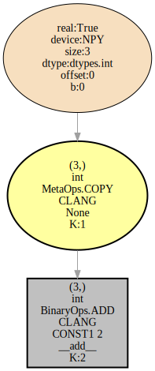
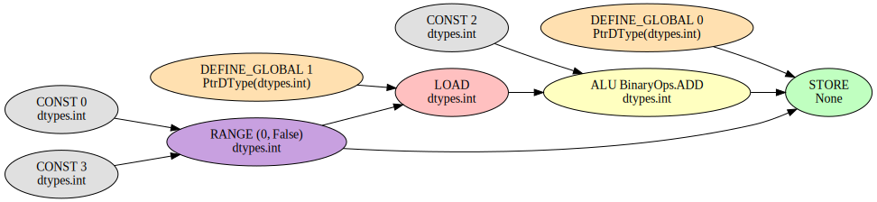

tinygrad tries to be simple. I like deleting things. See if I can't help delete in tinygrad. Seems to be a new and adventurous world on the other side.

# tinygrad dev exploration

[TOC]
## Direction

read using [pyIntroducer](https://github.com/lorinbaum/pyintroducer)
- tensor.tolist() CLANG introduced
- tensor.tolist() CUDA introduced
- gpt2 CUDA introduced

consider more abstract layers all the way to the mission., connect to code

## More refined

### tinycorp mission

accelerate, commoditize the petaflop
improve soft-hardware interface for tensor compute first
funded by love and tinyboxes

factory -> soft (tinygrad), hard (tinybox, tinychip?)
product -> compiled models?

*tinygrad model --> friendly C --> standalone would be (is?) nice*

## Less refined

### encountered python

`__slots__` lists the expected class attributes for fast access and memory savings [more](https://stackoverflow.com/questions/472000/usage-of-slots)
`all()` and `any()` for evaluating multiple bools.
`WeakValueDictionary` for accessing values that can be garbage collected like the reference isn't there
if there is an argument in a function definition like `*atuple`,  it becomes optional and returns an empty tuple (or list?) if not given
`deque` from `collections` = data structure for efficient insertion and deletion from two ends of a list.
`dict.get(self, key, default=None, /)` Return the value for key if key is in the dictionary, else default.
format specifiers. `int:8` means the int takes up 8 spaces when printing. same as `int:8d` d for digit. can do alignment with `int:>8d` for right alignment.
`tempfile` module for temporary files that automatically delete after close

### Notes on introduction of tensor.tolist() on CLANG

TODO: WINO context var to enable winograd optimization?
`BinaryOps`:
- `IDIV` = integer division
- `CMPLT` = <
- `SHL` = shift left
- `THREEFRY` = rng related
`TernaryOps`:
- `WHERE` = Multiplexer
- `MULACC`: `x*y+z
`ReduceOps`:
- `WMMA` = wave matrix multiply accumulate: hardware accelerated matrix multiplication

```python
class UOps(Enum):
  SINK = auto(); EXPAND = auto(); CONTRACT = auto() # noqa: E702                                                                                                                                         # codegen/uops.py:15
  DEFINE_GLOBAL = auto(); DEFINE_VAR = auto(); DEFINE_LOCAL = auto(); DEFINE_ACC = auto() # noqa: E702                                                                                                   # codegen/uops.py:16
  CONST = auto(); SPECIAL = auto() # noqa: E702                                                                                                                                                          # codegen/uops.py:17
  NOOP = auto(); GEP = auto() # noqa: E702                                                                                                                                                               # codegen/uops.py:18
  CAST = auto(); BITCAST = auto(); VECTORIZE = auto() # noqa: E702                                                                                                                                       # codegen/uops.py:20
  ALU = auto(); REDUCE = auto(); WMMA = auto() # noqa: E702                                                                                                                                              # codegen/uops.py:21
  LOAD = auto(); STORE = auto(); PHI = auto() # noqa: E702                                                                                                                                               # codegen/uops.py:23
  BARRIER = auto(); IF = auto(); RANGE = auto() # noqa: E702                                                                                                                                             # codegen/uops.py:25
  ENDRANGE = auto(); ENDIF = auto() # noqa: E702 
```

`PatternMatcher`?


```python
a = (Tensor([1,2,3], device="CLANG") + 2)
```

- data -> numpy ndarray
- LazyBuffer with shapetracker from ndarray.shape
	- lazycache disabled, but `LAZYCACHE` context variable is 1 by default
	- `_METADATA.get()` is `None` by default
	- `LazyBuffer` gets a `Buffer` that does not allocate anything yet.
	- gets allocator from `Device`, gets `NpyDevice` from  `ops_npy.py`, which is unnecessary
	- puts the ndarray into `Buffer._buf`, deletes `LazyBuffer.srcs` (was empty tuple), so that `LazyBuffer.realized` returns `True`
- new `LazyBuffer` now on `CLANG`, same shapetracker, `MetaOps.COPY`, `arg` = `Buffer.size`, `srcs` = tuple with previous (npy) lazybuffer

before addition:
```python
Tensor.lazydata {
	'device': 'CLANG',
	'st': ShapeTracker(views=(View(shape=(3,), strides=(1,), offset=0, mask=None, contiguous=True),)),
	'dtype': dtypes.int,
	'shape': (3,),
	'size': 3,
	'metadata': None,
	'_base': None,
	'op': <MetaOps.COPY: 3>,
	'arg': 12,
	'srcs': (<LB NPY (3,) int (<MetaOps.EMPTY: 1>, <buf real:True device:NPY size:3 dtype:dtypes.int offset:0>)>,),
	'buffer': <buf real:False device:CUDA size:3 dtype:dtypes.int offset:0>,
	'contiguous_child': None,
	'forced_realize': False
}
```

addition calls `_metadata_wrapper`, sets `_METADATA` to `__add__`, the function being called.
to add, 2 turns into a Tensor where the lazydata has `op=MetaOps.CONST, shape=(), arg=2`
to add, shapes must match, the "2 Tensor" is broadcasted from shape `()` to `(3,)`
`()`-> reshape -> `(1,)` -> expand -> `(3,)`

by default `MERGE_VIEW=1`, so the latest `View` in the `ShapeTracker` is replaced by the new one.
new `LazyBuffer` with `base` being the previous `LazyBuffer`
`expand` always replaces latest view in shapetracker regardless of `MERGE_ViEW`
again new `LazyBuffer` with the base of the previous one. The "intermediate" lazybuffer from reshape is garbage collected.

Tensor(2) after broadcasting:

```python
Tensor.lazydata {
	'device': 'CLANG',
	'st': ShapeTracker(views=(View(shape=(3,), strides=(0,), offset=0, mask=None, contiguous=False),)),
	'dtype': dtypes.int,
	'shape': (3,),
	'size': 3,
	'metadata': expand,
	'_base': LazyBuffer {
		'device': 'CLANG',
		'st': ShapeTracker(views=(View(shape=(), strides=(), offset=0, mask=None, contiguous=True),)),
		'dtype': dtypes.int,
		'shape': (),
		'size': 1,
		'metadata': None,
		'_base': None,
		'op': <MetaOps.CONST: 2>,
		'arg': 2,
		'srcs': (),
		'buffer': <buf real:False device:CLANG size:1 dtype:dtypes.int offset:0>,
		'contiguous_child': None,
		'forced_realize': False
	}
}
```

addition creates new LazyBuffer;
```python
Tensor.lazydata {
	'device': 'CLANG',
	'st': ShapeTracker(views=(View(shape=(3,), strides=(1,), offset=0, mask=None, contiguous=True),)),
	'dtype': dtypes.int,
	'shape': (3,),
	'size': 3,
	'metadata': __add__,
	'_base': None,
	'op': <BinaryOps.ADD: 1>,
	'arg': None,
	'srcs': (
		<LB CLANG (3,) int (<MetaOps.COPY: 3>, None)>,
		<LB CLANG (3,) int ShapeTracker(views=(View(shape=(3,), strides=(0,), offset=0, mask=None, contiguous=False),))>
	),
	'buffer': <buf real:False device:CLANG size:3 dtype:dtypes.int offset:0>,
	'contiguous_child': None,
	'forced_realize': False
}

```

>The `LazyBuffer` graph specifies the compute in terms of low level tinygrad ops. Not all LazyBuffers will actually become realized. There's two types of LazyBuffers, base and view. base contains compute into a contiguous buffer, and view is a view (specified by a ShapeTracker). Inputs to a base can be either base or view, inputs to a view can only be a single base.
>- [tinygrad docs](https://docs.tinygrad.org/developer/developer/#tinygrad.lazy.LazyBuffer)

#### Realize

```python
a.tolist()
```

-> `cpu = self.cast(self.dtype.scalar()).contiguous().to("CLANG").realize()`
cast does nothing because its already the right dtype
contiguous does nothing because its already contiguous
to does nothing, its already on CLANG. Note: this initially looks like it would realize on CLANG regardless of device but really, it just adds a CLANG lazybuffer to the end of the graph, to move the data to the cpu

##### Schedule

>The scheduler converts the graph of LazyBuffers into a list of ScheduleItem. One ScheduleItem is one kernel on the GPU, and the scheduler is responsible for breaking the large compute graph into subgraphs that can fit in a kernel. ast specifies what compute to run, and bufs specifies what buffers to run it on.
>- [tinygrad docs](https://docs.tinygrad.org/developer/developer/#scheduling)

```python
@dataclass(frozen=True)
class ScheduleItem:
  ast: LazyOp
  bufs: Tuple[Buffer, ...]
  metadata: Optional[List[Metadata]] = None
```

`children:Dict[LazyBuffer:Dict[Lazybuffer : None]]` is in direction of execution, so a child is an lb that depends on the current one. stores only if the parent is unrealized
`realizes:Dict[LazyBuffer : None]` stores unrealized bases and ones with `MetaOps`, so it includes the realized npy lb.
`output_groups` stores lb that are unrealized and not `MetaOps.CONST`
lots of complexity is skipped because there are no ReduceOps in the lb graph.

lop recursively gets a graph of LazyOp from the LazyBuffer graph.
MetaOps.CONST - lbs turn into a LazyOp with BufferOps.CONST, no sources and a ConstBuffer
The realized npy lb turns into a LazyOps with BufferOps.LOAD, no sources and a MemBuffer. adds the buffer to inputs, like other lbs would that are either realized or in realizes but not in the current output_group
ast gets a LazyOp with BufferOps.STORE, lops as sources and a MemBuffer

`_lower_lazybuffer` returns
- `LazyOp(MetaOps.KERNEL, tuple(ast))`
- `list(input)`
- var_vals
- some metadata

the next group, the lb with MetaOps.COPY returns different: returns a LazyOp with MetaOps.COPY and same sources and arg from the lb.
 
```python
"""
prescheduled:Dict[
	"group[0]":LazyBuffer : Tuple[
		"group": List[LazyBuffer]
		LazyOp,
		"inputs": List[LazyBuffer],
		"var_vals": Dict[],
		"metadata": List[]
	]
]
"""
prescheduled = {
	<LB CLANG (3,) int (<BinaryOps.ADD: 1>, None)>: (
		[<LB CLANG (3,) int (<MetaOps.COPY: 3>, None)>],
		LazyOp(MetaOps.KERNEL, arg=None, src=(
			LazyOp(BufferOps.STORE, arg=MemBuffer(idx=0, dtype=dtypes.int, st=ShapeTracker(views=(View(shape=(3,), strides=(1,), offset=0, mask=None, contiguous=True),))), src=(
				LazyOp(BinaryOps.ADD, arg=None, src=(
				    LazyOp(BufferOps.LOAD, arg=MemBuffer(idx=1, dtype=dtypes.int, st=ShapeTracker(views=(View(shape=(3,), strides=(1,), offset=0, mask=None, contiguous=True),))), src=()),
				    LazyOp(BufferOps.CONST, arg=ConstBuffer(val=2, dtype=dtypes.int, st=ShapeTracker(views=(View(shape=(3,), strides=(0,), offset=0, mask=None, contiguous=False),))), src=()),
				)),
			)),
		)),
		[<LB CLANG (3,) int (<MetaOps.COPY: 3>, None)>],
		{},
		[__add__]
	),
	<LB CLANG (3,) int (<MetaOps.COPY: 3>, None)>: (
		[<LB CLANG (3,) int (<MetaOps.COPY: 3>, None)>],
		LazyOp(MetaOps.COPY, arg=12, src=()),
		[<LB NPY (3,) int (<MetaOps.EMPTY: 1>, <buf real:True device:NPY size:3 dtype:dtypes.int offset:0>)>],
		{},
		[]
	)
}
```

... skipping some ...

```python
schedule = [
	ScheduleItem(
		ast=LazyOp(MetaOps.COPY, arg=12, src=()),
		bufs=(
			<buf real:False device:CLANG size:3 dtype:dtypes.int offset:0>,
			<buf real:True device:NPY size:3 dtype:dtypes.int offset:0>
		),
		metadata=[]
	),
	ScheduleItem(
		ast=LazyOp(MetaOps.KERNEL, arg=None, src=(
			LazyOp(BufferOps.STORE, arg=MemBuffer(idx=0, dtype=dtypes.int, st=ShapeTracker(views=(View(shape=(3,), strides=(1,), offset=0, mask=None, contiguous=True),))), src=(
			    LazyOp(BinaryOps.ADD, arg=None, src=(
				    LazyOp(BufferOps.LOAD, arg=MemBuffer(idx=1, dtype=dtypes.int, st=ShapeTracker(views=(View(shape=(3,), strides=(1,), offset=0, mask=None, contiguous=True),))), src=()),
				    LazyOp(BufferOps.CONST, arg=ConstBuffer(val=2, dtype=dtypes.int, st=ShapeTracker(views=(View(shape=(3,), strides=(0,), offset=0, mask=None, contiguous=False),))), src=()),
				)),
			)),
		)),
		bufs=(
			<buf real:False device:CLANG size:3 dtype:dtypes.int offset:0>,
			<buf real:False device:CLANG size:3 dtype:dtypes.int offset:0>
		),
		metadata=[__add__]
	)
]
```

with `GRAPH=1`, tinygrad produces an svg that reflects this schedule:


`_internal_memory_planner` does nothing here

##### lower schedule

in `lower_schedule_item`, trying to get "transfer" attribute from the allocator, ops_clang are imported

first ExecItem: 
```python
ExecItem {
	prg=tinygrad.engine.realize.BufferCopy {
		device = <tinygrad.runtime.ops_clang.ClangDevice object at 0x7147ec6d3be0>
		display_name = '\x1b[33mcopy       12,   CLANG <- NPY    \x1b[0m',
		dname = "CLANG",
		first_run = True,
		lds_estimate = 0,
		mem_estimate = 12,
		op_estimate = 0
	},
	bufs=[
		<buf real:False device:CLANG size:3 dtype:dtypes.int offset:0>,
		<buf real:True device:NPY size:3 dtype:dtypes.int offset:0>
	],
	metadata=None
}
```

`_MallocAllocator` always allocates with `ctypes.c_uint8 * size`

if DEBUG >= 2, it will print the kernel (prg) name and kernel number
- in magenta if jit
- in green if the kernel is run the first time


second scheduleItem:

"methods" (MetaOps.KERNEL) are cached in the method_cache if they repeat in the schedule

lazyops are recursively verfied `verify_lazyop` (opy.py)

`hand_coded_optimizations` if no tensor cores. But they don't do anything on the add kernel.
would do BEAM here, but isn't enabled for this one.

-> `Kernel.to_program`

`get_optimized_ast` recursively goes through each op.
gives `MetaOps.KERNEL` an `arg` with `KernelInfo` dataclass
gives `BufferOps` arg (MemBuffer or ConstBuffer in the current Kernel) "new" shapetrackerse, which in this case are the same as before.

then verfiyes new ast -> `veryify_lazyops`

generate the UOpGraph
-> `lazyop_to_uop`

`sink` that is passed to UOpGraph:
```python
UOp(UOps.SINK, None, arg=None, src=(
  UOp(UOps.STORE, None, arg=None, src=(
    UOp(UOps.DEFINE_GLOBAL, PtrDType(dtypes.int), arg=0, src=()),
    UOp(UOps.RANGE, dtypes.bigint, arg=(0, False), src=(
      UOp(UOps.CONST, dtypes.bigint, arg=0, src=()),
      UOp(UOps.CONST, dtypes.bigint, arg=3, src=()),
    )),
    UOp(UOps.ALU, dtypes.int, arg=BinaryOps.ADD, src=(
      UOp(UOps.LOAD, dtypes.int, arg=None, src=(
        UOp(UOps.DEFINE_GLOBAL, PtrDType(dtypes.int), arg=1, src=()),
        UOp(UOps.RANGE, dtypes.bigint, arg=(0, False), src=(
		  UOp(UOps.CONST, dtypes.bigint, arg=0, src=()),
          UOp(UOps.CONST, dtypes.bigint, arg=3, src=()),
        )),
      )),
      UOp(UOps.ALU, dtypes.int, arg=TernaryOps.WHERE, src=(
        UOp(UOps.CONST, dtypes.bool, arg=True, src=()),
        UOp(UOps.CONST, dtypes.int, arg=2, src=()),
        UOp(UOps.CONST, dtypes.int, arg=0, src=()),
      )),
    )),
  )),
))


```

which is then linearized through `UOpGraph.linearize`

patternmatcher comes in. a new pattern matcher is used that merges patterns from const_folder and transcendental_folding

```python
# tinygrad/codegen/uops.py
def _match(uop:UOp, pat:UPat, store:Dict[str, UOp]) -> List[Dict[str, UOp]]:
  """
  for pat/uop and recursively their source pats and uops:
  if pat and uop are valid / match: add uop to store at pat.name if there is no other uop for pat.name
  """
```

for any matches, the callable stored in the pattern matcher will return the replacement uop.

new `sink` after pattern matching
```python
UOp(UOps.SINK, None, arg=None, src=(
  UOp(UOps.STORE, None, arg=None, src=(
    UOp(UOps.DEFINE_GLOBAL, PtrDType(dtypes.int), arg=0, src=()),
    UOp(UOps.RANGE, dtypes.int, arg=(0, False), src=(
      UOp(UOps.CONST, dtypes.int, arg=0, src=()),
      UOp(UOps.CONST, dtypes.int, arg=3, src=()),
    )),
    UOp(UOps.ALU, dtypes.int, arg=BinaryOps.ADD, src=(
      UOp(UOps.LOAD, dtypes.int, arg=None, src=(
        UOp(UOps.DEFINE_GLOBAL, PtrDType(dtypes.int), arg=1, src=()),
        UOp(UOps.RANGE, dtypes.int, arg=(0, False), src=(
          UOp(UOps.CONST, dtypes.int, arg=0, src=()),
          UOp(UOps.CONST, dtypes.int, arg=3, src=()),
        )),
	  )),
      UOp(UOps.CONST, dtypes.int, arg=2, src=()),
    )),
  )),
))
```

more pattern matching with const_folder + transcendental_folding + expander + float4_folding
then again with  const_folder + transcendental_folding + expander + reducer
which does not change sink in any way

does toposort, adds and end for the range, removes SINK, which just indicated MetaOps.KERNEL

```python
UOPGraph._uops = [
	UOp(UOps.DEFINE_GLOBAL, PtrDType(dtypes.int), arg=0, src=()),
	UOp(UOps.DEFINE_GLOBAL, PtrDType(dtypes.int), arg=1, src=()), 
	UOp(UOps.CONST, dtypes.int, arg=0, src=()),
	UOp(UOps.CONST, dtypes.int, arg=2, src=()),
	UOp(UOps.CONST, dtypes.int, arg=3, src=()),
	UOp(UOps.RANGE, dtypes.int, arg=(0, False), src=(
		UOp(UOps.CONST, dtypes.int, arg=0, src=()),
		UOp(UOps.CONST, dtypes.int, arg=3, src=()),
	)),
	UOp(UOps.LOAD, dtypes.int, arg=None, src=(
		UOp(UOps.DEFINE_GLOBAL, PtrDType(dtypes.int), arg=1, src=()),
		UOp(UOps.RANGE, dtypes.int, arg=(0, False), src=(
			UOp(UOps.CONST, dtypes.int, arg=0, src=()),
			UOp(UOps.CONST, dtypes.int, arg=3, src=()),
		)),
	)),
	UOp(UOps.ALU, dtypes.int, arg=BinaryOps.ADD, src=(
		UOp(UOps.LOAD, dtypes.int, arg=None, src=(
		    UOp(UOps.DEFINE_GLOBAL, PtrDType(dtypes.int), arg=1, src=()),
		    UOp(UOps.RANGE, dtypes.int, arg=(0, False), src=(
			    UOp(UOps.CONST, dtypes.int, arg=0, src=()),
				UOp(UOps.CONST, dtypes.int, arg=3, src=()),
			)),
		)),
		UOp(UOps.CONST, dtypes.int, arg=2, src=()),
	)),
	UOp(UOps.STORE, None, arg=None, src=(
		UOp(UOps.DEFINE_GLOBAL, PtrDType(dtypes.int), arg=0, src=()),
		UOp(UOps.RANGE, dtypes.int, arg=(0, False), src=(
		    UOp(UOps.CONST, dtypes.int, arg=0, src=()),
		    UOp(UOps.CONST, dtypes.int, arg=3, src=()),
		)),
		UOp(UOps.ALU, dtypes.int, arg=BinaryOps.ADD, src=(
		    UOp(UOps.LOAD, dtypes.int, arg=None, src=(
			    UOp(UOps.DEFINE_GLOBAL, PtrDType(dtypes.int), arg=1, src=()),
		        UOp(UOps.RANGE, dtypes.int, arg=(0, False), src=(
				    UOp(UOps.CONST, dtypes.int, arg=0, src=()),
				    UOp(UOps.CONST, dtypes.int, arg=3, src=()),
				)),
			)),
		    UOp(UOps.CONST, dtypes.int, arg=2, src=()),
		)),
	)),
	UOp(UOps.ENDRANGE, None, arg=None, src=(
		UOp(UOps.RANGE, dtypes.int, arg=(0, False), src=(
		    UOp(UOps.CONST, dtypes.int, arg=0, src=()),
			UOp(UOps.CONST, dtypes.int, arg=3, src=()),
		)),
	))
]
```



UOp graph from `GRAPHUOPS=1` context variable
TODO: colors mean anything? -> `codegen/uopgraph.py` -> `UOPGraph.graph`

kernel gets a name (`codegen/kernel.py` -> `Kernel.name`)
r if any reduceops
C if only BufferOps
else E
+
optional len(Kernel.ast.src) if > 1 else nothing
+
`_`
+
numbers for shapes in different colors (?) joined by black `_`


Render:

iterates through uops, globals and const are stored as their name and value and inserted when needed
otherwise translates 1:1 UOps to valid C code.
```c
void E_3(int* restrict data0, const int* restrict data1) {
	for (int ridx0 = 0; ridx0 < 3; ridx0++) {
		int val0 = data1[ridx0];
		data0[ridx0] = (val0+2);
	}
}
```

appears to cache the kernel as bytes in an sqlite3 database?
writes bytes to a temp file
loads the kernel function from the temp file as a function using `ctypes.CDLL(path)[fname]`

`method_cache` stores the kernel as a `CompiledRunner`

returns the second `ExecItem`:
```python
ExecItem(
	prg=tinygrad.engine.realize.CompiledRunner {
		clprg = <tinygrad.runtime.ops_clang.ClangProgram object at 0x76d56a0fb4f0>,
		device = <tinygrad.runtime.ops_clang.ClangDevice object at 0x76d56a0a2b30>,
		display_name = 'E_\x1b[34m3\x1b[0m\x1b[90m\x1b[0m',
		dname = "CLANG",
		first_run = True,
		lsd_estimate = 24,
		lib = {horrible bytemess},
		mem_estimate = 24,
		op_estimate = 3,
		p = Program(
			name='E_\x1b[34m3\x1b[0m\x1b[90m\x1b[0m',
			src='\nvoid E_3(int* restrict data0, const int* restrict data1) {\n  for (int ridx0 = 0; ridx0 < 3; ridx0++) {\n    int val0 = data1[ridx0];\n    data0[ridx0] = (val0+2);\n  }\n}',
			dname='CLANG',
			uops=[
				UOp(UOps.DEFINE_GLOBAL, PtrDType(dtypes.int), arg=0, src=()),
				UOp(UOps.DEFINE_GLOBAL, PtrDType(dtypes.int), arg=1, src=()),
				UOp(UOps.CONST, dtypes.int, arg=0, src=()),
				UOp(UOps.CONST, dtypes.int, arg=2, src=()),
				UOp(UOps.CONST, dtypes.int, arg=3, src=()),
				UOp(UOps.RANGE, dtypes.int, arg=(0, False), src=(
					UOp(UOps.CONST, dtypes.int, arg=0, src=()),
					UOp(UOps.CONST, dtypes.int, arg=3, src=()),
				)),
				UOp(UOps.LOAD, dtypes.int, arg=None, src=(
					UOp(UOps.DEFINE_GLOBAL, PtrDType(dtypes.int), arg=1, src=()),
					UOp(UOps.RANGE, dtypes.int, arg=(0, False), src=(
						UOp(UOps.CONST, dtypes.int, arg=0, src=()),
						UOp(UOps.CONST, dtypes.int, arg=3, src=()),
					)),
				)),
				UOp(UOps.ALU, dtypes.int, arg=BinaryOps.ADD, src=(
					UOp(UOps.LOAD, dtypes.int, arg=None, src=(
						UOp(UOps.DEFINE_GLOBAL, PtrDType(dtypes.int), arg=1, src=()),
						UOp(UOps.RANGE, dtypes.int, arg=(0, False), src=(
							UOp(UOps.CONST, dtypes.int, arg=0, src=()),
							UOp(UOps.CONST, dtypes.int, arg=3, src=()),
						)),
					)),
					UOp(UOps.CONST, dtypes.int, arg=2, src=()),
				)),
				UOp(UOps.STORE, None, arg=None, src=(
					UOp(UOps.DEFINE_GLOBAL, PtrDType(dtypes.int), arg=0, src=()),
					UOp(UOps.RANGE, dtypes.int, arg=(0, False), src=(
						UOp(UOps.CONST, dtypes.int, arg=0, src=()),
						UOp(UOps.CONST, dtypes.int, arg=3, src=()),
					)),
					UOp(UOps.ALU, dtypes.int, arg=BinaryOps.ADD, src=(
						UOp(UOps.LOAD, dtypes.int, arg=None, src=(
							UOp(UOps.DEFINE_GLOBAL, PtrDType(dtypes.int), arg=1, src=()),
							UOp(UOps.RANGE, dtypes.int, arg=(0, False), src=(
								UOp(UOps.CONST, dtypes.int, arg=0, src=()),
								UOp(UOps.CONST, dtypes.int, arg=3, src=()),
							)),
						)),
						UOp(UOps.CONST, dtypes.int, arg=2, src=()),
					)),
				)),
				UOp(UOps.ENDRANGE, None, arg=None, src=(
					UOp(UOps.RANGE, dtypes.int, arg=(0, False), src=(
						UOp(UOps.CONST, dtypes.int, arg=0, src=()),
						UOp(UOps.CONST, dtypes.int, arg=3, src=()),
					)),
				))
			],
			mem_estimate=24,
			global_size=None,
			local_size=None,
			vars=[],
			globals=[0, 1],
			outs=[0],
			_ran_post_init=True
		)
	},
	bufs=[
		<buf real:False device:CLANG size:3 dtype:dtypes.int offset:0>,
		<buf real:True device:CLANG size:3 dtype:dtypes.int offset:0>
	],
	metadata=[__add__]
)
```

allocates buffers
calls the loaded c function, measuring time it takes to execute.

gets output buffer (moves it to a new buffer if not allow_zero_copy?)
memoryview is cast to Tensor.dtype.fmt and Tensor.shape (?)
memoryview.tolist() returns the final output.


---

### Detected room for improvement / questions

`Tensor(2).lazydata.contiguous_child` is `None` but
`Tensor(1).lazydata.contiguous_child` is a tuple of weakref to some lazybuffer and its own ShapeTracker?

beautiful lazy graph and linearized graph in DEBUG=4

context vars don't add themselves to actual context
some context vars are acceseed via import from helpers, some through getenv
try `from tinygrad.helpers import JIT; bool(JIT)` -> True
and `from tinygrad.helpers import getenv; bool(getenv("JIT"))` -> False

### Research

https://towardsdatascience.com/matrix-multiplication-on-the-gpu-e920e50207a8